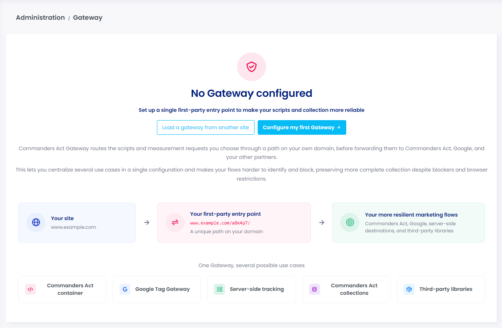
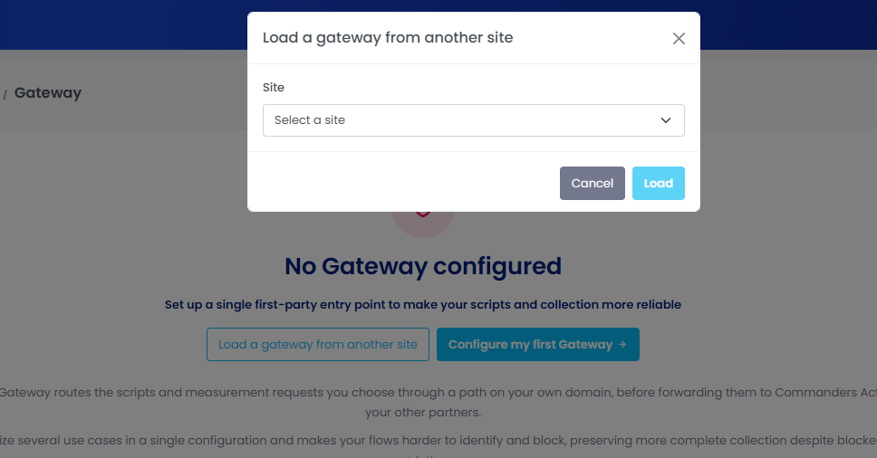
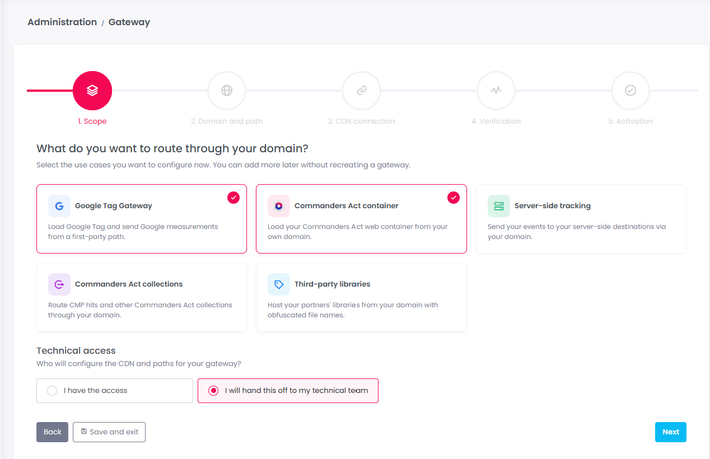
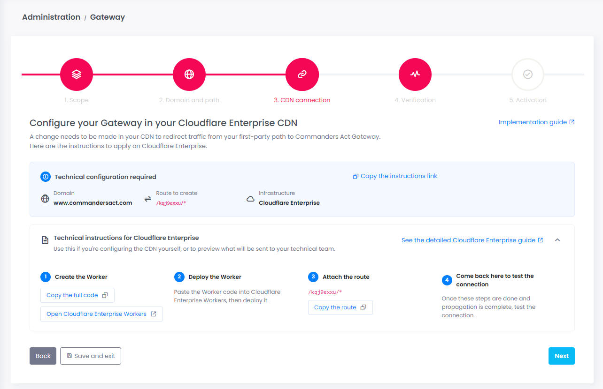
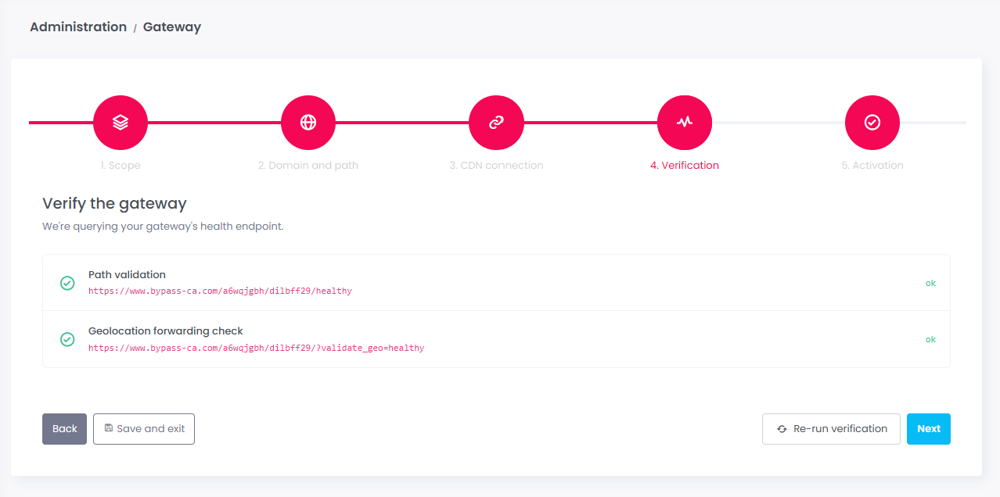
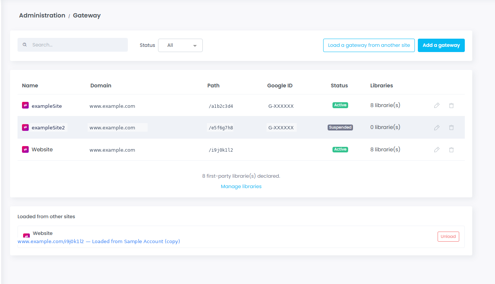
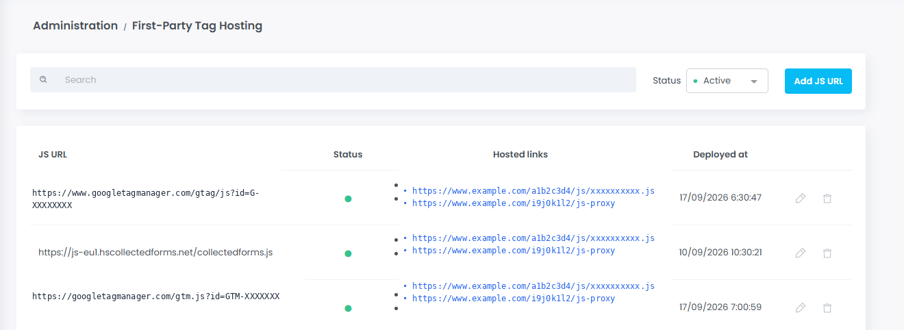

# Manage your Gateway

### Configure your Gateway from the Administration interface

Commanders Act Gateway is set up and managed directly from the platform, under **Administration > Gateway**. This interface lets you create, configure, and monitor your first-party Gateway(s) without writing any code — the only technical step you may need help with is connecting your CDN, covered in [Route traffic](https://claude.ai/chat/053cd264-041d-4acd-a089-ed8a1aaf7efd#step-2-route-traffic) above.

#### Before you start

If no Gateway is configured yet on this site, you'll land on an introduction screen explaining what the Gateway does and the use cases it can power.

<figure><figcaption>
No Gateway configured
</figcaption></figure>

From here, you have two options:

* **Configure my first Gateway** — starts the 5-step setup wizard described below.
* **Load a gateway from another site** — if you already manage a Gateway on another site in your account, select it from the list to reuse its configuration as a starting point instead of starting from scratch.

<figure><figcaption>
Load a gateway from another site
</figcaption></figure>

Once at least one Gateway is configured, this page becomes your management dashboard — see [Managing your Gateways](manage-your-gateway.md#managing-your-gateways) below.

> 💡 **Good to know:** you can leave the wizard at any point using **Save and exit**. Your progress is kept and the Gateway stays with an _inactive_ status until you complete the setup.

#### Step 1 · Scope

<figure><figcaption>
Scope step
</figcaption></figure>

This first screen defines **what you want to route through your domain**. Select one or more use cases — you'll be able to add more later without recreating the Gateway:

| Use case                                             | What it does                                                                |
| ---------------------------------------------------- | --------------------------------------------------------------------------- |
| **Google Tag Gateway** _(selected by default)_       | Loads Google Tag and sends Google measurements from a first-party path.     |
| **Commanders Act container** _(selected by default)_ | Loads your Commanders Act web container from your own domain.               |
| **Server-side tracking**                             | Sends your events to your server-side destinations via your domain.         |
| **Commanders Act collections**                       | Routes CMP hits and other Commanders Act collections through your domain.   |
| **Third-party libraries**                            | Hosts your partners' libraries from your domain with obfuscated file names. |

Then choose **who will handle the technical access**:

* **I have the access** — you'll configure the CDN yourself.
* **I will hand this off to my technical team** _(selected by default)_ — the interface prepares ready-to-share instructions for your IT team.

#### Step 2 · Domain and path

<figure><figcaption></figcaption></figure>

Fill in the information needed to reserve your first-party path:

* **Internal Gateway name** — for your own reference in the platform.
* **First-party path** — generated automatically (you can regenerate it); this becomes the unique URL on your domain that carries your Gateway traffic.
* **Domain** — the website the Gateway will run on.
* **Google tag ID** — required only if you selected _Google Tag Gateway_ in Step 1.
* **CDN provider / load balancer** — Cloudflare Free, Cloudflare Enterprise, Akamai (beta), Fastly (beta), another CDN, or "I don't know."
* **Cookies to exclude from the Gateway** _(optional)_ — pre-filled with the two cookies excluded by default in the standard Worker code; adjust if your setup requires it.

> ⚠️ Avoid words like _tracking, analytics, metrics, tag, google,_ or _ads_ in your path — they make it easier for blockers to detect. Your technical team will also need to confirm the path isn't already used on your site.

#### Step 3 · CDN connection

<figure><figcaption></figcaption></figure>

The interface generates the exact technical configuration for your setup (domain, route, infrastructure) along with a step-by-step guide matching the CDN you chose in Step 2. You can copy a shareable instructions link for your IT team, or follow the on-screen steps yourself if you have the access.

For detailed, CDN-specific implementation instructions, see [Route traffic](https://doc.commandersact.com/developers/commanders-tag-gateway#step-2-route-traffic).

#### Step 4 · Verification

<figure><figcaption></figcaption></figure>

When you reach this step, the platform automatically checks that your Gateway is live and reachable: a path validation check and a geolocation forwarding check, both of which must return "ok." If a check fails, review your CDN configuration and click **Re-run verification**. You can only move on once both checks pass.

#### Step 5 · Activation

<figure><figcaption></figcaption></figure>

<figure><figcaption></figcaption></figure>

Your Gateway's first-party entry point is now live. This final screen lists one action card per use case you selected in Step 1, each explaining exactly what to update on your side to finish activating it:

* **Google Tag Gateway** — replace your Google tag URLs (gtag.js, GTM) with your new first-party path, in every container where they're loaded.
* **Commanders Act container** — replace your container loading URL with the new first-party URL provided.
* **Server-side tracking** and **Commanders Act collections** — no manual tag changes needed; simply regenerate and deploy your Commanders Act container(s).
* **Third-party libraries** — declare each JS file (e.g. Meta Pixel) in the First-Party Tag Hosting interface; Commanders Act generates an obfuscated file name for you to use in the corresponding tag.

The right-hand panel recaps your Gateway's configuration (domain, path, infrastructure, selected use cases) and links to the help center if you need support.

You can come back and add or change use cases at any time from this Gateway's configuration. Click **Finish** to complete the setup.

#### Managing your Gateways

<figure><figcaption></figcaption></figure>

Once you have at least one Gateway, **Administration > Gateway** becomes your management dashboard:

* **Search and status filter** — quickly find a Gateway by name or narrow the list to a given status (Active, Suspended…).
* **Add a gateway** — starts the setup wizard for a new Gateway.
* **Load a gateway from another site** — reuse an existing Gateway's configuration as a starting point.
* **Gateway table** — one row per Gateway, with its name, domain, first-party path, Google ID (if applicable), status, and number of first-party libraries declared. Use the icons on the right to edit or delete a Gateway — deleting always asks for confirmation first.
* **Loaded from other sites** — lists any Gateway configuration you loaded from another site, with the option to **Unload** it if it's no longer needed.

A link below the table (**Manage libraries**) takes you straight to First-Party Tag Hosting — see below.

#### First-Party Tag Hosting

<figure><figcaption></figcaption></figure>

This page (**Administration > First-Party Tag Hosting**) is where you declare the third-party JS libraries you want to serve first-party through your Gateway(s) — the step referenced in the _Third-party libraries_ use case.

* **Add JS URL** — declare a new library by its original (third-party) JS URL.
* **Search and status filter** — find a declared library or filter by status.
* **Table** — for each declared JS URL, you'll find its status, the **hosted links** generated for it (one first-party URL per Gateway it's active on), and its last deployment date. Use the icons on the right to edit or delete an entry.

Once a library is declared here, use its generated first-party URL in your tag configuration instead of the original third-party one, as shown in the [Activation](https://claude.ai/chat/053cd264-041d-4acd-a089-ed8a1aaf7efd#step-5-activation) step above.
