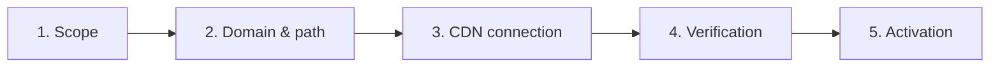

# Manage your Gateway

### Configure your Gateway from the Administration interface

You create, configure and monitor your first-party Gateways in **Administration > Gateway**, with no code. The only technical step is connecting your CDN (see [Route traffic](https://doc.commandersact.com/developers/commanders-tag-gateway#step-2-route-traffic)).

### Get started 

If the site has no Gateway yet, you see an introduction screen. Choose one of two options:

* **Configure my first Gateway** — launches the 5-step setup wizard below.
* **Load a gateway from another site** — reuses an existing Gateway from your account as a starting point.

<figure><figcaption>
No Gateway configured
</figcaption></figure>

<figure><figcaption>
Load a gateway from another site
</figcaption></figure>

> 💡 **Tip:** Click **Save and exit** at any time. Your progress is saved, and the Gateway stays _inactive_ until setup is complete.

### Set up a Gateway in 5 steps 

#### Step 1 · Scope

<figure><figcaption>
Scope step
</figcaption></figure>

Select what to route through your domain. You can add use cases later without recreating the Gateway.

| Use case                                 | What it does                                                              |
| ---------------------------------------- | ------------------------------------------------------------------------- |
| **Google Tag Gateway** _(default)_       | Loads Google Tag and sends Google measurements from a first-party path.   |
| **Commanders Act container** _(default)_ | Loads your Commanders Act web container from your own domain.             |
| **Server-side tracking**                 | Sends your events to your server-side destinations via your domain.       |
| **Commanders Act collections**           | Routes CMP hits and other Commanders Act collections through your domain. |
| **Third-party libraries**                | Hosts partner libraries on your domain with obfuscated file names.        |

Then choose who handles the CDN: **I have the access**, or **I will hand this off to my technical team** _(default)_, which prepares ready-to-share instructions for IT.

#### Step 2 · Domain and path

<figure><figcaption></figcaption></figure>

Fill in the information needed to reserve your first-party path:

<table data-header-hidden data-search="false"><thead><tr><th></th><th></th></tr></thead><tbody><tr><td>Field</td><td>Notes</td></tr><tr><td><strong>Internal Gateway name</strong></td><td>For your own reference.</td></tr><tr><td><strong>First-party path</strong></td><td>Auto-generated, can be regenerated. The unique URL on your domain that carries Gateway traffic.</td></tr><tr><td><strong>Domain</strong></td><td>The website the Gateway runs on.</td></tr><tr><td><strong>Google tag ID</strong></td><td>Only if you selected <em>Google Tag Gateway</em>.</td></tr><tr><td><strong>CDN provider / load balancer</strong></td><td>Cloudflare Free, Cloudflare Enterprise, Akamai (beta), Fastly (beta), other CDN, or "I don't know".</td></tr><tr><td><strong>Cookies to exclude</strong> <em>(optional)</em></td><td>Pre-filled with the 2 cookies excluded by the standard Worker code.</td></tr></tbody></table>

> ⚠️ Avoid _tracking, analytics, metrics, tag, google_ or _ads_ in the path — blockers detect them more easily. Your technical team must also confirm the path isn't already used on your site.

#### Step 3 · CDN connection

<figure><figcaption></figcaption></figure>

The platform generates the exact configuration (domain, route, infrastructure) and a step-by-step guide for your CDN. Follow it yourself, or copy the shareable link for your IT team. CDN-specific details: [Route traffic](https://doc.commandersact.com/developers/commanders-tag-gateway#step-2-route-traffic).

#### Step 4 · Verification

<figure><figcaption></figcaption></figure>

Two checks run automatically: **path validation** and **geolocation forwarding**. Both must return "ok" before you can continue. If one fails, fix your CDN configuration and click **Re-run verification**.

#### Step 5 · Activation

<figure><figcaption></figcaption></figure>

<figure><figcaption></figcaption></figure>

Your first-party entry point is live. Complete the action card for each use case (see below), then click **Finish**. The right-hand panel recaps your configuration and links to the help center.

### Finish activating each use case 

| Use case                                                  | What to do                                                                                                                 |
| --------------------------------------------------------- | -------------------------------------------------------------------------------------------------------------------------- |
| **Google Tag Gateway**                                    | Replace your Google tag URLs (gtag.js, GTM) with your first-party path, in every container that loads them.                |
| **Commanders Act container**                              | Replace the container loading URL with the new first-party URL.                                                            |
| **Server-side tracking** / **Commanders Act collections** | No tag changes. Regenerate and deploy your container(s).                                                                   |
| **Third-party libraries**                                 | Declare each JS file (e.g. Meta Pixel) in First-Party Tag Hosting, then use the generated obfuscated file name in the tag. |

You can add or change use cases later from the Gateway's configuration.

#### Manage your Gateways

<figure><figcaption></figcaption></figure>

### Finish activating each use case 

| Use case                                                  | What to do                                                                                                                 |
| --------------------------------------------------------- | -------------------------------------------------------------------------------------------------------------------------- |
| **Google Tag Gateway**                                    | Replace your Google tag URLs (gtag.js, GTM) with your first-party path, in every container that loads them.                |
| **Commanders Act container**                              | Replace the container loading URL with the new first-party URL.                                                            |
| **Server-side tracking** / **Commanders Act collections** | No tag changes. Regenerate and deploy your container(s).                                                                   |
| **Third-party libraries**                                 | Declare each JS file (e.g. Meta Pixel) in First-Party Tag Hosting, then use the generated obfuscated file name in the tag. |

You can add or change use cases later from the Gateway's configuration.

### Manage your Gateways 

Once a Gateway exists, **Administration > Gateway** becomes your dashboard. From there you can:

* **Search** by name or **filter** by status (Active, Suspended…).
* **Add a gateway** or **Load a gateway from another site**.
* **Review the Gateway table**: name, domain, first-party path, Google ID, status and number of declared libraries. Use the row icons to edit or delete (deletion asks for confirmation).
* **Unload** configurations listed under _Loaded from other sites_ when you no longer need them.
* Open **Manage libraries** (below the table) to go to First-Party Tag Hosting.

#### First-Party Tag Hosting

<figure><figcaption></figcaption></figure>

In **Administration > First-Party Tag Hosting**, declare the third-party JS libraries to serve through your Gateway(s).

1. Click **Add JS URL** and enter the library's original third-party URL.
2. Find the generated **hosted links** in the table — one first-party URL per Gateway where the library is active. The table also shows status and last deployment date; use the row icons to edit or delete.
3. Use the first-party URL in your tag instead of the original one.
