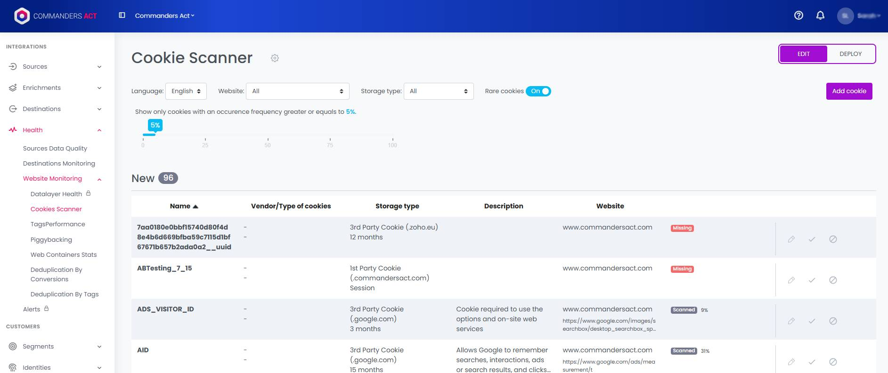

# Cookie Scanner

## Overview

<figure><figcaption></figcaption></figure>

Commanders Act offers a cookie scanner that continuously monitors websites for cookies in real time. The scanner has access to a database of common analytics and marketing cookies and can therefore provide ready to use descriptions and information. This cookie information can be used to install a dynamic cookie notice on the website that provides transparent information about the used cookies and their purpose to visitors.

## Activation

Simply follow these 3 steps to enjoy this feature on your account:

1-Cookie Scanner is an optional module. Only a Commanders Act consultant (or support team) can activate it. So the first step will be to ask to our team to activate the feature on your Commanders Act site.&#x20;

2-Declare the domains that you need to be scanned with the Cookie Scanner\
`Data Governance > Consent Management > Settings > Cookie Scanner Domains`

<figure><figcaption></figcaption></figure>

3-Regenerate and Deploy your privacy banner(s)

## Scan Cookies

### Mechanisms

Cookie scanner combines three mechanisms to identify cookies on websites:



Cookie Scanner uses a JavaScript tag that is directly deployed on the website (e.g. with Commanders Act TMS). The JavaScript tag scans cookies of website users in real time. This allows to identify cookies that are set in very specific scenarios e.g. it allows to identify cookies that are only set for a specific geolocation or behind a log-in form.

The tag also monitors the 3rd party domains the website communicates with (e.g. for an Analytics service). This information is used to infer 3rd party cookies via the cookie scanner cookie database.

JavaScript tags have limited access to cookie information—therefore cookie scanner enriches the information identified with the JavaScript tag with information received with the Chrome extension and cookie database.



Not all cookies are accessible to JavaScript tags. The [Commanders Act Assistant Chrome extension](https://chrome.google.com/webstore/detail/commanders-act-assistant/lfaifjhjdolnpnlgeohohaalbeidhlpj) has more technical capabilities to scan missing cookie information. To use the Chrome extension it just needs to be installed in an up to date Chrome browser. After that it starts scanning cookies while surfing the website. This provides a powerful mechanism to identify cookies in all areas of the website, no matter they require a log-in.

Commanders Act recommends to install the Chrome extension on multiple team members across different country teams to cover a wide range of use cases.&#x20;



Cookie Scanner uses a cookie database to enrich missing information that can not be identified with the tag and extension. For example it provides ready to use descriptions for common tracking and marketing cookies.&#x20;

Additionally the cookie database provides the tag with a mechanism to infer typical 3rd party cookies based on the communication of the website with 3rd party domains.



Some technical systems (like Drupal) create dynamic cookie names. Cookie Scanner therefore groups cookies when 5 or more cookies start with the same 4 characters. (e.g. abcd123, abcd2345, abcd3456, etc.)

### Cookie Types

Cookie scanner can scan following types of cookies:

| Cookie Type                   | Description                                                                                                              | Scanned with                                                      |
| ----------------------------- | ------------------------------------------------------------------------------------------------------------------------ | ----------------------------------------------------------------- |
| **1st Party Cookie**          | 1st party cookies are cookies that are stored on the domain of the website.                                              | <ul><li>Tag client-side</li><li>Chrome Extension</li></ul>        |
| **3rd Party Cookie**          | 3rd party cookies are cookies that are stored on a 3rd party domain.                                                     | <ul><li>Chrome Extension</li><li>Cookie Database</li></ul>        |
| **HttpOnly 1st Party Cookie** | HttpOnly 1st Party Cookie are server cookies that are stored on the domain of the website and that have a HttpOnly flag. | 

<ul><li>Tag client-side</li><li>Chrome Extension</li></ul> |
| **HttpOnly 3rd Party Cookie** | HttpOnly 3rd Party Cookie are server cookies that are stored on a 3rd party domain and that have a HttpOnly flag.        | 

<ul><li>Chrome Extension</li><li>Cookie Database</li></ul> |
| **Local Storage**             | localStorage is a JavaScript accessible browser storage.                                                                 | <ul><li>Tag client-side</li><li>Chrome Extension</li></ul>        |
| **Session Storage**           | sessionStorage is a JavaScript accessible session based browser storage.                                                 | 

<ul><li>Tag client-side</li><li>Chrome Extension</li></ul> |

### Cookie Fields

Cookie Scanner scans following fields per cookie:

| **Name**             | 
Name of cookie e.g. _ga *In case of multiple (more than 3) cookies with common pattern, they re grouped by patterns
                                                                                                                                                                                                                                                                                                                                                                                                                                                                                                                                                                                                                                                                                                                          | <ul><li>Tag client-side</li><li>Chrome Extension</li></ul>                         |
| -------------------- | ------------------------------------------------------------------------------------------------------------------------------------------------------------------------------------------------------------------------------------------------------------------------------------------------------------------------------------------------------------------------------------------------------------------------------------------------------------------------------------------------------------------------------------------------------------------------------------------------------------------------------------------------------------------------------------------------------------------------------------------------------------------------------------------------------------------------------------------------------ | ---------------------------------------------------------------------------------- |
| **Vendor**           | Name of the vendor that uses the cookie e.g. Google                                                                                                                                                                                                                                                                                                                                                                                                                                                                                                                                                                                                                                                                                                                                                                                                    | <ul><li>Cookie Database</li></ul>                                                  |
| **Category**         | Category of the cookie that give a high level information on the purpose of the cookie e.g. Technical Cookie                                                                                                                                                                                                                                                                                                                                                                                                                                                                                                                                                                                                                                                                                                                                           | 

<ul><li>Cookie Database</li></ul>                                           |
| **Storage Location** | 
Storage location of the cookie (combination of cookie type and storage domain). It has one of the following values:

<ul><li>1st Party Cookie (<a href="http://www.example.de/">www.example.de</a>)</li><li>3rd Party Cookie (www.example.de)</li><li>HttpOnly 1st Party Cookie (<a href="http://www.example.de/">www.example.de</a>)</li><li>HttpOnly 3rd Party Cookie (<a href="http://www.example.de/">www.example.de</a>)</li><li>localStorage (<a href="http://www.example.de/">www.example.de</a>)</li><li>sessionStorage (<a href="http://www.example.de/">www.example.de</a>)</li></ul>
The domain in brackets is the domain where the cookie is stored. For 1st party cookies it is the domain or subdomain of the website. For 3rd party cookies it is a 3rd party domain or subdomain that is different from the website.
 | <ul><li>Tag client-side</li><li>Chrome Extension</li></ul>                         |
| **Storage Duration** | 
Storage duration of the cookie. An algorithm is used to smoothen technical inaccuracies and to optimise readability for users:

<ul><li>For Session Cookies it displays "Session"</li><li>Under 1 month it displays in days, e.g. "7 days"</li><li>Above 1 month it displays in month, e.g. "13 months"</li><li>Above 36 month it displays  in years, e.g. "5 years".</li><li>Above 100 years it displays “Unlimited”</li></ul>
Local storage always has duration "Unlimited" and session storage always has duration "Session".
                                                                                                                                                                                                                                                                                                     | <ul><li>Tag client-side</li><li>Chrome Extension</li><li>Cookie Database</li></ul> |
| **Description**      | Description for what the cookie is used, e.g. “Base64 UUID used to identify users on this website to optimise usage across sessions. Used on all pages.”                                                                                                                                                                                                                                                                                                                                                                                                                                                                                                                                                                                                                                                                                               | <ul><li>Cookie Database</li></ul>                                                  |
| **Website**          | 
Domain(s) of the website(s) the cookie is scanned. For 1st party cookies, the full URL of the latest scan is also displayed
                                                                                                                                                                                                                                                                                                                                                                                                                                                                                                                                                                                                                                                                                                                  | 

<ul><li>Tag client-side</li><li>Chrome Extension</li></ul>                  |


Cookie scanner doesn't store cookie's values


## Manage Cookie Information

`Health > Website Monitoring > Cookie Scanner > EDIT (Tab)`

In the edit step of the cookie notice it is possible to investigate, edit and enrich cookie information.

### Sections

All identified cookies are listed in three groups:

1. **New** lists new Cookies that have not yet been manually investigated
2. **Active** lists Cookies that should be shown in the cookie notice
3. **Ignored** lists (internal) Cookies that should not be shown in the cookie notice

### Edit Cookie Information

It is possible to edit the information of each cookie by pressing the `Pen` icon to the right on the table. This will open a cookie dialogue with following options:

| Option               | Description                                                                                                                                                                                                                                                                                             |
| -------------------- | ------------------------------------------------------------------------------------------------------------------------------------------------------------------------------------------------------------------------------------------------------------------------------------------------------- |
| **Name**             | The name of the cookie can not be edited.                                                                                                                                                                                                                                                               |
| **Vendor**           | Dropdown menu that allows to map the cookie to a Commanders Act vendor managed under `Data Governance > Consent Management > Vendors`.                                                                                                                                                                  |
| **Vendor Label**     | Defines the name of the cookie vendor listed on the cookie notice.                                                                                                                                                                                                                                      |
| **Vendor URL**       | A URL of the vendor that is used in the cookie notice. This allows customers to click the name of the vendor.                                                                                                                                                                                           |
| **Category**         | Dropdown menu that allows to map the cookie to a Commanders Act category managed under `Data Governance > Consent Management > Categories`.                                                                                                                                                             |
| **Category Label**   | Defines the name of the cookie category listed on the cookie notice.                                                                                                                                                                                                                                    |
| **Storage Type**     | One of the storage types listed under Cookie Fields.                                                                                                                                                                                                                                                    |
| **Storage Domain**   | The domain where the cookie is stored.                                                                                                                                                                                                                                                                  |
| **Storage Duration** | The duration the cookie is valid on users browsers.                                                                                                                                                                                                                                                     |
| **Description**      | A description of the cookie. If possible this field is automatically filled from the cookie database. In case it is overwritten the description is not anymore synced with the cookie database. Clicking the `Reset Default` button will re-sync the description with the cookie database descriptions. |
| **Custom Fields**    | All custom fields created in the cookie scanner options.                                                                                                                                                                                                                                                |

### Create Custom Cookie

It is possible to add custom cookies by pressing the `ADD COOKIE` button on the top right of the interface. This will open a cookie dialogue that has the same fields as the edit cookie information dialogue. Additionally it has a `Name` field that allows to set the name of the custom cookie.

### Activate, Deactivate or Delete Cookies

New cookies and inactive cookies can be activated via the `Checkmark` icon. This adds them to the Active cookies list.

Active cookies and be deactivated by clicking the `Stop sign` icon. This adds them to the Inactive cookies list.

Inactive cookies can be deleted with the `Trash can` icon. This removes the cookie from the list entirely.&#x20;


Cookies that should not be shown in the cookie notice should be kept in the inactive list and not deleted. Otherwise they will re-appear as soon as the cookie scanner identifies them again.


### Localize Cookie Information


Localisation is not available yet.


It is possible to localize cookie information. This allows to translate important information of each cookie for the cookie notice that can be embedded on a website.

To localize cookie information it is first necessary to select supported languages. To select supported languages go to `Data Governance > Consent Management > Settings` and select the country codes of the languages the cookie notice should be made available in. It is recommended to select country codes from the dropdown menu, but it is also possible to add custom country codes. Cookie Scanner offers automatic translation of predefined information for common languages (EN, FR, DE, IT).

After selecting the needed country codes the cookie information can be translated in the `EDIT` step of the interface. To translate a cookie click the `Pen` icon to open the edit modal. There it is possible to select a country code via a dropdown. Then adjust the setting the fields to translate them.  You can preview the cookie list in a specific language by using the country code dropdown in the top right of the interface.&#x20;

Following fields support localisation:

* Vendor Label
* Category Label
* Description
* Custom Fields

### Labels

The cookie list displays optional labels for each cookie in the cookie list to inform about important information and notifications.

| Label                  | Description                                                                                                                 |
| ---------------------- | --------------------------------------------------------------------------------------------------------------------------- |
| **Inferred**           | The cookie was not identified directly, but inferred via the cookie database. It might be a false positive.                 |
| **Missing**            | The cookie was not scanned for over one month. It might not be in active use anymore.                                       |
| **Custom**             | The cookie was manually created.                                                                                            |
| **Set before consent** | The cookie is set before a customer provides consent via Commanders Act CMP. This can be intentional for essential cookies. |

### Occurrence frequency

For all types of cookies & storage you can visualize the percentage of detection frequency

<figure><figcaption></figcaption></figure>

## Manage Cookie Notice

`Health > Website Monitoring > Cookie Scanner > DEPLOY (Tab)`

The `DEPLOY (Tab)` interface is used to install, create and deploy a cookie notice on a website. It provides a versioned list of cookie notices that were created within the account.

### Install Cookie Notice

After all cookie information was setup in the `EDIT (Tab)` it is possible to install the cookie notice on a website. The cookie notice is available in 3 versions:

#### 1. Javascript snippet

Copy/past the js code on your legal page to automatically build the cookies list table.

<figure><figcaption></figcaption></figure>

#### 2. HTML Table

The HTML table is the recommended way to install a dynamic cookie notice on websites.&#x20;

For this it is recommended to setup both a JavaScript tag (e.g. tag template 'TRUST | Install Cookie Notice' in TagCommander) and a placeholder `
` on the website (e.g. in the Content Management System). The placeholder is a slot where the table should be inserted and the tag loads the table and inserts it into the slot.&#x20;

Both the `
` and the tag need to be configured with a common `id`. e.g. in case the placeholder `
` has following id: `

` it is necessary to set the parameter `#PLACEHOLDER_DIV_ID#` of the tag template `TRUST | Install Cookie Notice` to `ca-slot--cookie-notice` .

**Endpoint of the HTML file:**

`https://cdn.tagcommander.com/cookie-scanner/<site_id>/v1/cookies-<language_code>.html`

**site\_id:** Commanders Act site ID (e.g. `1234`).

**language\_code:** Language of the cookie notice (e.g. `fr`, default language is `en`).


The HTML table uses semantic and accessible table HTML. This ensures that the table uses the default styling of your website. The style of the table can be directly adjusted with the CSS of the website. In case you need help styling you can reach out to your Commanders Act consultant.


#### 3. JSON API

The JSON API provides a method to install a cookie notice for advanced use cases. It provides all cookie information in a structured data format that can be used by technical users to create custom functionalities. The JSON API can e.g. be used to inject a custom cookie notice into a native App.

**Endpoint of the json file:**

`https://cdn.tagcommander.com/cookie-scanner/<site_id>/v1/cookies-<language_code>.json`

**site\_id:** Commanders Act site ID (e.g. `1234`).

**language\_code:** Language of the cookie notice (e.g. `fr`, default language is `en`).

### Create Cookie Notice Version

Before it is possible to deploy updates to the cookie notice it is necessary to create a new version. To create a new cookie notice version click the `NEW VERSION` button on the top right of the interface. This will take all cookies in the Active list of the `EDIT (Tab)` to create the cookie notice. In the new version dialogue it is possible to provide a comment that explains changes in the new version for internal reference.

### Preview Cookie Notice Version

The `Play` button to the right of a cookie notice version can be used to preview a cookie notice. This will not apply any styling of the website so the look will differ compared to the cookie notice on the website.

### Export Cookie Notice Version

A `Down Arrow` button is available for each cookie notice version. It allows to download the cookie notice in all localisations in `HTML`, `JSON`, `CSV` and `XSLX` format. In the `XSLX` one tab is included per language. For all other formats a `ZIP` will be provided that includes one file per language.

<figure><figcaption></figcaption></figure>

### Deploy Cookie Notice Version

The `DEPLOY` button to the right of each cookie notice version can be used to deploy a cookie notice to the website. This allows to deploy new versions, but allows to roll back to older version in case of issues.

## Options

### Custom Fields

Cookie Scanners allows to add custom fields to provide additional details per cookie. These fields can be added inside of the feature settings accessible via the `Gear` icon. It is possible to re-arrange the fields by changing their order via drag and drop.

<figure><figcaption></figcaption></figure>

### Filters

You can filter your cookie's list by host (website), language and storage type (1st party, 3rd party, local storage, session storage)

<figure><figcaption></figcaption></figure>

If you select 3rd party type, you will obtain an additional filter to view cookies from a specific domain:

<figure><figcaption></figcaption></figure>

### Rare cookies filter

By default, the rare cookies (scanned on less than 5% of pages) are now excluded from your list. \
Use the cursor to manage the scanner's tolerance. \
If it is positioned on 10%, the list will displays only the cookies scanned more often than 9.9%. \
You can modify this value, it's up to you!

<figure><figcaption></figcaption></figure>

## User Rights


User Rights for Cookie Scanner are not yet available.


Cookie Scanner offers following user rights:

| User Right                     | Description                                                         |
| ------------------------------ | ------------------------------------------------------------------- |
| View Cookie List               | User can see the cookie list.                                       |
| Manage Cookie List             | User can edit the cookie list and create custom cookies.            |
| Generate Cookie Notice         | User can view the Deploy Step and generate a cookie notice version. |
| Deploy Cookie Notice           | User can deploy cookie notice versions.                             |
| Manage Cookie Scanner Settings | User can adjust cookie scanner settings (e.g. custom fields).       |
