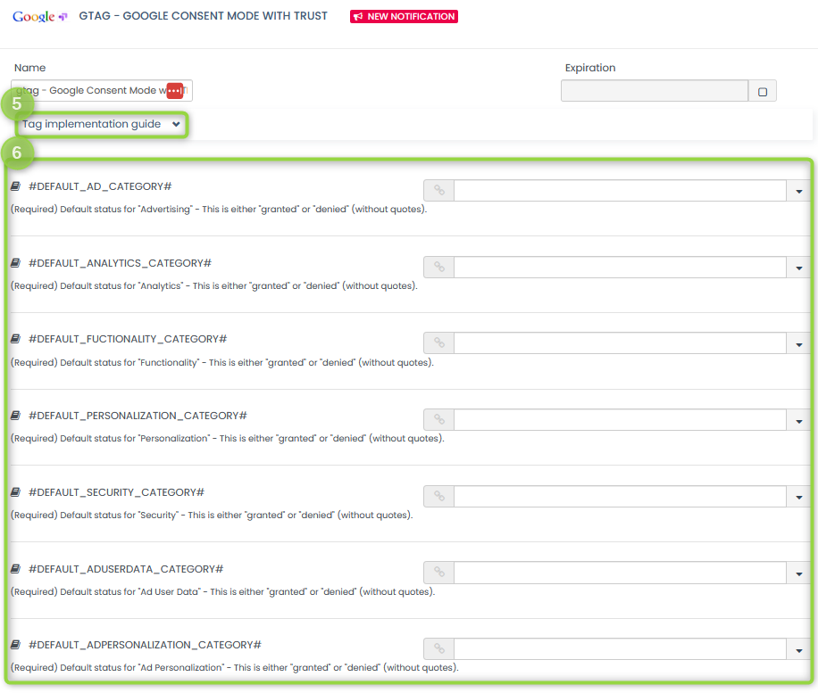

# Consent Mode in Commanders Act TMS

Commanders Act provides a tag template to manage the "[Consent Mode](https://developers.google.com/tag-platform/devguides/consent)" in Commanders Act TMS.\
This seamless integration takes advantage of our [Commanders Act OnSite API](../../onsite-api/).&#x20;

## Setup

Summarizing all recommended steps:

1. Access your [Commanders Act account](https://platform.commandersact.com/).
2. Add our tag template.
3. Configure your tag and rules.
4. Configure your third-party vendor tags in GTM.
5. Test and deploy your container(s).

## Add our tag template

From the "**INTEGRATIONS**" side menu, expand`(1)`"**Sources**" and select `(2)`"**Web containers**".

<figure><figcaption>
Select "Sources" and "Web containers".
</figcaption></figure>

Select a "Web" container and, from the step `(3)`"**SELECT**" (or "EDIT"), click on `(4)`"**Add Tag(s)**".

<figure><figcaption>
Click on "Add Tag(s)".
</figcaption></figure>

Search for the tag "**gtag - Google Consent Mode with TRUST (BETA)**" to add it and proceed with its configuration.

<figure><figcaption>
Add the tag "gtag - Google Consent Mode with TRUST (BETA)".
</figcaption></figure>

## Configure your tag and rules

You can now configure your tag and check the `(5)` "**Tag Implementation guide**" for more details.\
See `(6)` **each field** for detailed information on how you can map these fields with your data layer.

<figure><figcaption>
Configure each field as needed.
</figcaption></figure>

Under "**RULES**", select `(7)` "**Do Not Include In Privacy Scope**" as privacy category or select a category that is always ON.

<figure><figcaption>
Select "Do Not Include in Privacy Scope".
</figcaption></figure>


If your website adopts virtual pages, you need to add a trigger for when these pages are loaded. This can be done under the top section "TRIGGER(S)".&#x20;



You can skip the following steps, completing your configuration, if you don't have any third-party vendor tags hosted in GTM.


To ensure that the consent is correctly managed by GTM with third-party vendor tags, we strongly recommend to enable reactive events by configuring the related fields.

<figure><figcaption>
Configure reactive events.
</figcaption></figure>

## Configure your third-party vendor tags in GTM

While Google native product tags, such as "Google Analytics" or "Google Ads" ones, work out of the box, third-party vendor tags, hosted in GTM, require additional settings to properly operate with the user consent. First, open your tag configuration and check under the `(8)` "**Advanced Settings**" → `(9)`"**Consent Settings**" if a consent type (E.g. "_ad\_storage_") is already preconfigured: if not, you need to add it by selecting the option `(10)` "**Require additional consent for tag to fire**" and `(11)` input the consent type(s) you want to include.

<figure><figcaption>
Tag specific "Consent Settings" in GTM.
</figcaption></figure>

Then, you need to configure its triggers and this is where we're going to use our reactive events we prepared in the previous section ([#configure-your-tag-and-rules](consent-mode-in-commanders-act-tms.md#configure-your-tag-and-rules "mention")). Locate the "Triggering" area in your tag configuration and add a [Trigger Group](https://support.google.com/tagmanager/answer/9164222?hl=en).

<figure><figcaption>
Part 1: configure a "Trigger Group".
</figcaption></figure>

In the trigger group add `(12)`any preexisting triggers and `(13)`a trigger named as your configured reactive event.

<figure><figcaption>
Part 2: configure a "Trigger Group".
</figcaption></figure>

The latter has to be configured as a `(14)`"**Custom Event**" with the same `(15)`"**Event Name**" you used in the previous section ([#configure-your-tag-and-rules](consent-mode-in-commanders-act-tms.md#configure-your-tag-and-rules "mention")) and it has to fire on `(16)`"**All Custom Events**".

<figure><figcaption>
Part 3: configure a "Trigger Group".
</figcaption></figure>

This completes your configuration. You can now start the testing phase, leading to the final deployment in production. Learn more on how you can configure and run tests with your tags in GTM by checking the section "[**Consent configuration**](https://support.google.com/tagmanager/answer/10718549/?hl=en-GB)" in the "[**Help Center**](https://support.google.com/tagmanager/)".
