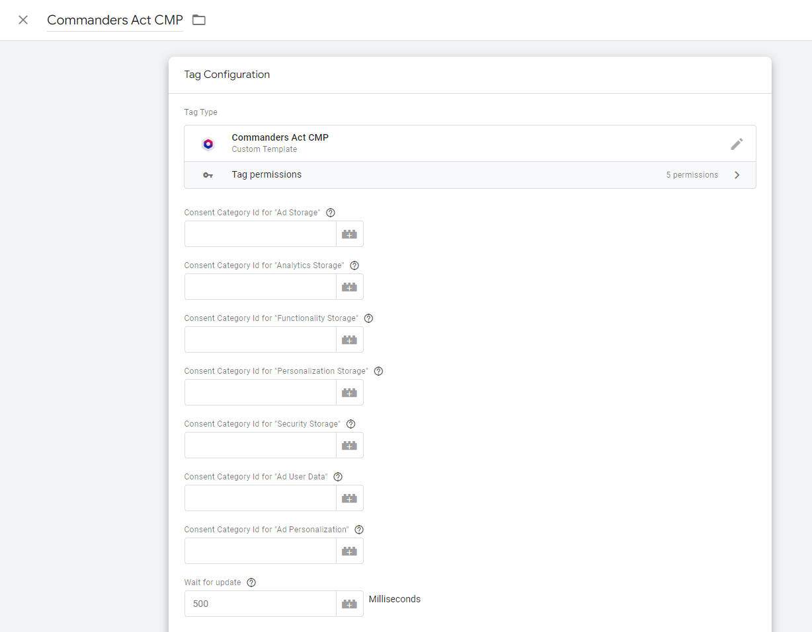
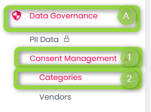
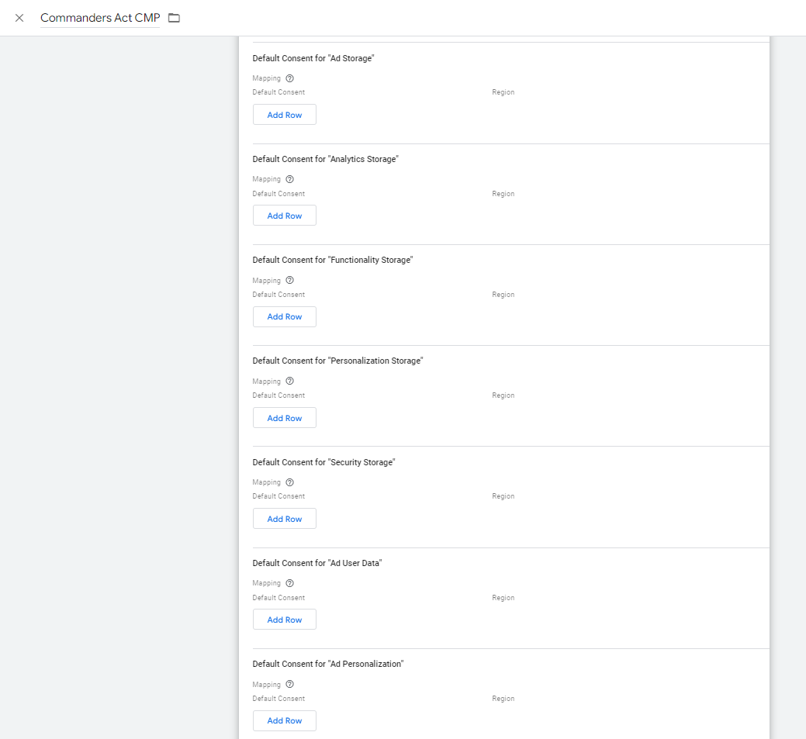
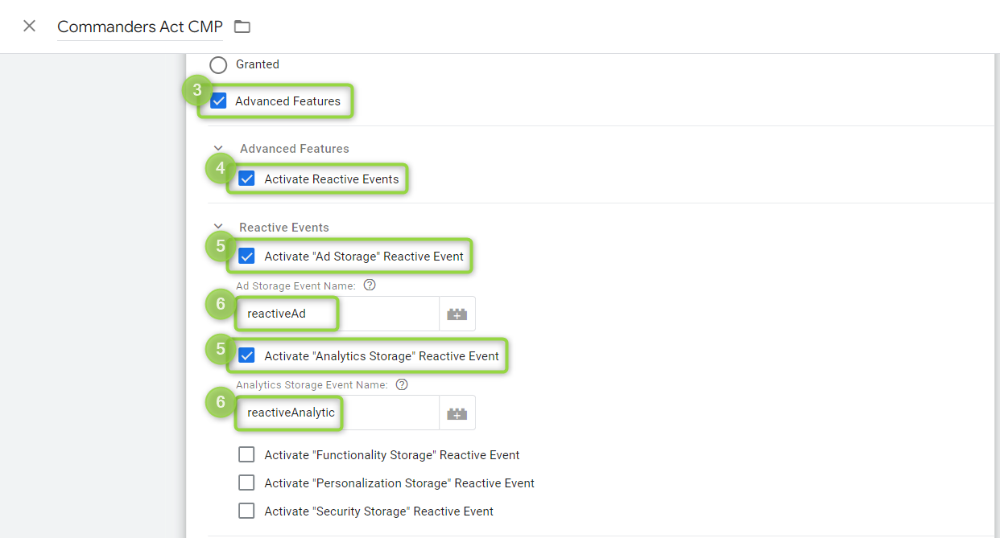
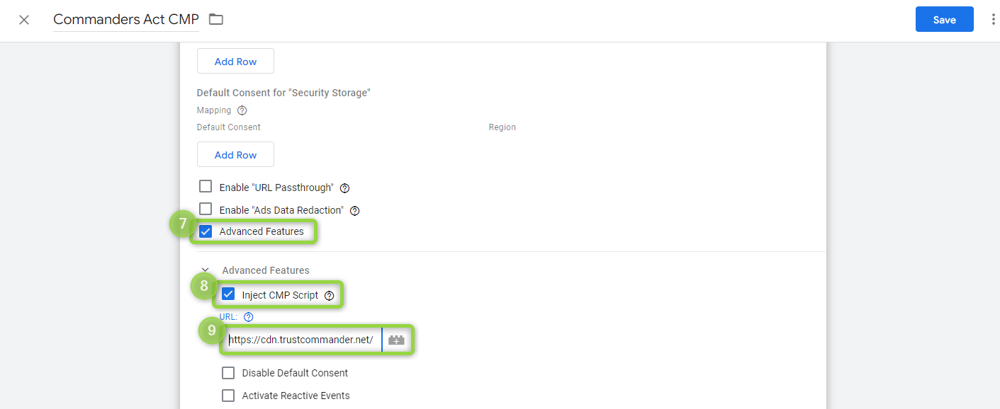
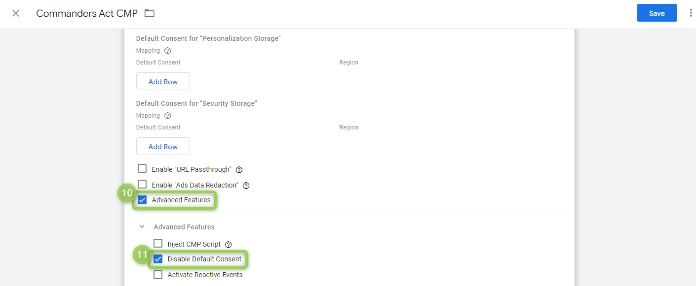
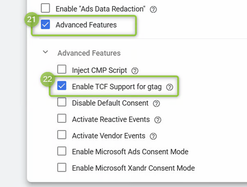

# Google Tag Manager (GTM) - Consent Mode

Commanders Act provides a tag template to manage the "[Consent Mode](https://developers.google.com/tag-platform/devguides/consent)" in Google Tag Manager.\
This seamless integration takes advantage of our Commanders Act OnSite API.


Please note: Google only requires a validated consent signal only for EEA countries and UK.

Implementing Google Consent Mode in regions beyond may negatively impact campaign performance and is not recommended.


## Setup

Summarizing all recommended steps:

1. Access [GTM](https://tagmanager.google.com/).
2. Select your "Web" type container.
3. Add our tag template from the "[Community Template Gallery](https://tagmanager.google.com/gallery/#/owners/TagCommander/templates/GTM-OnSite-API)".
4. Configure the related tag and its trigger.
5. Configure your third-party vendor tags.
6. Enable TCF Support for gtag.&#x20;
7. Test and deploy your container.

## Configure the related tag and its trigger

Following the above steps, adding our template "[**Commanders Act CMP**](https://tagmanager.google.com/gallery/#/owners/TagCommander/templates/GTM-OnSite-API)" from the Google "Community Template Gallery", you're presented with the following "**Tag Configuration**" which is the core area where you can manage your consent needs with GTM:

<figure><figcaption>
The "Commanders Act CMP" configuration in GTM.
</figcaption></figure>

First, you need to input your consent category identifiers for the following **7 categories**: `Ad Storage`, `Analytics Storage`, `Functionality Storage`, `Personalization Storage`, `Security Storage`, `Ad User Data` and `Ad Personalization`. You can define/find these identifiers by logging in to our platform and follow the section:\
`(A)`"**Data Governance**" → `(1)`"**Consent Management**" → `(2)`"**Categories**".

<figure><figcaption>
Define/find your category identifiers.
</figcaption></figure>

Your identifiers are shown between round parentheses (see highlighted in green below):\\

<figure><figcaption></figcaption></figure>


If you have sub-categories with the same scope of the five defined by Google, you need to use their ids instead of the main category ones. You can also rename your categories or change their ids by checking the subsection "[**Managing categories**](https://community.commandersact.com/trustcommander/user-guides/categories-and-tags/manage-categories#managing-categories)".


If your CMP loads asynchronously, it might not always run before your GTM container. That’s why you have the option to set a "**Wait for update**" value in milliseconds to control how long to wait before data is sent. This field is optional and its default value is 0. In case you need to set it, we recommend starting from the base value of 500 milliseconds.

You also need to set the default status, for each of the 7 categories, before users interact with your [**privacy banner**](https://community.commandersact.com/trustcommander/user-guides/privacy-banners) and taking into account region-specific behavior. This is done by clicking the "Add Row" button and selecting either "Denied" or "Granted" to match with your input regions and/or sub-regions.


Ensure that your default command accounts for regional variations in your consent strategy. For more information on customizing the default command, you can see Google’s documentation [here](https://developers.google.com/tag-platform/devguides/consent#region-specific_behavior).


<figure><figcaption>
Select your default status for each category and by region and sub-region.
</figcaption></figure>

To make sure that the consent is correctly managed by GTM with third-party vendor tags, we strongly recommend to enable reactive events. Turn on the `(3)` "**Advanced Features**", `(4)` "**Activate Reactive Events**" and `(5)` "**Activate \[Storage-Name] Reactive Event**" for each \[Storage Name] you're using. Finally, enter their `(6)` "**Event Name**". These events will be used in the next section when configuring your third-party vendor tags.

<figure><figcaption>
Reactive events activation under "Advanced Features".
</figcaption></figure>

You also have the option to directly inject your CMP script by turning on the `(7)` "**Advanced Features**", `(8)` "**Inject CMP Script**" and input your `(9)` "**URL**".

<figure><figcaption>
Inject your script directly using this template.
</figcaption></figure>

Disabling the default consent may come handy when you don't want to use the Consent Mode.\
This is done by turning on the `(10)` "**Advanced Features**" and `(11)` "**Disable Default Consent**".

<figure><figcaption>
Disable the "Default Consent".
</figcaption></figure>

As the last step, you need to select the "Consent Initialization - All Pages" trigger in the "**Triggering**" lower area:

<figure><figcaption>
Select "Consent Initialization - All Pages" as trigger.
</figcaption></figure>

#### Modify Permissions

If your banner is hosted on your servers (on premise) or if you use our [CDN 1st party feature](../../../../configure/administration/domain-management/), then you need to update the Permissions of the template.

Simply add your host URL in the tab "Injects scripts" (see block "allowed patterns").

<figure><figcaption></figcaption></figure>

## Configure your third-party vendor tags

Third-party vendor tags require additional settings to properly operate with the user consent. First, open your tag configuration and check under the `(12)` "**Advanced Settings**" and `(13)`"**Consent Settings**" if a consent type (E.g. "_ad\_storage_") is already preconfigured, if not you need to add it by selecting the option `(14)` "**Require additional consent for tag to fire**" and `(15)` input the consent type(s) you want to include.

<figure><figcaption></figcaption></figure>

Then, you need to configure its triggers and this is where we're going to use our reactive events we prepared in the previous section. Locate the "**Triggering**" area in your tag configuration and add a "[**Trigger Group**](https://support.google.com/tagmanager/answer/9164222?hl=en)".

<figure><figcaption></figcaption></figure>

In the trigger group add `(16)` any preexisting triggers and `(17)`a trigger named as your configured reactive event.

<figure><figcaption></figcaption></figure>

The latter has to be configured as a `(18)`"**Custom Event**" with the same `(19)`"**Event Name**" you used in the previous section and it has to fire on `(20)`"**All Custom Events**".

<figure><figcaption></figcaption></figure>

This completes your configuration. You can now start the testing phase, leading to the final deployment in production. Learn more on how you can configure and run tests with your tags in GTM by checking the section "[**Consent configuration**](https://support.google.com/tagmanager/answer/10718549/?hl=en-GB)" in the "[**Help Center**](https://support.google.com/tagmanager/)". You can also read the page [Consent Mode setup](https://developers.google.com/tag-platform/security/guides/consent) provided by Google for Developers


Look our ["Test your configuration"](https://doc.commandersact.com/features/consent-management/setup-guides/tag-manager/google-consent-mode-in-commanders-act-tms#test-your-configuration) page for debbuging hints!



Regarding the configuration of your workspace on the Commanders Act platform, there is no need to activate anything special for Consent Mode. Everything is managed via Google Tag Manager.\
However, you must add the following URL to the privacy centre of your CMP:\
[https://business.safety.google/privacy/](https://business.safety.google/privacy/)\
**This is a legal requirement.**


## Enable TCF Support for gtag


Check [Google Ads integration with the IAB Transparency & Consent Framework (TCF)](https://support.google.com/google-ads/answer/10021549?hl=en) for more details on how you can set up the IAB Transparency and TCF Framework.


You can enable TCF support with your Google Ads tags under `(21)` "**Advanced Features**" by flagging `(22)` "**Enable TCF Support for gtag**".

