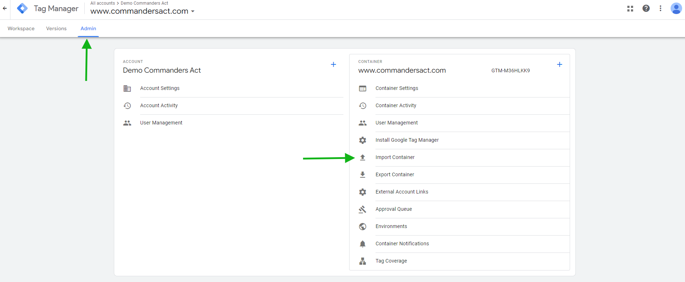
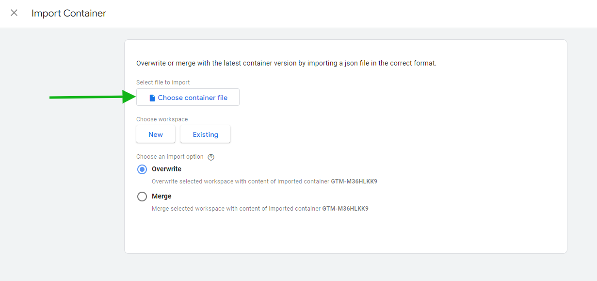
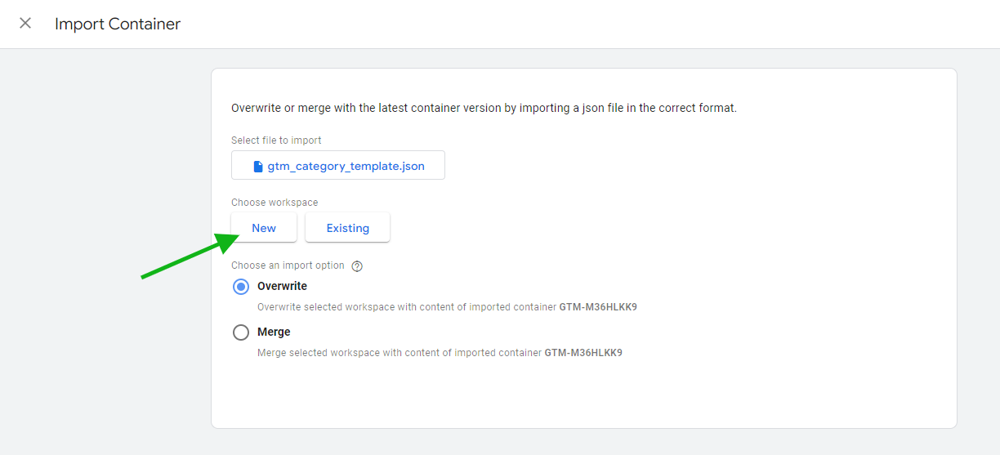
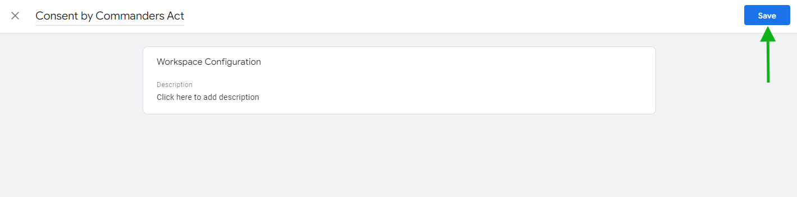
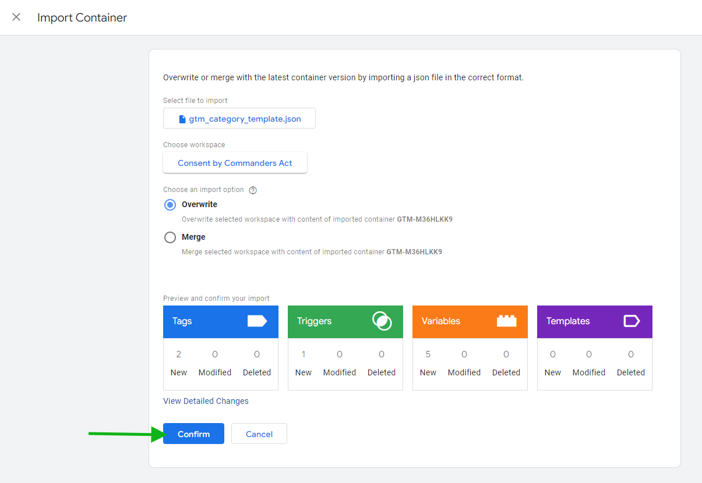
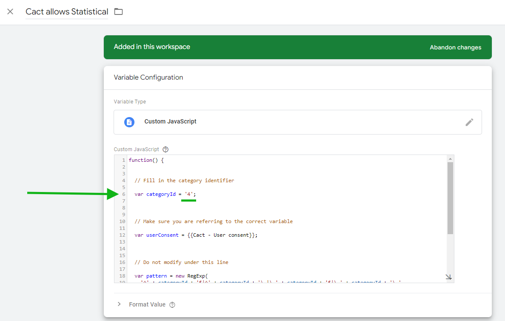
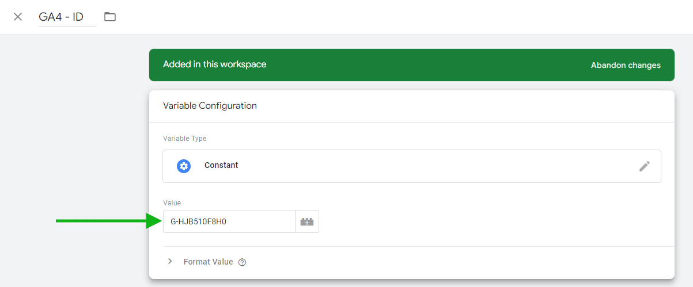
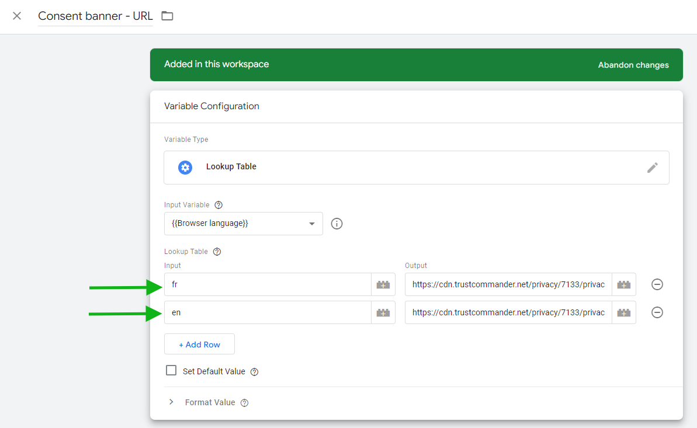

# Google Tag Manager (GTM)

### Introduction

In this section, you will find a complete guide to integrate Commanders Act Consent banners in your Google Tag Manager

Enclosed you'll find two sample configuration files, a very simple setup that you'll need to reproduce you'll need to reproduce on your site. The first and most common configuration is the gtm\_category\_template.json, a category-based configuration (example with only 1 category). The other possibility is a vendor-based configuration, with only the Cact allows Statistical variable changing in gtm\_partner\_template..json.





### Getting Started

1. &#x20;In GTM, create a new account so as not to overwrite your current configuration.
2. In this new test account, go to Admin, then on the right side of the screen click on Import Container and select the file attachment gtm\_category\_template.json

<figure><figcaption></figcaption></figure>

<figure><figcaption></figcaption></figure>

<figure><figcaption></figcaption></figure>

<figure><figcaption></figcaption></figure>

<figure><figcaption></figcaption></figure>

3. Observe the configuration to constrain a simple Google Analytics page view tag

### Added elements

<figure><figcaption></figcaption></figure>

### Understand and personalize the json

#### Tags

1. **"Google Analytics Page view"** is only a basic tag example, "Cact consent given Statistical" trigger is applied on
2. **"Consent Cact - Start"** tag refers to the "Consent Banner - URL" variable, and is the tag that "activates" the privacy module\* and is the only tag that will be triggered with a simple All pages trigger. **All other tags must have a trigger that includes the user's consent.** \
   \
   \*if you need more information about setup of your Consent banner, you can read our [Consent management starter kit](https://community.commandersact.com/customer-success/starter-kit/consent-management) documentation)

#### Trigger

**"Cact consent given Statistical"** which triggers the page view tag as soon as the user has given consent on a first visit. consent has been given by the user on a first visit. The page view hit from consent pushes a tcConsentChanged event in GTM's dataLayer for each interaction with the privacy module

| Field                     | Value                                                                |
| ------------------------- | -------------------------------------------------------------------- |
| **Trigger name**          | **Cact consent given Statistical**                                   |
| **Trigger Type**          | CUSTOM\_EVENT                                                        |
| **Event name**            | Cact allows Statistical                                              |
| **This trigger fires on** | When the user interact with the consent banner and on each page view |

#### Tips about trigger

"Cact consent given Statistical" is an arbitrary name, you can call it "Consent on page view for Analytics" or "Consent Analytics".&#x20;

It is dedicated to a specific category, you will need to create "Cact on page view Advertising" and/or "Consent on page view Functional" for example, depending on your needs.&#x20;

"Cact consent given Statistical" should also be reproduced and adapted for your other categories and coupled with custom triggers

#### Configuration example

<figure><figcaption></figcaption></figure>

The trigger should therefore refer to the variable for its category and trigger the associated tag if it returns "allowed"

#### Variables

1. **"Cact - User consent"**: will return different values, depending of user consent choice (no\_consent, optout, all\_consent or the list of consent categories IDs accepted by the user)
2. **"Cact allows Statistical"**:  return "allowed" or "refused", depending of the choice of the user\
   _\*Don't forget to personalize the ID with the value of your own setup on the Commanders Act Platform_

<figure><figcaption></figcaption></figure>

3. **"GA4 - ID"**: Change this value by your own GA4 - ID

<figure><figcaption></figcaption></figure>

4. **"Browser language"**: will detect the browser language, **do not modify this variable**. It will be helpful if you have a multi-language website
5. **"Consent banner - URL"**: to be personalized with the your Consent banners url.\
   To obtain your privacy banner url, go on the page `Sources > Privacy banners > Deploy` \
   You can also have a look on [this page](https://doc.commandersact.com/features/consent-management/user-guides/privacy-banners/deploy-banner) for more information

<figure><figcaption></figcaption></figure>


To make your tags are submitted to user consent, you need to verify consent in each of your triggers

