# Facebook Conversions API

[Facebook ](https://www.facebook.com/)is an online social media and social networking service owned by [Meta](https://www.meta.com).\
This destination allows you to push every kind of event directly to Facebook through API: by sending online and offline conversions to you can increase the reach and accuracy of your campaigns.

You can, for example, not send campaigns related to a specific product to users who already bought it, or you can also send campaigns to users who bought a specific product in cross-sell logic.

## How to send events to Facebook?

Facebook developed an API called 'Facebook Conversions API' [https://developers.facebook.com/docs/marketing-api/conversions-api](https://developers.facebook.com/docs/marketing-api/conversions-api)

You need a Facebook Business Manager account [https://business.facebook.com/](https://business.facebook.com/)

Then on the menu, click on 'Events Manager':

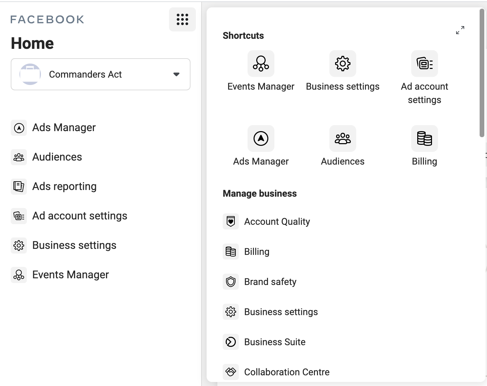

Here you have to create a new Web Pixel:

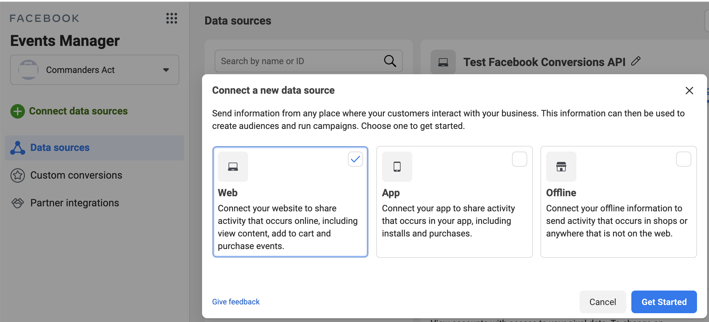

Select Conversions API and give a name to your connection:

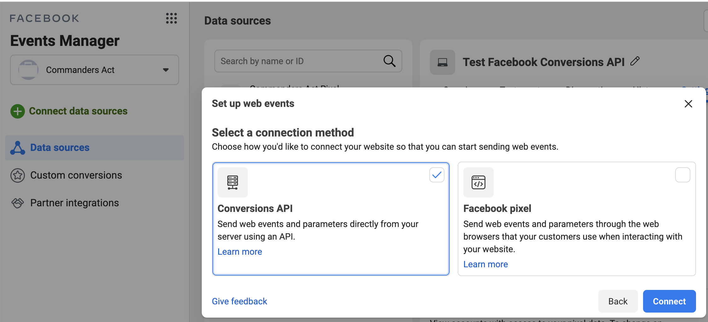

Now your pixel is created and you will have access to the IDs needed on our connector.

## Where can I find the Pixel ID?

You need to fill the pixel ID on our connector, it is the ID of the pixel you just created on steps above.

You can find this ID when you click on the pixel's name and on the right of the graph activities. You can find it also on the settings tab.

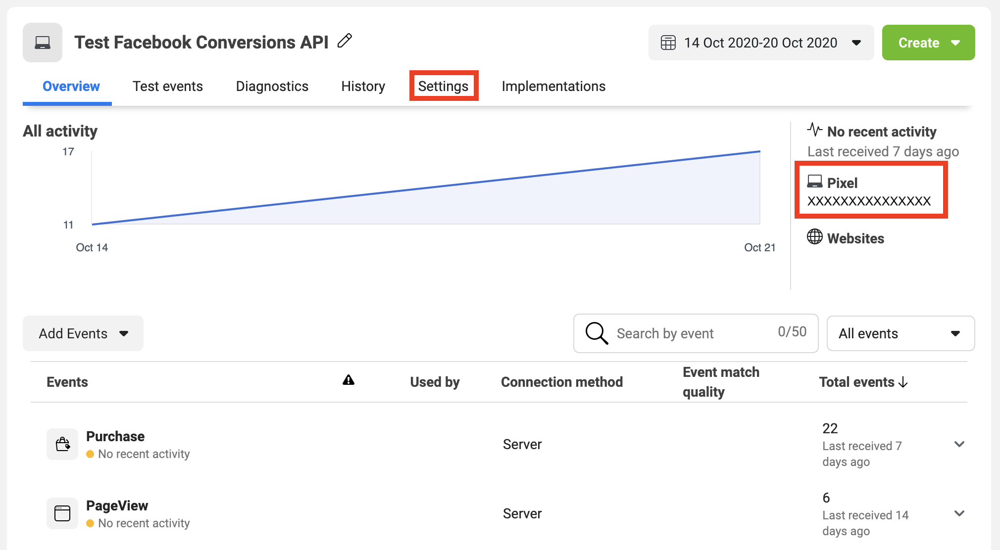

You can now copy and paste this ID on our connector.

Then you need the Access Token

## Where can I find the access token?

You can set your access token in two ways:

1. Facebook Login For Business Authentication
2. Generate a long-lived token


If you configure both, the "Facebook Login For Business Authentication" will be prioritized.


### Facebook Login For Business Authentication


This is the recommended authentication method.


1. In [your Commanders Act account](https://app.commandersact.com/), access `(1) Administration` → `(2) Connector Credentials` or click the link `add a new account` in the destination settings.\
   \
   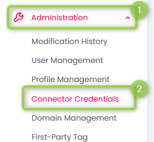\

2. Click `(3) Add connector credentials` on the top right:\
   \
   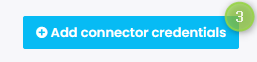\

3. Select `(4) Facebook Ads`\
   \
   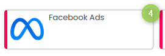\

4. Log in with your Facebook account credentials.
5. Go to your destination settings and select your added credentials in the drop-down menu under `(5) API Authentication` → `(6) Credentials`\
   \
   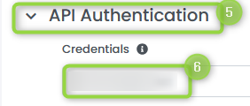
6. Save your destination settings.

### Generate a long-ived token

1. Go to [Meta Event Manager](https://www.facebook.com/events_manager2/)&#x20;
2. On the left menu, select `(1)` `Data sources` .

&#x20;   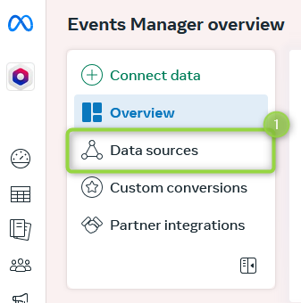

3. Locate your `(2)` existing dataset and select it or [create a new dataset](https://www.facebook.com/business/help/5818684664831465?id=490360542427371).&#x20;

&#x20;   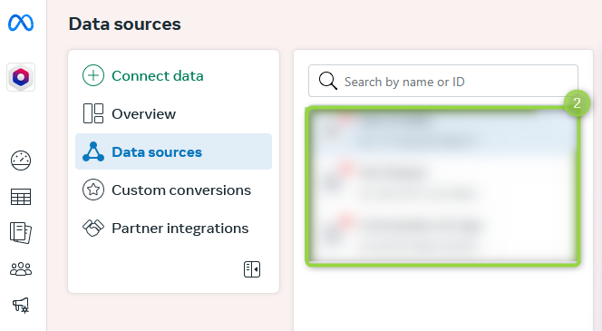

4. Click the tab `(3)` `Settings`

&#x20;   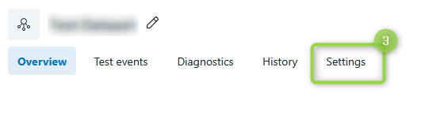

5. Locate the link `(4)` `Generate access token` and click it to generate an access token

&#x20;   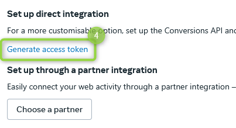


If you can't click the link "Generate access token" then you don't have the admin rights.


6. Copy and paste your access token into the field `API Access Token`  in your destination and save your destination settings.

## How to manage consents?

* Only events with a consent will be sent to Facebook
* Only conversions with personal information (email and/or phone number...) will be sent to Facebook

### For customers with our product TRUST Commander:

TRUST Commander is our Consent Management Platform. (More information: [https://www.commandersact.com/en/solutions/trustcommander/](https://www.commandersact.com/en/solutions/trustcommander/))

On the connector, the consent is managed with the field 'User Consent Category'. You should enter a category ID, the one corresponding to Facebook (advertising) on Trust consent categories.

### For customers without our product TRUST Commander:

We should distinguish 3 cases:

* Your online events are collected through our Commanders Act event's tag: You have to provide, in the event tags, the list of category ids consented by the user, through the `consent_categories` property.
* You are pushing your events to us through API or CSV file: a field `consent_categories` must be added on the JSON or CSV to precise the consent category IDs of the user. Then inside the connector setting, use the field 'User Consent Category' to enter a category ID, the one corresponding to Facebook (advertising)
*   You already manage consents on your side and you only send us, from your server,

    events that obtained the consent for the category advertising.\
    In this case, do not fill the field ‘User Consent Category’ in the connector.

## How the deduplication between the pixel and server is managed?

Using both the pixel and server is recommended per Facebook as it could avoid losing data.

To make it works, you should have the same configuration for both the pixel and server, using same Facebook parameters.


**event\_id** should be the same


On the pixel, _`event_id`_ is automatically generated by our Commanders Act Tag and we retrieve the same value for the server on `integrations.facebook.event_id`. As a result, these 2 values should be the same.\
&#xNAN;_`Event_name`_ should be the same also.

_`Fbp`_ parameter is automatically retrieved to keep the same value between pixel and server.

Deduplication works when the same event is sent _first_ from the browser and _then_ from the server, otherwise it creates a duplicate.\
Events are pushed in real-time.

### Examples

On pixel:

```
fbq('track', 'AddToCart', {
  value: #CARTVALUE#,
  currency: #CURRENCY#,
  contents: fb_addtocart_products,
  content_type: 'product'
}, { eventID: tC.uniqueEventId });
```

`eventID: tC.uniqueEventId` is automatically generated.

On server:

```
integrations.facebook.event_id
```

`integrations.facebook.event_id` automatically retrieves the eventID value coming from the pixel (`eventID: tC.uniqueEventId`) for standard events.

## Mappings to Facebook Standard Events

The _Facebook CAPI Destination_ will turn the _Commanders Act_ event like...

```json
{
  "event_name": "purchase",
  "id": "purchase_id_1234",
  "type": "online",
  "user": {
    "email": "user@example.com",
    "id": "user_example_id",
    "tcId": "202205231352367212315156",
    "consistent_anonymous_id": "202205231352367212315156",
    "consent_categories": [ "1", "2", "3", "4" ]
  }
  "value": 246.9,
  "currency": "EUR",
  "items": [
    {
      "product": {
        "id": "product123"
      },
      "price": "123.45",
      "id": "ET",
      "item_category": "Car",
      "item_quantity": 2
    }
  ],
  "context": {
    "event_id": "1a01c3e940f150eb9b8c542587f1abfd8f0e1cc1f",
    "event_timestamp": 1707830130234,
    "page": {
      "location": {
        "href": "https://site.com/path?s=2",
        "hostname": "site.com",
        "pathname": "/path",
        "search": "?s=2"
      },
      "url": "https://site.com/path?s=2"
    },
    "device": {
      "ip": "123.123.123.123",
      "user_agent": "Mozilla/5.0 (Windows NT 10.0; Win64; x64) AppleWebKit/537.36 (KHTML, like Gecko) Chrome/121.0.0.0 Safari/537.36"
    },
    "cookie": "_fbp=fb.1.1653472342558.832801021; some_other=cookie;"
  },
  "integrations": {
    "facebook": {
      "custom_data": {
        "category": "category1"
      },
      "user_data": {
        "fbp": "fb.1.1558571054389.1098115397"
      }
    }
  },
}
```

...into _Facebook CAPI_ events like :

```json
{
  "event_name": "Purchase",
  "event_time": 1707830130,
  "event_source_url": "https://site.com/path?s=2",
  "action_source": "website",
  "user_data": {
    "em": [
      "b4c9a289323b21a01c3e940f150eb9b8c542587f1abfd8f0e1cc1ffc5e475514"
    ],
    "external_id": [
      "user_example_id"
    ],
    "client_ip_address": "123.123.123.123",
    "client_user_agent": "Mozilla/5.0 (Windows NT 10.0; Win64; x64) AppleWebKit/537.36 (KHTML, like Gecko) Chrome/121.0.0.0 Safari/537.36",
    "fbc": "fb.1.1554763741205.AbCdEfGhIjKlMnOpQrStUvWxYz1234567890",
    "fbp": "fb.1.1558571054389.1098115397"
  },
  "custom_data": {
    "id": "purchase_id_1234",
    "currency": "EUR",
    "value": 246.9,
    "contents": [
      {
        "id": "product123",
        "quantity": 2,
        "item_price": 123.45
      }
    ]
  }
}
```

The following mappings are fully automated and do not require any additional configuration by default. You can still customize each as follows.

### Mapping: (root)




Most properties can be remapped using our "Smart Mapping" feature.


<table><thead><tr><th width="381">Commanders Act Properties</th><th>Facebook Properties</th></tr></thead><tbody><tr><td><code>event_id</code> <strong>[2][3]</strong></td><td><code>event_id</code> <strong>[1]</strong></td></tr><tr><td><code>event_name</code></td><td><code>event_name</code> <strong>[4]</strong></td></tr><tr><td><code>context.event_timestamp</code></td><td><code>event_time</code> <strong>[5]</strong></td></tr><tr><td><code>context.page.url</code></td><td><code>event_source_url</code></td></tr><tr><td><code>context.page.referrer</code></td><td><code>referrer_url</code></td></tr><tr><td><p><code>Enable App tracking</code></p><p><code>type</code></p></td><td><code>action_source</code> <strong>[6]</strong></td></tr><tr><td><code>opt_out</code> <strong>[3]</strong></td><td><code>opt_out</code> <strong>[7]</strong></td></tr><tr><td><code>data_processing_options</code> <strong>[3]</strong></td><td><code>data_processing_options</code> <strong>[7]</strong></td></tr><tr><td><code>data_processing_options_country</code> <strong>[3]</strong></td><td><code>data_processing_options_country</code> <strong>[7]</strong></td></tr><tr><td><code>data_processing_options_state</code> <strong>[3]</strong></td><td><code>data_processing_options_state</code> <strong>[7]</strong></td></tr></tbody></table>


**\[1]** Set based on available properties, in the reported order on the left. Default to a random generated value based on the timestamp.\
&#xNAN;**\[2]** In the base path/root of your event.\
&#xNAN;**\[3]** In <mark style="color:blue;">`integrations.facebook`</mark>  of your event. \
&#xNAN;**\[4]** See [Mapping: event\_name](facebook-conversions-api.md#mapping-event_name) for more details.\
&#xNAN;**\[5]** If no value is provided the current timestamp is used.\
&#xNAN;**\[6]** See [Mapping: action\_source](facebook-conversions-api.md#mapping-action_source) for more details.\
&#xNAN;**\[7]** See more details following this [LINK](https://developers.facebook.com/docs/marketing-api/conversions-api/parameters/server-event).


### Mapping: `event_name`

Facebook Pixel specifies [_Standard Events_](https://developers.facebook.com/docs/facebook-pixel/implementation/conversion-tracking#standard-events) whose semantics correspond to events in the [_Commanders Act Standard_](https://community.commandersact.com/platform-x/developers/tracking/events-reference)

If the destination receives a _Commanders Act Event_ with `event_name` matching the list, it will automatically be sent under the associated _Facebook Standard Event_ name. Otherwise, it will be sent without any transformation

| Commanders Act Events | Facebook Events        |
| --------------------- | ---------------------- |
| `begin_checkout`      | `InitiateCheckout`     |
| `purchase`            | `Purchase`             |
| `add_to_cart`         | `AddToCart`            |
| `view_item`           | `ViewContent`          |
| `view_item_list`      | `ViewContent`          |
| `search`              | `Search`               |
| `add_payment_info`    | `AddPaymentInfo`       |
| `add_to_wishlist`     | `AddToWishlist`        |
| `generate_lead`       | `Lead`                 |
| `page_view`           | `PageView`             |
| `sign_up`             | `CompleteRegistration` |
| `contact`             | `Contact`              |
| `customize_product`   | `CustomizeProduct`     |
| `donate`              | `Donate`               |
| `find_location`       | `FindLocation`         |
| `schedule`            | `Schedule`             |
| `search`              | `Search`               |
| `start_trial`         | `StartTrial`           |
| `submit_application`  | `SubmitApplication`    |
| `subscribe`           | `Subscribe`            |

Examples:

* If the destinations sees a `add_to_cart` event _(IN the list)_, it will send an `AddToCart` to Facebook CAPI
* If the destinations sees a `custom_name` event _(NOT IN the list)_, it will send an `custom_name` to Facebook CAPI _(no transformation)_


**Remark:** You can customise the event\_name using _Properties Transformations_ in Destination settings.


### Mapping: `action_source`



By default, `action_source` will be set to `'website'` (most events relate to online activity).\
`IF` `Enable App tracking`  is checked THEN `action_source='app'`

#### Offline conversions specificity:

* `IF` your event has the property `type='offline'`&#x20;
* `THEN` the _Facebook Event_ will have `action_source='physical_store'`
* `ELSE` the _Facebook Event_ will have `action_source='website'`

Example :

```json
// CommandersAct
{
  "event_name": "purchase",
  "type": "offline",
  // ...
}

// Event sent to Facebook API:
{
  "event_name": "Purchase",
  "action_source": "physical_store"
  "custom_data": { /* */ }
  // ...
}
```

If you need to overwrite this value, you currently can use _Properties Transformation_ to set the `integrations.facebook.action_source`.

### Mapping: `user_data`




Most properties can be remapped using our "Smart Mapping" feature.


<table><thead><tr><th width="405">Commanders Act Properties</th><th>Facebook Properties</th></tr></thead><tbody><tr><td><code>user.id</code> (hashed)<br><code>context.device.sdk_id</code><br><code>user.tcId</code> , <code>user.tcid</code>  or <code>user.tc_id</code></td><td><code>user_data.external_id</code> <strong>[1]</strong></td></tr><tr><td><code>user.email</code></td><td><code>user_data.em</code> (email, hashed)</td></tr><tr><td><code>user.phone</code></td><td><code>user_data.ph</code> (phone, hashed)</td></tr><tr><td><code>user.gender</code></td><td><code>user_data.ge</code> (gender, hashed)</td></tr><tr><td><code>user.birthdate</code></td><td><code>user_data.db</code> (birthdate, hashed)</td></tr><tr><td><code>user.lastname</code></td><td><code>user_data.ln</code> (last name, hashed)</td></tr><tr><td><code>user.firstname</code></td><td><code>user_data.fn</code> (first name, hashed)</td></tr><tr><td><code>user.city</code></td><td><code>user_data.ct</code> (city, hashed)</td></tr><tr><td><code>user.state</code></td><td><code>user_data.st</code> (state, hashed)</td></tr><tr><td><code>user.zipcode</code></td><td><code>user_data.zp</code> (zip code, hashed)</td></tr><tr><td><code>user.country</code></td><td><code>user_data.country</code> (hashed)</td></tr><tr><td><code>ip</code> <strong>[3][4]</strong></td><td><code>user_data.client_ip_address</code></td></tr><tr><td><code>user_agent</code> <strong>[3][4]</strong></td><td><code>user_data.client_user_agent</code></td></tr><tr><td><code>fbc</code> <strong>[2]</strong><br><code>The cookie "_fbc"</code> <strong>[5]</strong></td><td><code>user_data.fbc</code> (Click ID)</td></tr><tr><td><code>fbp</code> <strong>[2]</strong><br><code>The cookie "_fbp"</code> <strong>[5]</strong></td><td><code>user_data.fbp</code> (Browser ID)</td></tr><tr><td><code>advertising_id</code> <strong>[3]</strong></td><td><code>user_data.anon_id</code> <strong>[6]</strong><br><code>user_data.madid</code> <strong>[6]</strong></td></tr><tr><td><code>user_data[Property Name]</code> <strong>[7]</strong></td><td><code>user_data[Property Name]</code></td></tr></tbody></table>


**\[1]** Comma-separated string: values in the order provided on the left. \
**\[2]** In <mark style="color:blue;">`integrations.facebook`</mark>  or in the root of your events with the first having priority.\
&#xNAN;**\[3]** In <mark style="color:blue;">`context.device`</mark>  of your event. \
**\[4]** Automatically set if generated by Commanders Act OneTag.\
&#xNAN;**\[5]** Automatically created by the Facebook Pixel client-side tag.\
&#xNAN;**\[6]** Only for app events.\
&#xNAN;**\[7]** In <mark style="color:blue;">`integrations.facebook`</mark> of your event.


Every property can be overridden using `integrations.facebook.user_data.<property>`

#### Minimal required information <a href="#minimal-required-information" id="minimal-required-information"></a>

Events can only be used if there is enough information to match a user. Facebook expects at least one `user_data` property, but strongly advises sending as many properties as possible.

Here are our conditions to send the events :

* at least 1 of those fields: `em`, `ph`, `external_id`, `fbp`, `fbc`
* at least 3 of the other fields

**Note :** external\_id, fbp, fbc will allow matching event with other events. But to match a user, one of those events shall contain additional information (`em` and `ph` are best suited for matching)

### Mapping: `custom_data`




Most properties can be remapped using our "Smart Mapping" feature.\
The fields  `custom_data.contents`  and `custom_data.content_ids`  are mutually exclusive, meaning that just one of them can be present following this logic:

* If all these properties are present and set within items: `product.id` , `quantity` , and `product.price` , then `custom_data.contents` is set with all product information.
* otherwise, `custom_data.content_ids` is set with all available `product.id` .


| Commanders Act Properties                                        | Facebook Properties                          |
| ---------------------------------------------------------------- | -------------------------------------------- |
| `value`                                                          | `custom_data.value`                          |
| <p><code>currency</code></p><p><code>items.0.currency</code></p> | `custom_data.currency`                       |
| `id`                                                             | `custom_data.order_id`                       |
| `search_term`                                                    | `custom_data.search_string`                  |
| `items.X.id`                                                     | `custom_data.contents.X.id` **\[1]**         |
| `items.X.quantity`                                               | `custom_data.contents.X.quantity` **\[1]**   |
| `items.X.product.price`                                          | `custom_data.contents.X.item_price` **\[1]** |
| `items.0.product.name`                                           | `custom_data.content_name`                   |
| `items.0.product.category_1`                                     | `custom_data.content_category`               |
| `items.X.id`                                                     | `custom_data.content_ids` **\[2]**           |
| `Content type value`                                             | `custom_data.content_type` **\[3]**          |
| `status`                                                         | `custom_data.status`                         |
| `items.length`                                                   | `custom_data.num_items`                      |
| `Send all your event properties as custom data`                  | `custom_data[Property Name]` **\[4]**        |
| `custom_data[Propery Name]` **\[5]**                             | `custom_data[Property Name]`                 |



**\[1]** Mutually exclusive with `custom_data.content_ids` .\
**\[2]** Array containing all product identifiers. Mutually exclusive with `custom_data.contents`.\
**\[3]** Depending on the selected value for <mark style="color:blue;">`Content type value`</mark> , which can be found under <mark style="color:blue;">`Advanced Settings`</mark> , this is either <mark style="color:blue;">`product`</mark> or not set. \
&#xNAN;**\[4]** When <mark style="color:blue;">`Send all your event properties as custom data`</mark>  is checked all properties in your event with type "string", "number" and "boolean" will be included in <mark style="color:blue;">`custom_data`</mark>  with the same property name.\
&#xNAN;**\[5]** In <mark style="color:blue;">`integrations.facebook`</mark>  in your event.


#### Default behavior

Facebook specifies rules for [standard properties](https://developers.facebook.com/docs/marketing-api/conversions-api/parameters/custom-data). The rest is completely free.

By default, we fill `custom_data` as follows :

1. We copy all _CommandersAct Event_ properties into `custom_data` (except some context fields like `source_key`)
2. Then we map the standard properties according to the table above (can overwrite 1. values)
3. Finally, we overwrite with `integrations.facebook.custom_data.<property>` if exists

#### Overwrite `custom_data`

Best choice would be to use _Properties Transformation_ to modify your event properties which will be copied into `custom_data`.

But you can override the final value using `integrations.facebook.custom_data.<property>`.

Example :

```
cact('trigger', 'purchase', {
    "currency": "EUR",
    "value": 101,
    "integrations": {
        "facebook": {
            "custom_data": {
                "content_name": "some_custom_name",
                "your_field": "your_value"
            }
        }
    }
});
```

### Mapping: `app_data`




Most properties can be remapped using our "Smart Mapping" feature.


| Commanders Act Properties               | Facebook Properties            |
| --------------------------------------- | ------------------------------ |
| `ad_tracking_enabled` **\[1]**          | `advertiser_tracking_enabled`  |
| `application_tracking_enabled` **\[1]** | `application_tracking_enabled` |
| `context.campaign.name`                 | `campaign_ids`                 |
| `install_referrer` **\[2]**             | `install_referrer`             |
| `installer_package` **\[2]**            | `installer_package`            |
| `url_schemes` **\[2]**                  | `url_schemes`                  |
| `windows_attribution_id` **\[2]**       | `windows_attribution_id`       |
| `type` **\[1]**                         | `extinfo[0]` **\[3]**          |
| `app.namespace` **\[1]**                | `extinfo[1]`                   |
| `app.build` **\[1]**                    | `extinfo[2]`                   |
| `app.version` **\[1]**                  | `extinfo[3]`                   |
| `os.version` **\[1]**                   | `extinfo[4]`                   |
| `model` **\[1]**                        | `extinfo[5]`                   |
| `language` **\[1]**                     | `extinfo[6]`                   |
| `[No default field]` **\[4]**           | `extinfo[7]`                   |
| `network.carrier` **\[1]**              | `extinfo[8]`                   |
| `screen.width` **\[1]**                 | `extinfo[9]`                   |
| `screen.height` **\[1]**                | `extinfo[10]`                  |
| `screen.density` **\[1]**               | `extinfo[11]`                  |
| `[No default field]` **\[5]**           | `extinfo[12]`                  |
| `[No default field]` **\[6]**           | `extinfo[13]`                  |
| `[No default field]` **\[7]**           | `extinfo[14]`                  |
| `timezone` **\[1]**                     | `extinfo[15]`                  |


**\[1]** In <mark style="color:blue;">`context.device`</mark>  of your event. \
&#xNAN;**\[2]** In <mark style="color:blue;">`integrations.facebook`</mark>  or in the root of your events with the first having priority.\
&#xNAN;**\[3]** When <mark style="color:blue;">`context.device.type`</mark>  is set with <mark style="color:blue;">`Android`</mark>  or <mark style="color:blue;">`iOS`</mark>  (case insensitive), this is set with <mark style="color:blue;">`a2`</mark>  or <mark style="color:blue;">`i`</mark>`2`  respectively.\
&#xNAN;**\[4]** Can be set in <mark style="color:blue;">`Smart Mapping`</mark>  → <mark style="color:blue;">`App Data`</mark>  → <mark style="color:blue;">`Device Abbreviated Timezone`</mark> . \
&#xNAN;**\[5]** Can be set in <mark style="color:blue;">`Smart Mapping`</mark>  → <mark style="color:blue;">`App Data`</mark>  → <mark style="color:blue;">`CPU Cores`</mark> . \
&#xNAN;**\[6]** Can be set in <mark style="color:blue;">`Smart Mapping`</mark>  → <mark style="color:blue;">`App Data`</mark>  → <mark style="color:blue;">`External Storage Size`</mark> . \
&#xNAN;**\[7]** Can be set in <mark style="color:blue;">`Smart Mapping`</mark>  → <mark style="color:blue;">`App Data`</mark>  → <mark style="color:blue;">`Available Storage Size`</mark> .


### `integrations.facebook.*` deprecation


`integrations.facebook.*` usage will be deprecated.\
The feature is still working, but it is recommended to use the destination settings instead for maintenance and reliability purpose.


## Check results on Facebook interface

To view quality matching on Facebook interface, go here:\
**Events manager** **>** **select the event > View Details > Event Matching > Rating Background**

## How to send offline conversions

The recommanded way is to use the [HTTP Tracking API](../../../sources/sources-catalog/http-tracking-api.md) source to send your offline events from your servers (or any other emmiter).\
You just need to send a [purchase event](../../../../developers/tracking/events-reference/#purchase) with the `type` property equals to `offline`\
More details on the automatic mapping here: [Mapping action\_source ](facebook-conversions-api.md#offline-conversions-specificity)
