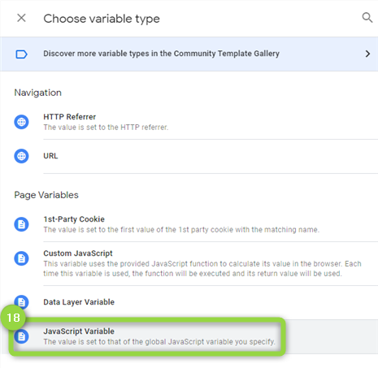
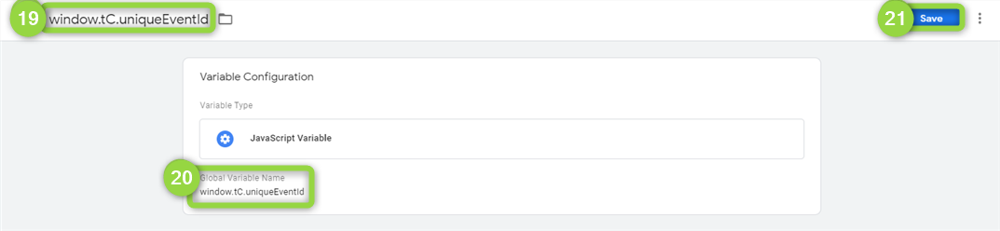

# Facebook CAPI through GTM

Commanders Act provides a GTM template to connect your existing GTM implementation to our serverside endpoint, enabling "Facebook CAPI" in a secured environment.

### Setup

1. Add our bridge tag
2. Update your Facebook tags

### 1. Add our bridge tag

First, access [GTM a](https://tagmanager.google.com/)nd then add our template "**Commanders Act | Serverside events bridge**"\
You can follow our dedicated guide:


[gtm.md](../../../../sources/sources-catalog/gtm.md)


### 2. Update your Facebook tags

If you're planning to keep running your existing Facebook pixels while using "Facebook CAPI" through GTM, it's really important that you update them following these guidelines. This will allow to deduplicate and keep consistent measurements of your events.

The process is straightforward as for every event you're sending via pixel tags you just need to add the event identifier - On GTM, open your "Facebook Pixel" tag and expand (14) "**More Settings**" to locate the "**Event ID**" and click (15) its icon on the right.

A new window will slide-in. Click on `(16)` the **plus on the top right.**

<figure><figcaption></figcaption></figure>

Click on `(17)` the "**Variable Configuration**".

Click `(18)` the "**JavaScript Variable**".

Rename your `(19)` variable as _**window.tC.uniqueEventId**_ and set the same name in `(20)` the "**Global Variable Name**" then click `(21)` the "**Save**" button.

<figure><figcaption></figcaption></figure>

Back on the tag configuration, expand `(22)` "**Advanced Settings**" and `(23)` "**Tag Sequencing**" to check `(24)` the option "**Fire a tag before Facebook Pixel fires**". In "Set-up Tag", select `(25)` "_Commanders Act | Serverside events bridge_" and save your tag.


Repeat this configuration for each active "Facebook Pixel" in GTM.



See Facebook documentation for more details: [Deduplicate Pixel and Server Event](https://developers.facebook.com/docs/marketing-api/conversions-api/deduplicate-pixel-and-server-events)&#x20;



Contact your reference consultant or our [Support team](mailto:support@commandersact.com) in case you need assistance.

