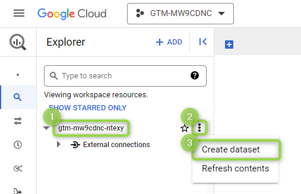
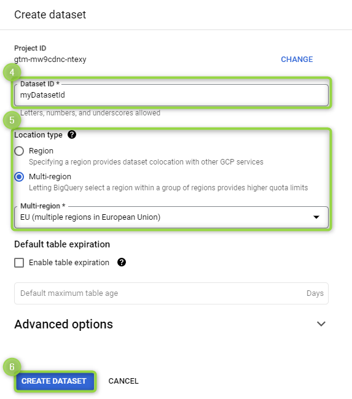
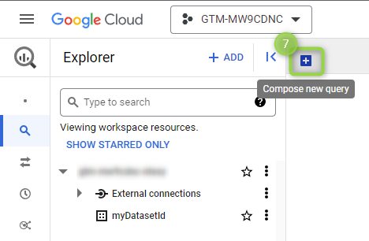
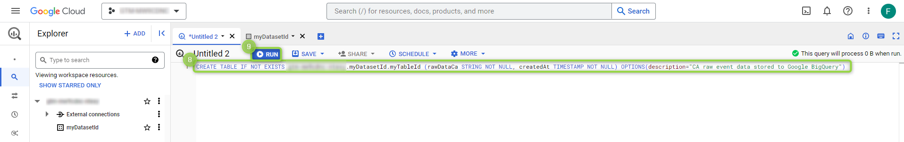

# Google BigQuery


This destination is currently under final review and will be available soon.


[BigQuery](https://cloud.google.com/bigquery/docs/introduction?hl=en) is Google's data warehouse that enables scalable analysis over data. This integration allows pushing all your event properties to BigQuery.

## Key features

The Google BigQuery destination provides the following key features:

* **Events structure**: our [Events reference](https://community.commandersact.com/platform-x/developers/tracking/events-reference) feeds BigQuery's tables, meaning that your data is properly bridged to the expected fields in an optimized way.
* **Universal schema**: store events data without adjusting BigQuery's schema.

## Destination setup


Ensure [BigQuery API](https://console.cloud.google.com/apis/library/bigquery.googleapis.com?project=gtm-mw9cdnc-ntexy) is enabled. More details are available following this [LINK](https://cloud.google.com/bigquery/docs/enable-transfer-service?hl=en#enable-api).


First, you need to create a BigQuery table, with a specific schema, for storing raw data into it. See the following two subsections for a complete walkthrough.

### Dataset

Access [BigQuery console](https://console.cloud.google.com/) to locate your `(1)` project identifier and click `(2)` the `three dots` on the right. Select `(3)` `Create dataset` from the menu or, alternatively, you can use an existing dataset and jump to the [next subsection](google-bigquery.md#table).

<figure><figcaption><p>Dataset creation #1.</p></figcaption></figure>

Input a `(4)` dataset identifier (E.g. "myDatasetId"), select a `(5)` location type and click `(6)` `CREATE DATASET`.

<figure><figcaption><p>Dataset creation #2.</p></figcaption></figure>

### Table

Create a table with the following structure:

| Field name | Type      | Mode     |
| ---------- | --------- | -------- |
| rawDataCa  | String    | Required |
| createdAt  | Timestamp | Required |

The esiest way to create it is to click `(7)` the `plus` button:

<figure><figcaption><p>Compose a new query.</p></figcaption></figure>

copy and paste the following query in `(8)` the input area:

```powerquery
CREATE TABLE IF NOT EXISTS [PROJECT_ID].[DATASET_ID].[TABLE_ID] (rawDataCa STRING NOT NULL, createdAt TIMESTAMP NOT NULL) OPTIONS(description="CA raw event data stored to Google BigQuery")
```


Replace`[PROJECT_ID]`,`[DATASET_ID]`and`[TABLE_ID]`with your project, dataset and table identifier respectively.


and then click the `(9)` `RUN` button.

<figure><figcaption><p>Run table creation query.</p></figcaption></figure>


Use [**Destination filters**](https://doc.commandersact.com/features/destinations/destination-filters) to refine events and/or other properties matching your specific needs.


### Configuration

| Settings     | Description                                                                                                                                                                                                                                                                                              |
| ------------ | -------------------------------------------------------------------------------------------------------------------------------------------------------------------------------------------------------------------------------------------------------------------------------------------------------- |
| `Project Id` | <p><em><strong><code>Required</code></strong></em></p><p>Your project identifier as reported in BigQuery console. More details are available following this <a href="https://support.google.com/googleapi/answer/7014113?hl=en">LINK</a>. This setting supports dynamic values <strong>[1].</strong></p> |
| `Dataset Id` | <p><em><strong><code>Required</code></strong></em><br>Your dataset identifier as reported in BigQuery console. More details are available following this <a href="https://cloud.google.com/bigquery/docs/datasets-intro?hl=en">LINK</a>. This setting supports dynamic values <strong>[1].</strong></p>  |
| `Table Id`   | <p><em><strong><code>Required</code></strong></em><br>Your table identifier as reported in BigQuery console. More details are available following this <a href="https://cloud.google.com/bigquery/docs/tables-intro?hl=en">LINK</a>. This setting supports dynamic values <strong>[1].</strong></p>      |


**\[1]** This feature allows you to set an event property holding a dynamic value by adding two open braces (`{{`) in front of your property name and two close braces (`}}`) at the end (E.g. `{{myEventPropertyPathAndName}}`).


## Quick reference

| Commanders Act Events   | BigQuery Table Columns             |
| ----------------------- | ---------------------------------- |
| `[Any events]` **\[1]** | `rawDataCa`, `createdAt` **\[2]**  |


**\[1]** Use [**Destination filters**](https://doc.commandersact.com/features/destinations/destination-filters) to specify your matching events.\
**\[2]** Two columns:<mark style="color:blue;">`rawDataCa`</mark>contains all your event properties, while<mark style="color:blue;">`createdAt`</mark>is the creation timestamp.


