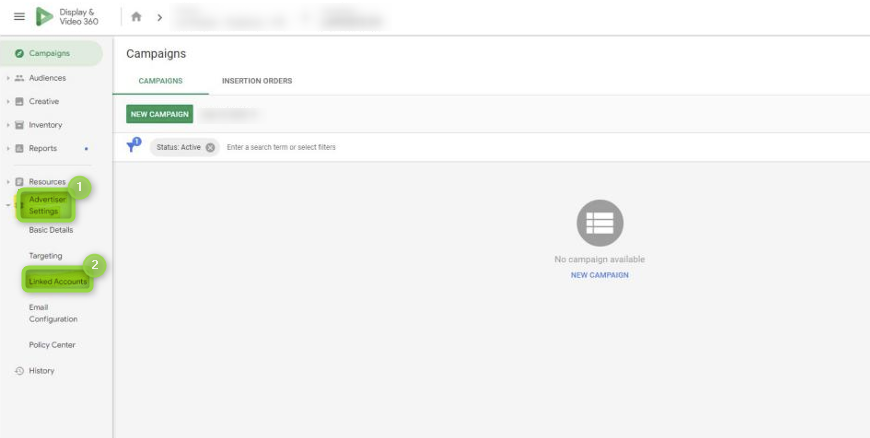

# Google Display & Video 360

[Google ](https://about.google/)is a multinational technology company focusing on online advertising, search engine technology, cloud computing, and computer software. Google Display & Video 360 is a paid product and part of the [Google Marketing Platform](https://marketingplatform.google.com/about/). Using [our destinations](google-display-and-video-360-and-search-ads-360.md#select-your-destination) you can share and synchronize user segments/audience with Google Display & Video 360.

 (2) (2).png>)

## Destination setup 


Ensure you can access the Google Marketing Platform (360).


First, proceed to the following section to link Commanders Act as an external data partner.

### Link External Data Partner

Access your [Display & Video 360 account](https://www.google.com/ddm/bidmanager) and, from the left menu, open `(1)` `Advanced Settings` and select `(2)` `Linked Accounts` :

<figure><figcaption></figcaption></figure>

Click `(3)` `LINK NEW ACCOUNT` :

<figure><figcaption></figcaption></figure>

Click `(4)` `External Data Partner` :

<figure><figcaption></figcaption></figure>

and choose the following from the partner list:


Name: **DMP: Commanders Act (TagCommander)**


Once the operation is validated, ensure the status is `(5)` active:

<figure><figcaption></figcaption></figure>


This connector is **only for Google DV360 accounts** (including Google Ads for DV360) but not for Google Ads accounts (without a DV360 account).

If you have a Google Ads account, you can use the [**Google Customer Match**](google-customer-match.md) destination.


### Select your destination


Depending on your Google account type, add one of the following destination.


* Display & Video 360 was previously DoubleClick Bid Manager.
  * If you had a DoubleClick Bid Manager account or if you have a Display & Video 360 account, please use our **Google Display & Video 360 Bid Manager** destination.
* Display & Video 360 can be also used with an Adexchange account
  * If you had an Adexchange account, please use our **Google Display & Video 360 Adex** destination.

### Configuration


At the `Audience` step, select your segments and then proceed to `Settings` to add your advertiser identifier. Segments will be directly created by Commanders Act, and appear in the audience list:\
\
\
\
Segment sharing is based on a cookie synchronization between Commanders Act and Google. If you see less data than expected in the data stream, check your cookie-sync ratio.\\


| Settings        | Description                                                                                                                                                                                                              |
| --------------- | ------------------------------------------------------------------------------------------------------------------------------------------------------------------------------------------------------------------------ |
| `Advertiser ID` | 
<em><strong><code>Required</code></strong></em> Your advertiser identifier. Learn how you can find your ID by accessing this <a href="https://support.google.com/displayvideo/answer/11415707?hl=en">LINK</a>.
 |

### Error management

* \[Google DDP API]\[2473] Could not fetch lists: \[AuthorizationError.**USER\_PERMISSION\_DENIED** @ clientCustomerId]

→ Trouble with [linking Commanders Act as external data partner](google-display-and-video-360-and-search-ads-360.md#link-external-data-partner). Be sure you are using the right name: **DMP: Commanders Act (TagCommander)**, and the advertiser identifier.

* \[Google DDP API]\[3206] Could not fetch lists: \[DmpUserListServiceError.**INVALID\_CLIENT\_CUSTOMER\_ID** @ clientCustomerId]

→ You don't have a Google DV360 account. Please use the [**Google Customer Match**](google-customer-match.md) destination.
