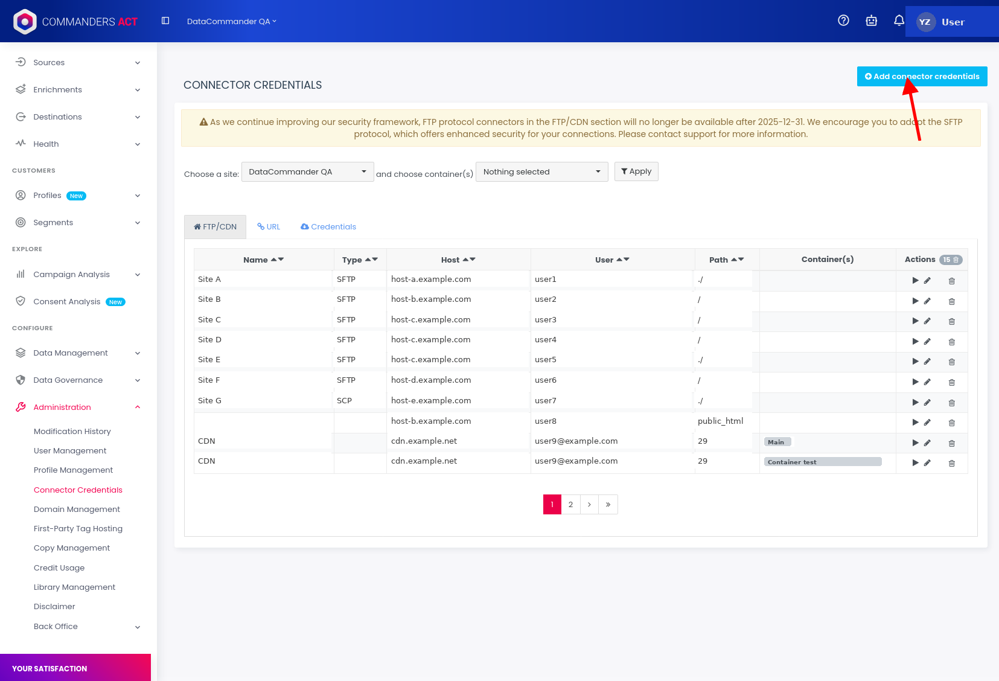
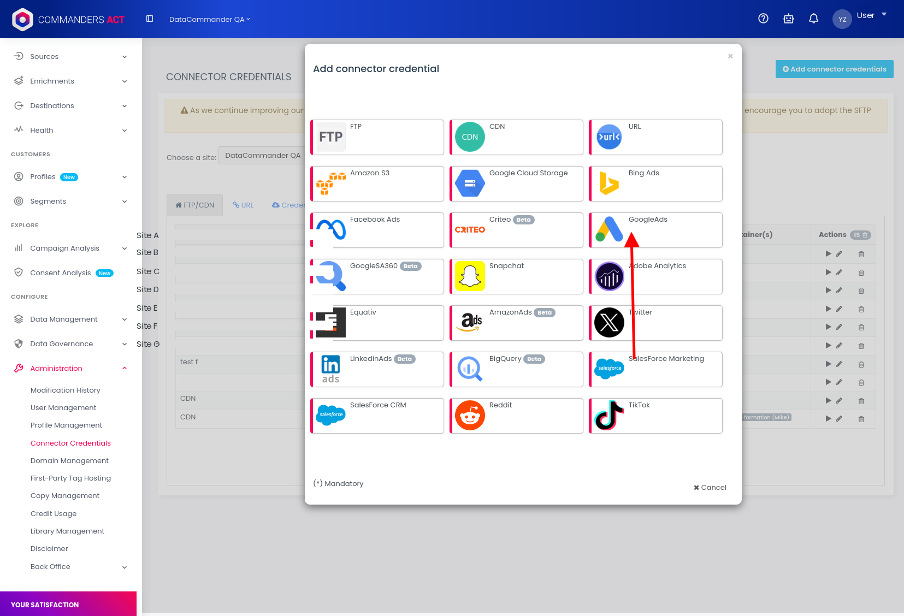
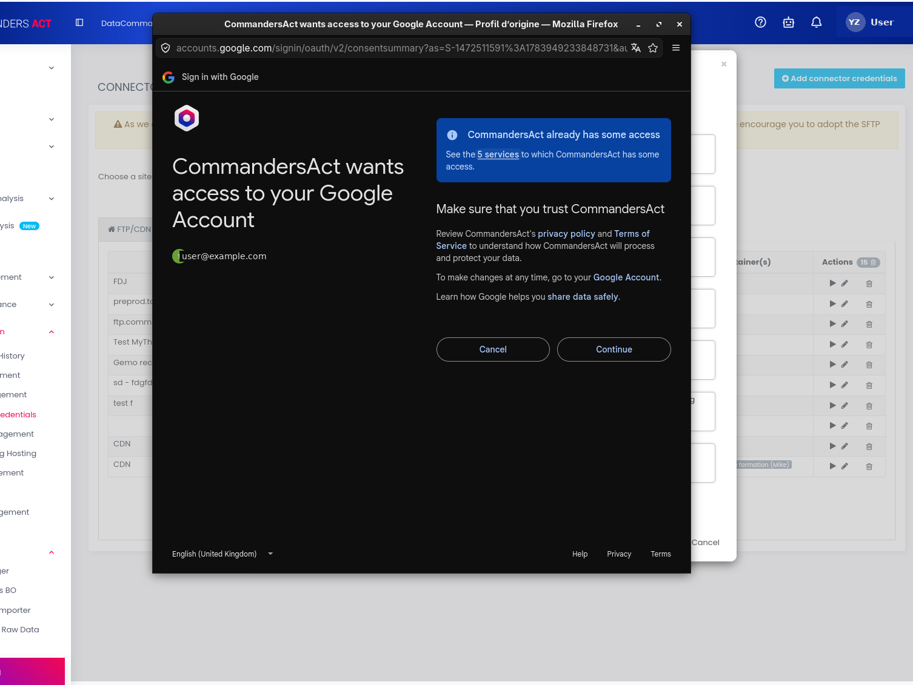
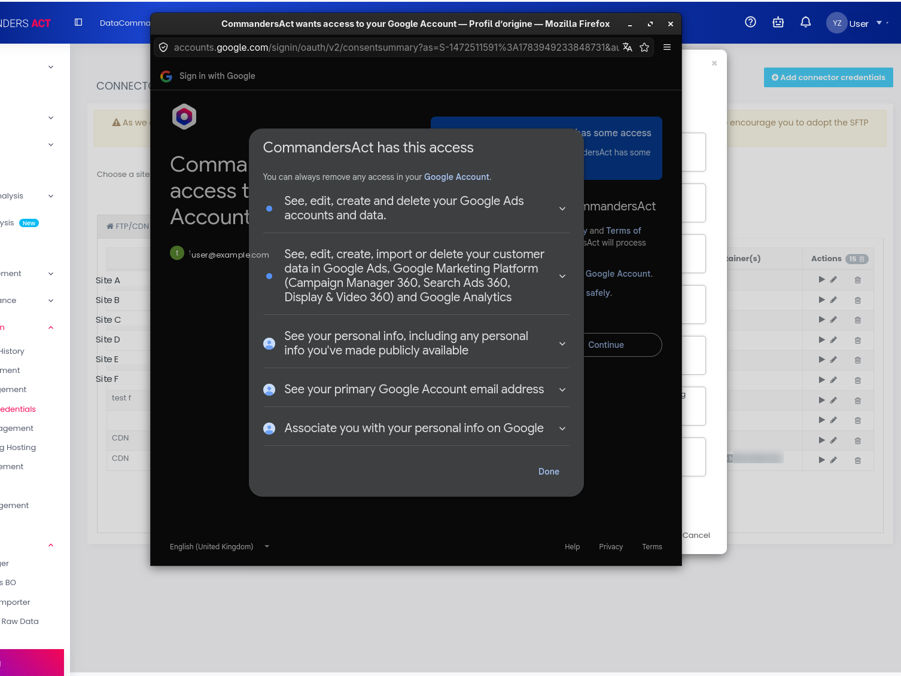
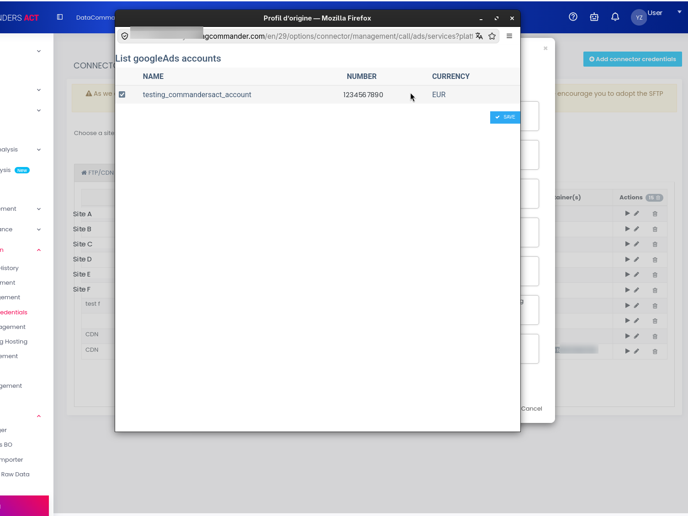

# Migration to Data Manager API


We will progressively update all of our existing Google destinations to use this new API, including:&#x20;

* Google Enhanced Conversions
* Google Customer Match
* Google Conversion Adjustments
* Google Enhanced Conversions for Leads

Some new destinations (e.g. Google Store Sales) require this API from the start.


## Connect your Google account to the Data Manager API


**Do not remove your existing Google Ads permissions or credential.** Only add the new permissions requested below, as removing your current access will break your existing connections.


Google is replacing the Google Ads API with the Data Manager API. To keep your Google connections running smoothly, add a new Google credential in Commanders Act.


**This updates your existing credential: it is never removed.** Your current connections stay active throughout the process.

Estimated time: less than 2 minutes.


## Steps for migration

1. Go to Connector Credentials
2. Select Google Ads
3. Sign in with Google
4. Select your Google Ad account(s)&#x20;

## Before you start: check your access rights

You'll need two levels of access to complete this:

* **In Commanders Act**: access to `Administration > Connector Credentials`. If you don't see this menu, ask your Commanders Act administrator to grant you access or to perform this update on your behalf.
* **In Google**: sufficient rights on the Google Ads account to grant API access (typically Admin access on the Google Ads account, or on the Google Workspace/Google account used to sign in). If you're not sure who manages this on your side, check with whoever originally set up your Google Ads connection.


If you sign in with a Google account that doesn't have the right permissions, the consent screen may not show all the expected permissions, or the connection may fail. In that case, ask your Google Ads administrator to complete this step instead.


## Step-by-step tutorial

### Step 1 — Go to Connector Credentials

In Commanders Act, go to `Administration > Connector Credentials`, then click **Add connector credentials** in the top right corner.

<figure><figcaption></figcaption></figure>

### Step 2 — Select Google Ads

In the connector list, select **GoogleAds**.

<figure><figcaption></figcaption></figure>

### Step 3 — Sign in with Google

A Google window opens asking you to sign in and grant access to CommandersAct. Review the summary, then click **Continue**.

Google may then show the detailed list of permissions requested.


**Accept all the permissions shown**, even if some look broader than what you expect to use. Do not uncheck or skip any permission on this screen as declining one can break part of your Google connection later.


<figure><figcaption></figcaption></figure>

<figure><figcaption></figcaption></figure>

### Step 4 — Select your Google Ads account

Once access is granted, select the Google Ads account(s) you want to link, then click **Save**.

If several Google Ads accounts are already connected to your Commanders Act account, select all the accounts you want to update: this will update the scope for all the accounts you select.

<figure><figcaption></figcaption></figure>

### Step 5 — You're done

Your Google credential is now updated for the Data Manager API. Your existing connections and destinations continue to run without any further action on your side.

## Why this migration?&#x20;

* **Get ahead of the change**: Google will progressively restrict access to the legacy API. The current version of the Google Customer Match destination is expected to be deprecated in 2027.
* **Enhanced security**: the Data Manager API supports data encryption,
* **More complete measurement**: sending IP addresses and session attributes is available to all users of the new API
* **Greater stability**: quotas are now managed per project rather than per developer token, reducing the risk of blocking.
* **Access to new Google features**: upcoming destinations, such as _Google Store Sales_ will be reserved for this new API.

## FAQ

**Will this delete my current Google connection?**

No. This action updates your existing credential in place. Nothing is deleted, and your current connections keep running during the update.

**What happens if I don't do this?**

Google is phasing out the Google Ads API in favor of the Data Manager API. Without this update, your Google Ads connections may stop working once Google fully retires the old API.

In addition, some future Google destinations will require the Data Manager API to run — you won't be able to use them until you complete this upgrade.

**Why do I keep both my Google Ads and Data Manager permissions?**

Google hasn't migrated every feature to the Data Manager API yet — some parts of the Google Ads connection still rely on the older API. Keeping both active ensures nothing breaks while Google completes this transition on their end.

**I only see some permissions, not "Data Manager" by name. Is that normal?**

Yes. Google's consent screen may not always list a permission named exactly "Data Manager". What matters is that you accept every permission shown on the screen, without unchecking any of them.

**Can several people in my company do this?**

Yes, this update can be repeated per user/account. See Before you start for the access rights required on both sides.
