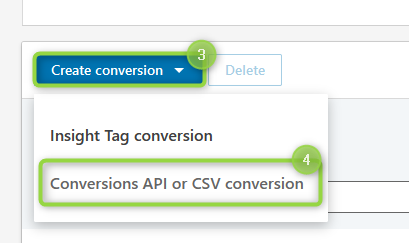
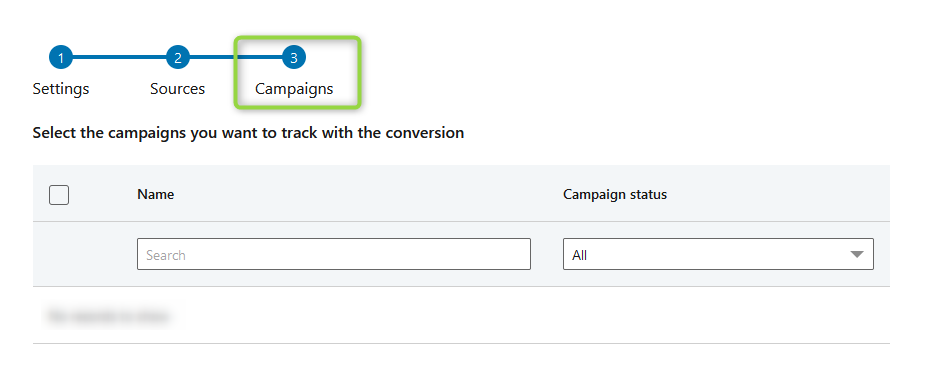

# LinkedIn Conversions API

[LinkedIn](https://www.linkedin.com/) is a business and employment-focused social media platform.\
Using this destination you can stream conversion events to LinkedIn through their [Conversions API](https://learn.microsoft.com/en-us/linkedin/marketing/integrations/ads-reporting/conversions-api?view=li-lms-2023-11\&tabs=http#streaming-conversion-events). This allows to measure the performance of your LinkedIn marketing campaigns no matter where the conversion happens and use this data to power campaign optimization. This destination can help strengthen performance and decrease cost per action with more complete attribution, improved data reliability, and better optimized delivery.

## Key features

The LinkedIn destination provides the following key features:

* **Events structure**: our [Events reference](https://doc.commandersact.com/developers/tracking/events-reference) model matches [LinkedIn's conversion rules](https://learn.microsoft.com/en-us/linkedin/marketing/integrations/ads-reporting/conversions-api?view=li-lms-2023-07\&tabs=curl#create-a-conversion-rule), meaning that your data is properly bridged to the expected fields in an optimized way.
* **Prebuilt mappings**: data mapping for event-based destinations happens automatically, which simplifies user inputs.
* **Automatic hashing**: information is automatically hashed matching partner specifications.
* **Smart mapping**: data mapping can be readjusted using your datalayer defined fields.&#x20;

## Destination setup

Before using this destination, review your conversion rules and campaigns in LinkedIn:


First, ensure at least one conversion rule is defined in LinkedIn by accessing your [Campaign Manager](https://www.linkedin.com/campaignmanager/) account and select <mark style="color:blue;">`Analyze`</mark> `(1)`  → <mark style="color:blue;">`Conversion tracking`</mark> `(2)` from the left menu:

.png>)\
You can also create a new conversion rule by clicking <mark style="color:blue;">`Create conversion`</mark> `(3)` →  <mark style="color:blue;">`Conversions API or CSV conversion`</mark> `(4)` :

Lastly, you need to associate your conversion rule with one or more campaigns. From the <mark style="color:blue;">`Conversion tracking`</mark>  section, click your conversion rule and reach step 3 where you can select the campaigns you want to track with the conversion:




In order to set the optional "Smart Mapping" field <mark style="color:blue;">`Linkedin UUID`</mark> or the related cookie <mark style="color:blue;">`li_fat_id`</mark> , advertisers need to enable enhanced conversion tracking from [Campaign Manager](https://www.linkedin.com/help/lms/answer/a423304/enable-first-party-cookies-on-a-linkedin-insight-tag). This activates first party cookies that append a click identifier parameter ("li\_fat\_id") to the click URLs. Refer [Enabling Click Ids](https://learn.microsoft.com/en-us/linkedin/marketing/conversions/enabling-first-party-cookies?view=li-lms-2023-11) for implementation details.&#x20;



LinkedIn CAPI supports deduplication with your client-side [Insight Tag](https://business.linkedin.com/marketing-solutions/insight-tag).\
Check the "Smart Mapping" field <mark style="color:blue;">`Event Id`</mark> , [Field Mappings](linkedin_capi.md#field-mappings) (See property <mark style="color:blue;">`eventId`</mark> ) or this [LINK](https://learn.microsoft.com/en-us/linkedin/marketing/conversions/deduplication?view=li-lms-2023-11) for more details.&#x20;


### Configuration

<table><thead><tr><th width="349">Settings</th><th>Description</th></tr></thead><tbody><tr><td><code>Authentication</code></td><td><em><strong><code>Required</code></strong></em>  Your credentials with LinkedIn Campaign Manager as set in the Commanders Act interface following: <code>Administration</code> ➜ <code>Connector Credentials</code> ➜ <code>Add connector credentials</code> ➜ <code>LinkedinAds</code></td></tr><tr><td><code>Conversion Rule Name</code></td><td><em><strong><code>Required</code></strong></em>  Select your conversion rule name from the drop-down menu. You can create/edit a conversion rule by accessing your <a href="https://www.linkedin.com/campaignmanager/">Campaign Manager</a> account and select "Analyze" → "Conversion tracking" from the left menu.</td></tr></tbody></table>

## Quick reference

| Commanders Act Events  | LinkedIn Tracking                |
| ---------------------- | -------------------------------- |
| `[Any Event]` **\[1]** | `[Any Conversion Rule]` **\[2]** |


**\[1]** Use [**Destination filters**](https://doc.commandersact.com/features/destinations/destination-filters) to specify your matching events.\
&#xNAN;**\[2]** See <mark style="color:blue;">`Conversion Rule Name`</mark>  in [Configuration](linkedin_capi.md#configuration) for more details.


## Field Mappings


Most properties can be remapped using our "Smart Mapping" feature.



At least one of the following statements, related to "Smart Mapping" fields, must be fulfilled:\
• The field <mark style="color:blue;">`User Email SHA256`</mark> is set.\
• The field <mark style="color:blue;">`Linkedin UUID`</mark> or the cookie <mark style="color:blue;">`li_fat_id`</mark> is set.\
• The field <mark style="color:blue;">`LiveRamp ACXIOM Id`</mark> is set.\
• The field <mark style="color:blue;">`Oracle MOAT Id`</mark> is set.\
• Both fields <mark style="color:blue;">`User First Name`</mark> and <mark style="color:blue;">`User Last Name`</mark> are set.\
Moreover, If you send any user information via "Smart Mapping" fields (E.g. <mark style="color:blue;">`User Company Name`</mark> , <mark style="color:blue;">`User Job Title`</mark> , or <mark style="color:blue;">`User Country`</mark> ), you must set the <mark style="color:blue;">`User First Name`</mark> and <mark style="color:blue;">`User Last Name`</mark> fields, regardless if you provide other identity values listed above. More details are available following this [LINK](https://learn.microsoft.com/en-us/linkedin/marketing/integrations/ads-reporting/conversions-api?view=li-lms-2023-11\&tabs=http#input-data-validation).


<table><thead><tr><th width="341.6685580062746">Commanders Act Properties</th><th>LinkedIn Properties</th></tr></thead><tbody><tr><td><code>Conversion Rule Id</code></td><td><code>conversion</code> <strong>[1][*]</strong></td></tr><tr><td><code>context.event_timestamp</code></td><td><code>conversionHappenedAt</code> <strong>[*]</strong></td></tr><tr><td><code>value</code></td><td><code>conversionValue.amount</code></td></tr><tr><td><code>currency</code></td><td><code>conversionValue.currencyCode</code></td></tr><tr><td><code>context.event_id</code></td><td><code>eventId</code> <strong>[2]</strong></td></tr><tr><td>
<code>user.email_sha256</code>

<code>partners.linkedin.uuid</code>

<code>partners.linkedin.acxiom_id</code>

<code>partners.linkedin.moat_id</code>
</td><td><code>user.userIds.X.idValue</code> <strong>[3]</strong></td></tr><tr><td>
<code>(user.email_sha256</code>

<code>partners.linkedin.uuid</code>

<code>partners.linkedin.acxiom_id</code>

<code>partners.linkedin.moat_id)</code>
</td><td><code>user.userIds.X.idType</code> <strong>[4]</strong></td></tr><tr><td><code>user.firstname</code></td><td><code>user.userInfo.firstName</code></td></tr><tr><td><code>user.lastname</code></td><td><code>user.userInfo.lastName</code></td></tr><tr><td><code>user.country</code></td><td><code>user.userInfo.countryCode</code></td></tr><tr><td><code>user.title</code></td><td><code>user.userInfo.title</code></td></tr><tr><td><code>user.company_name</code></td><td><code>user.userInfo.companyName</code></td></tr></tbody></table>


**\[\*]** Mandatory property.\
&#xNAN;**\[1]** Value includes the static string "urn:lla:llaPartnerConversion:".\
&#xNAN;**\[2]** The unique id generated by advertisers to indicate each event. This is used for deduplication. More details are available following this [LINK](https://learn.microsoft.com/en-us/linkedin/marketing/conversions/deduplication?view=li-lms-2023-11).\
&#xNAN;**\[3]** If a clear text user email is provided, it's automatically hashed via SHA256.\
The "Smart Mapping" field <mark style="color:blue;">`Linkedin UUID`</mark> has priority over the cookie <mark style="color:blue;">`li_fat_id`</mark> .\
&#xNAN;**\[4]** Depending on the value being set in <mark style="color:blue;">`user.userIds.X.idValue`</mark> , this is one of the following strings: <mark style="color:blue;">`SHA256_EMAIL`</mark> ,  <mark style="color:blue;">`LINKEDIN_FIRST_PARTY_ADS_TRACKING_UUID`</mark> ,  <mark style="color:blue;">`ACXIOM_ID`</mark> or <mark style="color:blue;">`ORACLE_MOAT_ID`</mark> . More details are available following this [LINK](https://learn.microsoft.com/en-us/linkedin/marketing/integrations/ads-reporting/conversions-api?view=li-lms-2023-11\&tabs=http#idtype).

