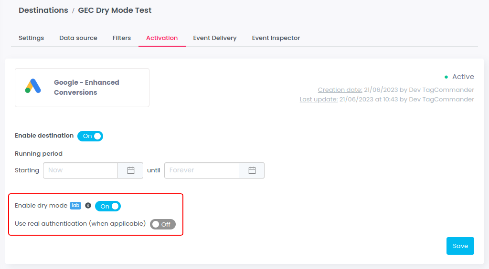

# Dry mode (lab)


Lab feature, not available for all customers (private preview)


The dry mode allows to simulate the sending of events, **but events are not sent** to the destination.

Once this feature is activated, all outbound HTTP requests of the destination are mocked in order to test it before going live. The payload, the request, is visible in Event Inspector to let you see events and correct the format if needed.&#x20;

As soon as you deactivate the dry mode, events will be sent to the destination.

When available, a switch is displayed on the destination interface:

<figure><figcaption></figcaption></figure>

'Use real authentication' option use authentication details provided on the settings tab (IDs, tokens...) to build the request.
