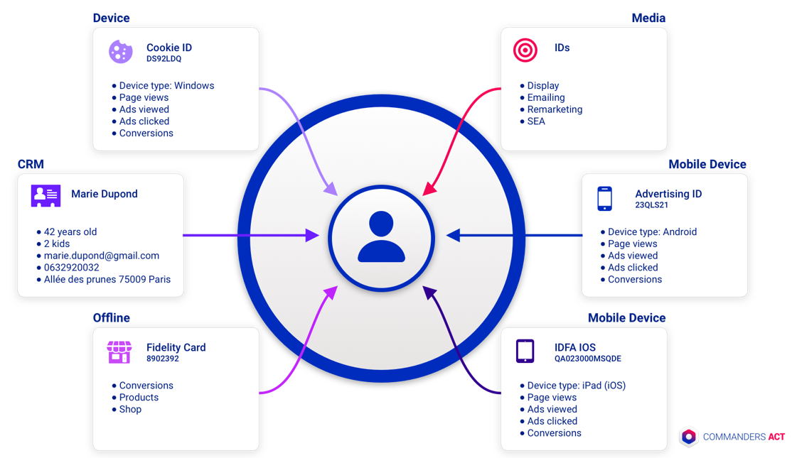

# Identity resolution

Identity resolution (aka Fuse v2) is our **live identity reconciliation feature**. \
Your customers are using many devices, switching from one channel to another (web, mobile, shops, ads…) and would like a personalized experience across all these devices/channels, from the moment he has given his consent within the [CMP](consent-management/).

For example, a customer can visit your website during the day with his laptop, then click on an ad and come back later to buy with his mobile phone and contact the customer service 2 days after.\
Your goal is to unify all these actions around one and unique user, the challenge being often that this date is stored in many systems: your CRM, your website, your ad agency, your customer service system…\
\
The identity resolution module allows you to **create a complete view of your customers**. You can activate this module inside the platform in the _Identity_ menu.\
\
This **real-time proprietary reconciliation algorithm** is then the core of your CDP. It allows you to define the most suitable audience segments and better activate them.

<figure><figcaption></figcaption></figure>

## How the algorithm works?

Technically, it use **reconciliation keys** in order to match the different visitors/users.\
These keys are defined by you, it can be an email address, a personal ID, a phone number, a postal address…

For now only 1 key is managed, but later you will be able to define multiple keys and prioritize its. For example, you can define that the main key is the email address and, if there is no email address, the second key to check is the phone number or whatever you feel relevant for you and your business.

A merge between 2 users will happen if a match is detected because the reconciliation key is the same for the 2 users (email address, for example). The newest user is merged into the oldest one. The data collected for the newest user is stored on the oldest one, and the newest user is deleted.

 (2) (1).png>)

Every document on visitor B (conversions, page views, impressions, clicks, consents…) are moved to user A. There is no data deleted, only the user is deleted, and information are moved to the main user (A in our example).


Technically speaking, you have the **tcid or caid** (cookie ID) to identify **devices,** **PID** (personal identifier) to identify **users** and **user\_id** to identify users based on a key coming from our customers (**CRM ID** for example).

**tcid = devices**\
**pid = users**\
**user\_id = users (key from customer)**


## What happens for consents?

When we will operate a merge, we will take into consideration the latest consents recorded in order to respect users’ choices.

## What happens for Augmented User Attributes

[Augmented user attributes](enrichments/augmented-user-attributes/) (sum, min, max, count, calculus...) are automatically recalculated when a merge occurs.

## How are managed shared devices?

Some devices are strictly personal, like mobile phones, but others could be shared like tablets. For example, in a family, the husband can use the tablet and 1 hour later the wife can use also the tablet. The algorithm is able to identify  and manage this behavior.

As soon as it detects a new reconciliation key (login, email address, user\_id) different from the previous session on the device, it can distinguish different users and address the right user.

 (2).png>)

On case 1 (left) it can't identify a new user because there are no reconciliation keys (no login, no email...). On contrary, on case 2 (right), there is a login, so it can create a new user or update an existing user. As a result, the tcid (cookie identifier) stays the same but the pid (personal identifier) is different as well as the user\_id.

## How are managed Wi-Fi public hotspots?

On public hotspots, many devices share the same IP address, they are connected on the same network. How to avoid having 1 unique user for all these devices?

Technically speaking, the algorythm don't consider on the same way users on Chrome / Android and users on Safari / iOS.

On Chrome / Android, it is able to create 1 user per device, with different pid (Personal Identifier) because the tcid (=cookie identifier) is different.

As soon as it can identify 2 devices with the same user\_id (login for example), it can merge these 2 users, to have 1 unique user for these 2 devices.

 (1).png>)

For Safari / iOS, it is different because it can't have different tcid. Due to cookie limitations on Safari, it uses a fingerprint. Unfortunately, on a public hotspot, all devices have the same IP address and, as a result, the fingerprint is the same, meaning we have 1 unique user for all these devices.

However, as soon as it can detect that a user is unique (with a login for example), it can create a separate user.

.png>)
