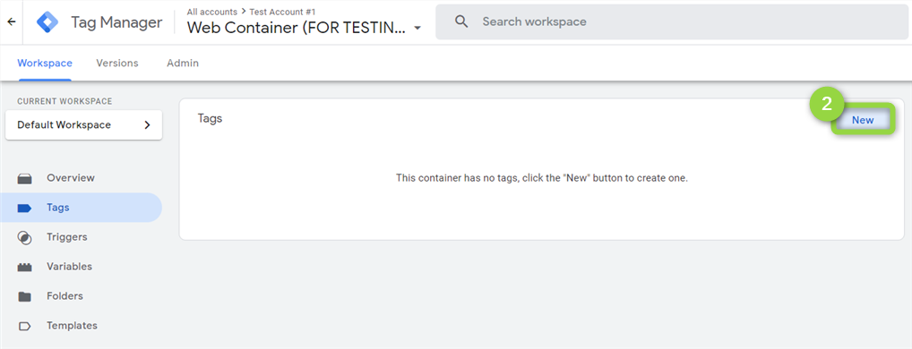

# AT Internet

[Piano Analytics](https://developers.atinternet-solutions.com/piano-analytics-tagging-en/getting-started-piano-analytics-en/what-is-piano-analytics-tagging-en/) is the successor of AT Internet Analytics Suite 2 (AS2).\
It's a user-centric tool that synthesises product & marketing analytics, while ensuring data quality.\
Your data will be sent server-side getting the most from AT Internet [Collection API](https://developers.atinternet-solutions.com/piano-analytics-tagging-en/event-tagging-piano-analytics-en/events-pattern-en/) and in form of [events](https://developers.atinternet-solutions.com/piano-analytics-tagging-en/event-tagging-piano-analytics-en/standard-event-tagging-en/).


The [Collection API](https://developers.atinternet-solutions.com/piano-analytics-tagging-en/event-tagging-piano-analytics-en/events-pattern-en/) is only available for [Piano Analytics](https://developers.atinternet-solutions.com/piano-analytics-tagging-en/getting-started-piano-analytics-en/what-is-piano-analytics-tagging-en/).

If your perimeters are certified (ACPM/Mediamétrie), you **can't use** Piano Analytics and this destination. You can check the following [compatibility table](https://developers.atinternet-solutions.com/piano-analytics-tagging-en/getting-started-piano-analytics-en/why-should-we-use-the-piano-analytics-tagging/#compatibility-table\_5) to get more insights on supported features by product.


## Key features

The AT Internet destination provides the following key features:

* **Events structure**: our [Events reference](https://community.commandersact.com/platform-x/developers/tracking/events-reference) model matches [AT Internet's one](https://developers.atinternet-solutions.com/piano-analytics-tagging-en/event-tagging-piano-analytics-en/standard-event-tagging-en/), meaning that your data is properly bridged to the expected fields in an optimized way.
* **Prebuilt mappings**: data mapping for events-based destinations happens automatically, which simplifies user inputs.
* **Custom events**: you can freely push custom events based on your specific needs.
* **Support for multi-item data**: information included in the [item](https://community.commandersact.com/platform-x/developers/tracking/events-reference#item) array is dispatched to AT Internet.
* **User identifier**: you can openly select a user identifier field for logged users.

## Destination setup

Before you get started with this destination, ensure you have access to [Piano Analytics](https://developers.atinternet-solutions.com/piano-analytics-tagging-en/getting-started-piano-analytics-en/what-is-piano-analytics-tagging-en/).


The client-side unique visitor identifier is required for this destination to work and is retrieved by getting the value of either the [`atuserid`](https://developers.atinternet-solutions.com/as2-tagging-en/javascript-en/getting-started-javascript-en/at-internet-cookies-javascript-en/#smarttag-js\_0) or [`xtidc`](https://developers.atinternet-solutions.com/as2-tagging-en/javascript-en/getting-started-javascript-en/at-internet-cookies-javascript-en/#xtcore-js\_1)cookie.


### Configuration

| Settings                  | Description                                                                                                                                                                                                                                                                                                                                                                                                 |
| ------------------------- | ----------------------------------------------------------------------------------------------------------------------------------------------------------------------------------------------------------------------------------------------------------------------------------------------------------------------------------------------------------------------------------------------------------- |
| Side Id                   | 
<em><strong><code>Required</code></strong></em>

The identifier of the site the data belongs to (E.g. <code>628087</code>). This can be found in the AT Internet interface following  ➜ <code>SETTINGS</code> ➜ <code>Data Collection Portal</code> ➜ <code>Tools</code> ➜ <code>Site Management</code> and selecting your site.
            |
| Secured Collection Domain | 
<em><strong><code>Required</code></strong></em>

The SSL Domain on which information is collected (E.g. <code>logs1412.xiti.com</code>). This can be found in AT Internet interface following  ➜ <code>SETTINGS</code>  <code>Data Collection Portal</code> ➜ <code>Tools</code> ➜ <code>Site Management</code> and selecting your site.
 |
| User Identifier           | You can bridge the user identifier for your logged users. More information are available following this [LINK](https://developers.atinternet-solutions.com/piano-analytics-tagging-en/event-tagging-piano-analytics-en/standard-event-tagging-en/#user\_1).                                                                                                                                                 |
| Custom Property           | When selecting "\[Custom Property]" as value for the above "User Identifier", this field will show up so you can specify a custom field holding the value for the user identifier **\[1]**.                                                                                                                                                                                                                 |


**\[1]** Using "dots" (".") you can navigate deeper to the specific field you want to get the value of. See [Events reference](https://community.commandersact.com/platform-x/developers/tracking/events-reference) for more details on the standard field names by event. You can also freely set custom fields: there are no boundaries.&#x20;


## Quick reference

| Commanders Act Events | AT Internet Events                                          |
| --------------------- | ----------------------------------------------------------- |
| `add_payment_info`    | `cart.payment`                                              |
| `add_shipping_info`   | `cart.delivery`                                             |
| `add_to_cart`         | `product.add_to_cart`                                       |
| `add_to_wishlist`     | `add_to_wishlist` **\[\*]**                                 |
| `begin_checkout`      | `begin_checkout` **\[\*]**                                  |
| `generate_lead`       | `generate_lead` **\[\*]**                                   |
| `login`               | `login` **\[\*]**                                           |
| `page_view`           | `page.display` or `product.page_display` **\[1]**           |
| `purchase`            | `transaction.confirmation` and `product.purchased` **\[2]** |
| `refund`              | `refund` **\[\*]**                                          |
| `remove_from_cart`    | `product.remove_from_cart`                                  |
| `search`              | `internal_search_result.display`                            |
| `select_content`      | `select_content` **\[\*]**                                  |
| `select_item`         | `select_item` **\[\*]**                                     |
| `sign_up`             | `sign_up` **\[\*]**                                         |
| `view_cart`           | `cart.display`                                              |
| `view_item`           | `product.display`                                           |
| `view_item_list`      | `view_item_list` **\[\*]**                                  |
| `[Custom Event]`      | `[Custom Event]` **\[\*]**                                  |


**\[\*]** Custom events must be added to the AT Internet **Data Model** first or they won't be processed. You can add new events by following  ➜ `SETTINGS` ➜ `Data Management` ➜ `Data Model` ➜`Events` .

**\[1]** If `properties.page_type` __ is equal to `product` _then_ `product.page_display` is sent, otherwise, `page.display`.

**\[2]** A`product.purchased` will be sent for each product being purchased.


## Mappings for AT Internet Parameters

| Commanders Act Properties                                                                                                                                             | AT Internet Parameters                                                                     |
| --------------------------------------------------------------------------------------------------------------------------------------------------------------------- | ------------------------------------------------------------------------------------------ |
| `properties.page_name`                                                                                                                                                | `page`                                                                                     |
| `properties.value`                                                                                                                                                    | 
<code>generate_lead_value</code>

<code>cart_turnovertaxincluded</code>
        |
| `properties.currency`                                                                                                                                                 | 
<code>generate_lead_currency</code>

<code>cart_currency</code>
                |
| `properties.id`                                                                                                                                                       | 
<code>transaction_id</code>

<code>generate_lead_id</code>
                     |
| `properties.item_list_name`                                                                                                                                           | `view_item_list_name`                                                                      |
| `properties.method`                                                                                                                                                   | 
<code>login_method</code>

<code>sign_up_method</code>
                         |
| `properties.search_term`                                                                                                                                              | `ise_keyword`                                                                              |
| `properties.items.X.id`                                                                                                                                               | `product_id`                                                                               |
| `properties.items.X.product.name`                                                                                                                                     | `product`                                                                                  |
| `properties.items.X.variant`                                                                                                                                          | `product_variant`                                                                          |
| `properties.items.X.product.brand`                                                                                                                                    | `product_brand`                                                                            |
| `(properties.items.X.discount > 0)`                                                                                                                                   | `product_discount` **\[1]**                                                                |
| `properties.items.X.product.price`                                                                                                                                    | `product_pricetaxincluded`                                                                 |
| `properties.items.X.product.currency`                                                                                                                                 | `product_currency`                                                                         |
| `properties.items.X.product.category_1`                                                                                                                               | `product_category1`                                                                        |
| `properties.items.X.product.category_2`                                                                                                                               | `product_category2`                                                                        |
| `properties.items.X.product.category_3`                                                                                                                               | `product_category3`                                                                        |
| `properties.items.X.product.category_4`                                                                                                                               | `product_category4`                                                                        |
| `properties.items.X.quantity`                                                                                                                                         | 
<code>product_quantity</code>

<code>cart_quantity</code> <strong>[2]</strong>
 |
| `properties.items.X.coupon`                                                                                                                                           | `product_promocode`                                                                        |
| `properties.coupon`                                                                                                                                                   | `transaction_promocode`                                                                    |
| `properties.payment_method`                                                                                                                                           | `payment_mode`                                                                             |
| `properties.shipping_amount`                                                                                                                                          | `shipping_costtaxincluded`                                                                 |
| `properties.shipping_tier`                                                                                                                                            | `shipping_delivery`                                                                        |
| `properties.cart_id`                                                                                                                                                  | `cart_id`                                                                                  |
| `properties.revenue`                                                                                                                                                  | `cart_turnovertaxfree`                                                                     |
| `properties.items.length`                                                                                                                                             | `cart_nbdistinctproduct`                                                                   |
| 
<code>user_id</code>

<code>user_email</code>

<code>user_email_md5</code>

<code>user_email_sha256</code>

<code>[custom_property]</code>
 | `user_id` **\[3]**                                                                         |
| `device.manufacturer`                                                                                                                                                 | `device_manufacturer`                                                                      |
| `device.model`                                                                                                                                                        | `device_model`                                                                             |
| `device.screen.height`                                                                                                                                                | `device_screen_height`                                                                     |
| `device.screen.width`                                                                                                                                                 | `device_screen_width`                                                                      |


**\[1]** Boolean value:`true` or `false`.

**\[2]** Sum all`properties.items.X.quantity`.

**\[3]** Depending on the user configuration.&#x20;


#### Headers parameters

| Commanders Act Properties | AT Internet Fields |
| ------------------------- | ------------------ |
| `device.user_agent`       | `User-Agent`       |
| `page.location`           | `Referer`          |
| `device.ip`               | `X-Forwarded-For`  |
