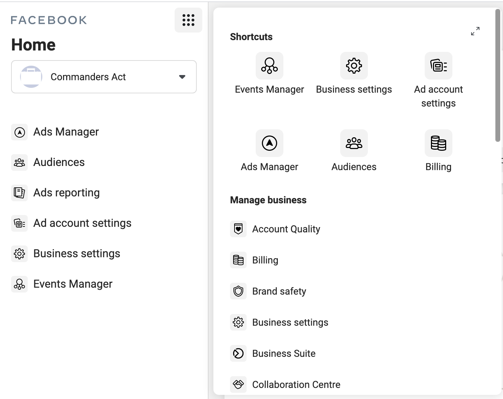
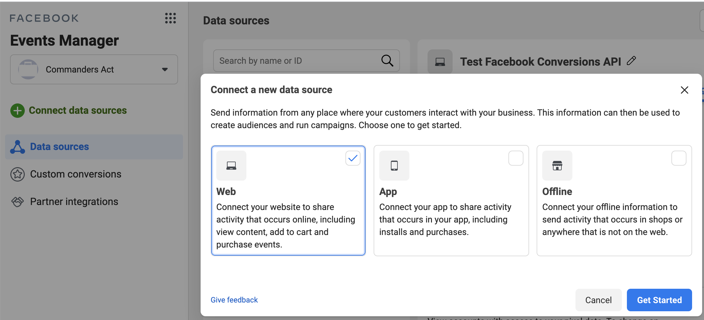
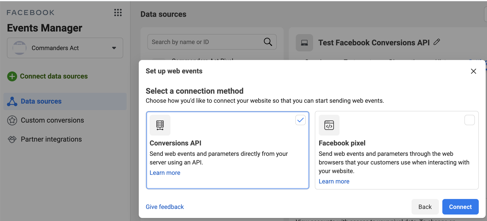
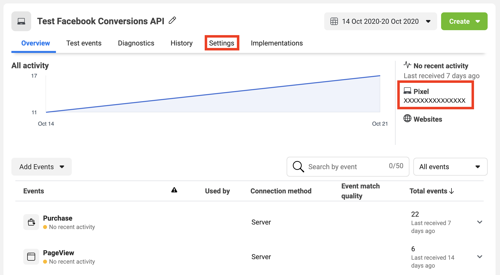

# Facebook conversions API

This connector allows you to push every kind of events directly to Facebook through API. Online conversions, offline conversions... send it to Facebook and it will help you to increase the reach and accuracy of your campaigns.

You can, for example, not send campaigns related to a specific product to users who already bought it, or you can also send campaigns to users who bought a specific product in cross-sell logic.

## How to send events to Facebook?

Facebook developed an API called 'Facebook Conversions API' [https://developers.facebook.com/docs/marketing-api/conversions-api](https://developers.facebook.com/docs/marketing-api/conversions-api)

You need a Facebook Business Manager account [https://business.facebook.com/](https://business.facebook.com)

Then on the menu, click on 'Events Manager':



Here you have to create a new Web Pixel:



Select Conversions API and give a name to your connection:



Now your pixel is created and you will have access to the IDs needed on our connector.

## Where can I find the Pixel ID?

You need to fill the pixel ID on our connector, it is the ID of the pixel you just created on steps above.

You can find this ID when you click on the pixel's name and on the right of the graph activities. You can find it also on the settings tab.



You can now copy and paste this ID on our connector.

Then you need the Access Token

## Where can I find the access token?

Click on the settings tab.

Scroll until the section 'Conversions API'

Click on the button 'Create Access Token':

.png>)


If you are not able to click on the button 'Create access token', that mean you don't have enough rights to do it. You should be administrator on your Facebook Business account to create it.


Then you can copy and paste the Access Token on our connector.

## How to manage consents?

* Only events with a consent will be sent to Facebook
* Only conversions with personal information (email and/or phone number...) will be sent to Facebook

### For customers with our product TRUST Commander:

TRUST Commander is our Consent Management Platform. (More information: [https://www.commandersact.com/en/solutions/trustcommander/](https://www.commandersact.com/en/solutions/trustcommander/))

On the connector, the consent is managed with the field 'User Consent Category'. You should enter a category ID, the one corresponding to Facebook (advertising) on Trust consent categories.

### For customers without our product TRUST Commander:

We should distinguish 3 cases:

* Your online events are collected through our Commanders Act event's tag: You have to provide, in the event tags, the list of category ids consented by the user, through the `consent_categories` property.
* You are pushing your events to us through API or CSV file: a field `consent_categories` must be added on the JSON or CSV to precise the consent category IDs of the user. Then inside the connector setting, use the field 'User Consent Category' to enter a category ID, the one corresponding to Facebook (advertising)
*   You already manage consents on your side and you only send us, from your server,

    events that obtained the consent for the category advertising.\
    In this case, do not fill the field ‘User Consent Category’ in the connector.

## How the deduplication between the pixel and server is managed?

Using both the pixel and server is recommended per Facebook as it could avoid losing data.

To make it works, you should have the same configuration for both the pixel and server, using same Facebook parameters.


**event\_id** should be the same


On the pixel, _`event_id`_ is automatically generated by our Commanders Act Tag and we retrieve the same value for the server on\_`integrations.facebook.event_id`\_. As a result, these 2 values should be the same.\
_`Event_name`_ should be the same also.

_`Fbp`_ parameter is automatically retrieved to keep the same value between pixel and server.

Deduplication works when the same event is sent _first_ from the browser and _then_ from the server, otherwise it creates a duplicate.\
Events are pushed in real-time.

### Examples

On pixel:

```
fbq('track', 'AddToCart', {
  value: #CARTVALUE#,
  currency: #CURRENCY#,
  contents: fb_addtocart_products,
  content_type: 'product'
}, { eventID: tC.uniqueEventId });
```

`eventID: tc.uniqueEventId` is automatically generated.

On server:

```
integrations.facebook.event_id
```

`integrations.facebook.event_id` automatically retrieves the eventID value coming from the pixel (`eventID: tc.uniqueEventId`) for standard events.

## Default Mappings to Facebook Standard Events

The following mappings are fully automated and do not require any additional configuration.\
Any of the Commanders Act Standard Events in the table below will be sent as the corresponding Facebook Standard Event. The Facebook pixel [standard events documentation](https://developers.facebook.com/docs/facebook-pixel/implementation/conversion-tracking#standard-events) has more information on these.

| COMMANDERS ACT EVENTS   | FACEBOOK STANDARD EVENT |
| ----------------------- | ----------------------- |
| `begin_checkout`        | `InitiateCheckout`      |
| `purchase`              | `Purchase`              |
| `add_to_cart`           | `AddToCart`             |
| `view_item`             | `ViewContent`           |
| `view_item_list`        | `ViewContent`           |
| `search`                | `Search`                |
| `add_payment_info`      | `AddPaymentInfo`        |
| `add_to_wishlist`       | `AddToWishlist`         |
| `generate_lead`         | `Lead`                  |
| `page_view`             | `PageView`              |
| `complete_registration` | `CompleteRegistration`  |
| `contact`               | `Contact`               |
| `customize_product`     | `CustomizeProduct`      |
| `donate`                | `Donate`                |
| `find_location`         | `FindLocation`          |
| `schedule`              | `Schedule`              |
| `search`                | `Search`                |
| `start_trial`           | `StartTrial`            |
| `submit_application`    | `SubmitApplication`     |
| `subscribe`             | `Subscribe`             |

### Facebook Custom Events

To send any of your Commanders Act events (that are not listed in the table above) to Facebook _custom_ events, you don't have anything to do. By default, your unmapped events are automatically sent as a Facebook _custom_ events with the name of your Commanders Act events.\
If you want to change the name of the custom event that will receive Facebook, you can overwrite the event\_name property using `integrations.facebook.event_name:'yourCustomEventName'`

## Default Mappings to Facebook Parameters

| COMMANDERS ACT STANDARD PROPERTIES                                                                                                 | FACEBOOK STANDARD PARAMETERS        |
| ---------------------------------------------------------------------------------------------------------------------------------- | ----------------------------------- |
| `user.id` (hashed)                                                                                                                 | `user_data.external_id`             |
| `user.email`                                                                                                                       | `user_data.em` (email, hashed)      |
| `user.phone`                                                                                                                       | `user_data.ph` (phone, hashed)      |
| `user.gender`                                                                                                                      | `user_data.ge` (gender, hashed)     |
| `user.birthdate`                                                                                                                   | `user_data.db` (birthdate, hashed)  |
| `user.lastname`                                                                                                                    | `user_data.ln` (last name, hashed)  |
| `user.firstname`                                                                                                                   | `user_data.fn` (first name, hashed) |
| `user.city`                                                                                                                        | `user_data.ct` (city, hashed)       |
| `user.state`                                                                                                                       | `user_data.st` (state, hashed)      |
| `user.zipcode`                                                                                                                     | `user_data.zp` (zip code, hashed)   |
| `user.country`                                                                                                                     | `user_data.country` (hashed)        |
| <p><code>browser.ip</code><br><em>Automatically set if generated from Commanders Act OneTag</em></p>                               | `user_data.client_ip_address`       |
| <p><code>browser.user_agent</code><br><em>Automatically set if generated from Commanders Act OneTag</em></p>                       | `user_data.client_user_agent`       |
| <p><code>integrations.facebook.fbc</code></p><p><em>Automatically set if generated from Commanders Act OneTag</em></p>             | `user_data.fbc` (Click ID)          |
| <p><code>integrations.facebook.fbp</code></p><p><em>Automatically set if generated from Commanders Act OneTag</em></p>             | `user_data.fbp` (Browser ID)        |
| `value`                                                                                                                            | `custom_data.value`                 |
| `currency`                                                                                                                         | `custom_data.currency`              |
| `items`                                                                                                                            | `custom_data.contents`              |
| <p><code>name</code><br><strong>OR</strong> first <code>items[i].product.name</code> found</p>                                     | `custom_data.content_name`          |
| <p><code>category</code><br><strong>OR</strong> first <code>items[i].product.category_N</code> found (<code>N</code> ∈ [1, 5])</p> | `custom_data.content_category`      |
| default value : '`product`'                                                                                                        | `custom_data.content_type`          |
| `status`                                                                                                                           | `custom_data.status`                |

Official documentation [_Customer Information Parameters_](https://developers.facebook.com/docs/marketing-api/conversions-api/parameters/customer-information-parameters)

Every property can be overridden using `integrations.facebook.user_data.<property>` (for standard data) _or_ `integrations.facebook.custom_data.<property>` (for custom data).

#### Minimal required information <a href="#minimal-required-information" id="minimal-required-information"></a>

Events can only be used if there is enough information to match a user. Facebook expects at least one `user_data` property, but strongly advises sending as many properties as possible.

Here are our conditions to send the events :

* at least 1 of those fields: `em`, `ph`, `external_id`, `fbp`, `fbc`
* at least 3 of the other fields

**Note :** external\_id, fbp, fbc will allow matching event with other events. But to match a user, one of those events shall contain additional information (`em` and `ph` are best suited for matching)

## Additional custom Facebook parameters



Custom Facebook parameters could be added.

Facebook allows you to send any data you want in custom data parameters. By default, we fill generic fields when possible (like value, currency, contents...).\
You can specify in the tag your own parameters in **integrations.facebook.custom\_data.**

```
cact('trigger', 'purchase', {
    "currency": "EUR",
    "value": 101,
    "integrations": {
        "facebook": {
            "custom_data": {
                "content_name": "booking",
                "your_field": "your_value"
            }
        }
    }
});
```
