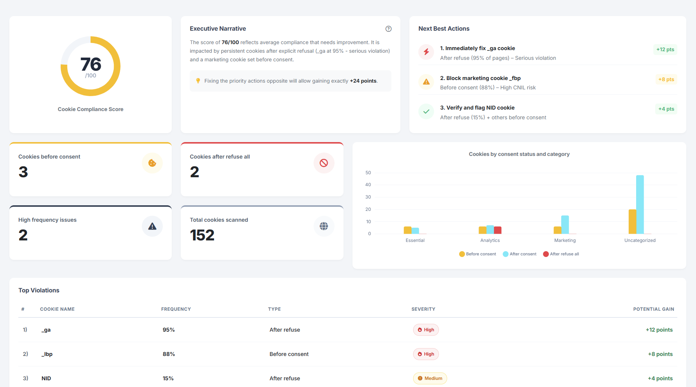

# Realtime Cookie Scanner

### 1. Introduction

The **Realtime Cookie Scanner (RCS)** is Commanders Act’s next-generation module for **continuous, intelligent, and real-world monitoring** of cookies and client-side storage (cookies, localStorage, sessionStorage, etc.).

Unlike crawler-based scanners that simulate visits with bots, the RCS observes **you real user sessions** — across all countries, devices, browsers, and contexts — providing a **complete, live picture** of what actually happens in your users’ browsers.

Whether a cookie appears only for **specific users, browsers, countries, forgotten landing pages, or A/B test variants**, RCS detects it.\
No missed edge cases, no blind spots, no delayed snapshots.

<figure><figcaption></figcaption></figure> <figure><figcaption></figcaption></figure>

***

### 2. Typical Use Cases

RCS provides Privacy, Marketing, and Technical teams with **instant, exhaustive, and actionable visibility** over every cookie and storage item.

**Common use cases include:**

* **Continuous CNIL / GDPR compliance monitoring**\
  Detect any cookie deposited before consent and stay compliant in real time.
* **Instant audit after container or tag deployment**\
  Ensure new releases haven’t introduced unauthorized cookies.
* **Proactive detection of new or undeclared partners**\
  Identify scripts depositing unexpected cookies.
* **Automatic multilingual cookie policy publication**\
  Generate and publish an auto-translated cookie table that stays up to date.
* **Post-release monitoring during redesigns or migrations**\
  Detect regressions or compliance issues immediately.

***

### 3. Key Features

#### 🔍 100 % Real-World Detection

* Observes every real user session — no crawlers, no simulations.
* Detects cookies triggered by clicks, scrolls, mobile interactions, or dynamic tags.
* Lists **all URLs** where each cookie was found.
* Groups **variants of the same cookie** (dynamic names or hashed suffixes).
* Displays **detection frequency** (e.g. 0.2 % rare / 32 % common).
* Frequency filter lets you show or hide rare cookies.
* Covers **all countries and devices** at no extra cost.

#### 🧠 Knowledge Base & AI Classification

* Powered by a **large cookie database** enriched through Commanders Act’s browser extensions (Chrome & Edge), leveraging anonymized data from thousands of users.
* Auto-detects vendor, purpose, and category.
* Uses AI to find rare cookies description/category, with human validation.
* Automatically ranks cookies by risk and frequency.

#### ⚙️ Supported Storage Types

1st Party Cookies, 3rd Party Cookies, HttpOnly 1st Party Cookies, HttpOnly 3rd Party Cookies, localStorage, sessionStorage

| Cookie Type                   | Description                                                                                                              | Scanned with                                               |
| ----------------------------- | ------------------------------------------------------------------------------------------------------------------------ | ---------------------------------------------------------- |
| **1st Party Cookie**          | 1st party cookies are cookies that are stored on the domain of the website.                                              | <ul><li>Tag client-side</li><li>Chrome Extension</li></ul> |
| **3rd Party Cookie**          | 3rd party cookies are cookies that are stored on a 3rd party domain.                                                     | <ul><li>Chrome Extension</li><li>Cookie Database</li></ul> |
| **HttpOnly 1st Party Cookie** | HttpOnly 1st Party Cookie are server cookies that are stored on the domain of the website and that have a HttpOnly flag. | <ul><li>Tag client-side</li><li>Chrome Extension</li></ul> |
| **HttpOnly 3rd Party Cookie** | HttpOnly 3rd Party Cookie are server cookies that are stored on a 3rd party domain and that have a HttpOnly flag.        | <ul><li>Chrome Extension</li><li>Cookie Database</li></ul> |
| **Local Storage**             | localStorage is a JavaScript accessible browser storage.                                                                 | <ul><li>Tag client-side</li><li>Chrome Extension</li></ul> |
| **Session Storage**           | sessionStorage is a JavaScript accessible session based browser storage.                                                 | <ul><li>Tag client-side</li><li>Chrome Extension</li></ul> |

#### 🔔 Realtime Alerts (< 60 s)

* Instant notifications for new cookies.
* Configurable by severity.
* Integrations : Email, Slack, Teams (and soon webhook).

<figure><figcaption></figcaption></figure>

#### 🌍 Multilingual Dynamic Cookie Table

* AI-translated, continuously updated table.
* Export in HTML, JSON, CSV, XLSX.
* Integrates with any website or CMP / TMS.

<figure><figcaption></figcaption></figure>

#### 📊 Live Dashboards

* Always up-to-date (real & realtime data, not batches).
* Breakdowns by vendor, category, domain, frequency, or status.
* Filters by domain, consent state, frequency, etc.

<figure><figcaption></figcaption></figure>

***

### 4. Setup and Configuration

Implementation is instant.

1-Your Commanders Act consultant or support simply activates RCS in the Backoffice.\
Once enabled, your Web Container injects the JS scanner and starts data collection.

> No scenarios to script, no login management, no maintenance.

RCS works immediately on real traffic — including logged-in or restricted pages.

> 💡 **Compatibility** : RCS is independent of the Commanders Act CMP or TMS and can be used with any CMP vendors or TMS vendors (GTM, etc.)

2-Declare the domains that you need to be scanned with the Cookie Scanner `Data Governance > Consent Management > Settings > Cookie Scanner Domains`

<figure><figcaption></figcaption></figure>

3-Declare the languages required in your cookie notice `Data Governance > Consent Management > Settings > Localisation`

<figure><figcaption></figcaption></figure>

4-Regenerate and Deploy your privacy banner(s) and/or your Web Containers\\

***

### 5. Interfaces & Roadmap

| Interface                                             | Description                                                              | Status              |
| ----------------------------------------------------- | ------------------------------------------------------------------------ | ------------------- |
| **Overview**                                          | Global summary of detected cookies and compliance status across domains. | 🧩 _In development_ |
| **New Cookies**                                       | Recently detected cookies with classification and alert options.         | 🧩 _In development_ |
| **Live Scan**                                         | Real-time feed of detections with domain and device filters.             | 🧩 _In roadmap_     |
| **Cookie Origins**                                    | Trace pages, domains, and scripts that set each cookie.                  | 🧩 _In roadmap_     |
| [**Cookies by Category**](cookies-by-category.md)     | Breakdown by functional, analytics, ads, security.                       | ✅ _Available_       |
| **Compliance Summary**                                | Overview of non-compliant cookies and risk levels.                       | 🧩 _In development_ |
| [**Cookie Notice Manager**](cookie-notice-manager.md) | Manage, version, and publish the cookie table.                           | ✅ _Available_       |

***

### 6. User Rights

| User Right                 | Description                                                 |
| -------------------------- | ----------------------------------------------------------- |
| **View Cookie List**       | View the full list of detected cookies.                     |
| **Manage Cookie List**     | Edit cookies, add custom entries, and adjust fields.        |
| **Generate Cookie Notice** | Create a new cookie notice version.                         |
| **Deploy Cookie Notice**   | Publish or roll back notice versions.                       |
| **Manage Settings**        | Configure custom fields, filters, and frequency thresholds. |

***

### 7. AI Act compliancy


[commanders-ai.md](../../getting-started/platform-interface/productivity-tools/commanders-ai.md)

