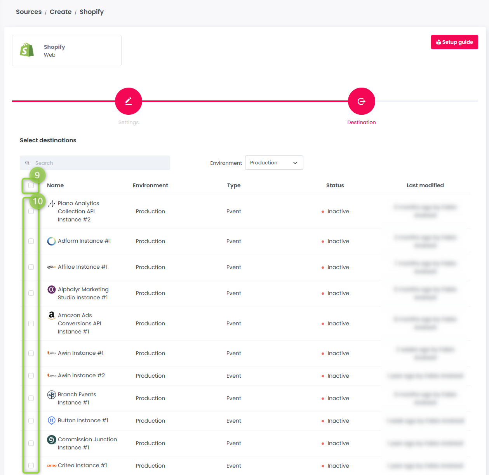
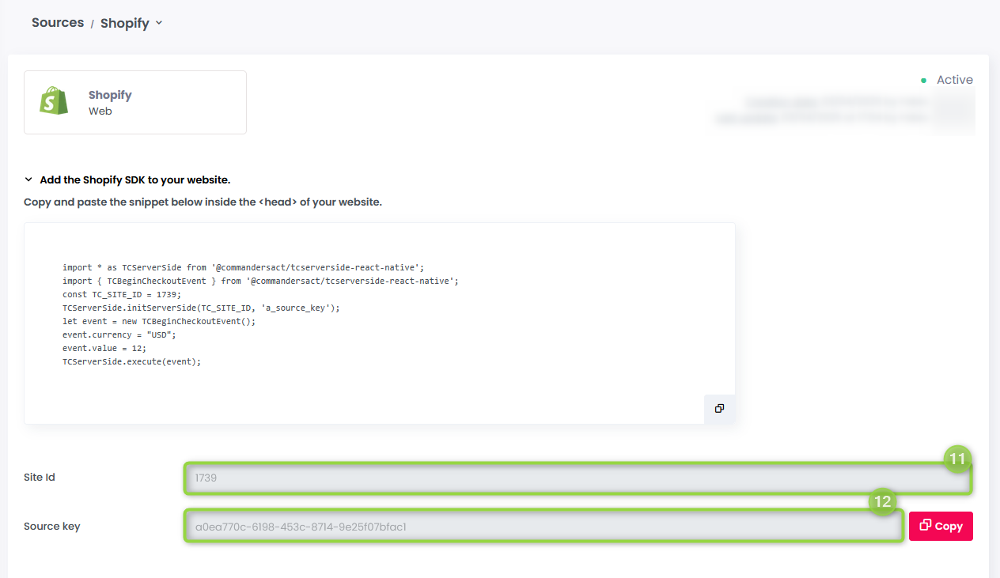
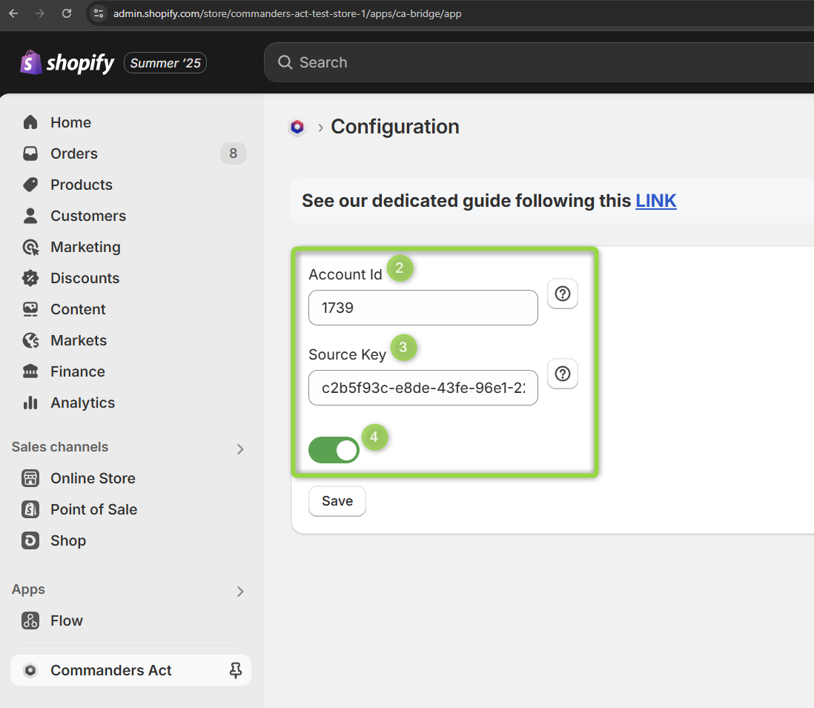

# Shopify


Our Shopify application and the related source are currently under final review and will be available soon.\
This page will walk you through the steps to add and configure your Shopify source and connect it to our Shopify Store application so you can get the most out of their sinergy.


The Commanders Act application, which is available in the Shopify App Store, helps merchants streamline their workflows by connecting Shopify events with partners. Whether you’re tracking customer interactions, or optimizing ad performance, our app simplifies the process. By intercepting Shopify Standard and Custom events, the Commanders Act application seamlessly integrates with your existing stack while leveraging Shopify Customer Privacy API. This means less manual setup and more secure data collection.

## Key features

* Connect [Shopify Standard](https://shopify.dev/docs/api/web-pixels-api/standard-events) and Custom events with your partners.
* Enable reliable server-side tracking capabilities via [destinations](https://doc.commandersact.com/getting-started/concepts#destination).
* Ensure user privacy by supporting [Shopify Customer Privacy API](https://shopify.dev/docs/api/customer-privacy).
* Preserve original Shopify event data.
* User-friendly configuration.
* Include debugging functionality for troubleshooting.

## Source setup

1. Log in into your [Commanders Act account](https://app.commandersact.com/).
2. From the left menu, click on `(1)` `Sources`  to expand the section:\
   \
   \

3. Click `(2)` `Source catalog` :\
   \
   \

4. In the search box, type `(3)` "Shopify" and click the `(4)` `Shopify web`  on the right:\
   \
   \

5. Click on `(5)` `Configure` :\
   \
   .png>)\

6. Input `(6)` a name for your source, select `(7)` an environment and click `(8)` `Next` :\
   \
   .png>)\

7. If you already have destinations up and running, you can connect them with your Shopify source by clicking the `(9)` top checkbox or by  `(10)` selecting which one of them you want to link:\
   \
   \

8. Scroll down to the bottom and click `Save`.
9. Take note of your `(11)` `Site/Account Id`  and `(12)` `Source Key` : \
   \
   \
   \
   You're going to use both values in the next section: [App setup](cashopapp.md#app-setup).

## App setup

1. Open [Shopify App Store](https://apps.shopify.com/).
2. In the search box, on the top, type: "Commanders Act" and click on it.
3. Install the app by clicking the `(1)` `Install`  button:\
   \
   \

4. Configure the app by providing both the `(2)` `Site/Account Id`  and `(3)` `Source Key`  from the source you created in the section [Source setup](cashopapp.md#source-setup) (See step 9.):\
   \
   \

5. Click `Save Configuration` to complete the setup and activate the app. See the next section [Validate your setup](cashopapp.md#validate-your-setup) to ensure tracking is activated.

## Validate your setup

1. Log in into your [Commanders Act account](https://app.commandersact.com/).
2. From the left menu, click on (1) `Sources`  to expand the section:\
   \
   \

3. Click (2) `Overview` :  \
   \
   \

4. In the search box, type (3) the name of your source and (4) click it:\
   \
   \
   \
   You may already have the (5) `Trend` showing a peak meaning that events are coming in. 
5. Click (6) `Event Inspector` :\
   \
   \

6. Check for reported log/entries.\

## Quick reference


The following table shows the mapping between Commanders Act and Shopify events.\
Custom Shopify events are also forwarded to Commanders Act with the same original Shopify event name.


| Shopify Events                     | Commanders Act Events         |
| ---------------------------------- | ----------------------------- |
| `cart_viewed`                      | `view_cart`                   |
| `checkout_completed`               | `purchase`                    |
| `checkout_shipping_info_submitted` | `add_shipping_info`           |
| `checkout_started`                 | `begin_checkout`              |
| `collection_viewed`                | `view_item_list`              |
| `page_viewed`                      | `page_view`                   |
| `payment_info_submitted`           | `add_payment_info`            |
| `product_added_to_cart`            | `add_to_cart`                 |
| `product_removed_from_cart`        | `remove_from_cart`            |
| `product_viewed`                   | `view_item`                   |
| `search_submitted`                 | `search`                      |
| `[Custom Shopify event name]`      | `[Custom Shopify event name]` |

## Field mappings


All Shopify properties are retrieved from the `event` property.\
The original Shopify event data, with all its properties, is stored in the Commanders Act property  `partners.shopify.event`  .


<table data-full-width="true"><thead><tr><th width="682.66650390625">Shopify Properties</th><th>Commanders Act Properties</th></tr></thead><tbody><tr><td><code>analytics.subscribe(...)</code></td><td><code>event_name</code> <strong>[1]</strong></td></tr><tr><td>
<code>data.checkout.order.id</code>

<code>data.element.id</code>
</td><td><code>id</code></td></tr><tr><td>
<code>data.checkout.subtotalPrice.amount</code>

<code>data.cartLine.cost.totalAmount.amount</code>

<code>data.cart.cost.totalAmount.amount</code>
</td><td><code>value</code></td></tr><tr><td><code>data.checkout.totalPrice.amount</code></td><td><code>revenue</code></td></tr><tr><td><code>data.checkout.shippingLine.price.amount</code></td><td><code>shipping_amount</code></td></tr><tr><td><code>data.checkout.totalTax.amount</code></td><td><code>tax_amount</code></td></tr><tr><td>
<code>data.checkout.currencyCode</code>

<code>data.cartLine.cost.totalAmount.currencyCode</code>

<code>data.cart.cost.totalAmount.currencyCode</code>
</td><td><code>currency</code></td></tr><tr><td><code>context.document.location.href</code></td><td><code>url</code></td></tr><tr><td><code>context.document.title</code></td><td><code>page_title</code></td></tr><tr><td><code>context.document.location.href</code></td><td><code>context.page.url</code></td></tr><tr><td><code>context.navigator.language</code></td><td><code>context.page.lang</code></td></tr><tr><td><code>context.navigator.userAgent</code></td><td><code>context.device.user_agent</code></td></tr><tr><td><code>data.searchResult.query</code></td><td><code>search_term</code></td></tr><tr><td><code>data.checkout.transactions.0.paymentMethod.type</code></td><td><code>payment_method</code> <strong>[2]</strong></td></tr><tr><td><code>data.checkout.discountApplications.X.title</code></td><td><code>coupon</code></td></tr><tr><td><code>data.checkout.order.customer.id</code></td><td><code>user.id</code></td></tr><tr><td><code>data.checkout.order.customer.isFirstOrder</code></td><td><code>user.status</code> <strong>[3]</strong></td></tr><tr><td>
<code>data.checkout.shippingAddress.firstName</code>

<code>data.checkout.billingAddress.firstName</code>
</td><td><code>user.firstname</code></td></tr><tr><td>
<code>data.checkout.shippingAddress.lastName</code>

<code>data.checkout.billingAddress.lastName</code>
</td><td><code>user.lastname</code></td></tr><tr><td><code>data.checkout.email</code></td><td><code>user.email</code></td></tr><tr><td>
<code>data.checkout.phone</code>

<code>data.checkout.shippingAddress.phone</code>
</td><td><code>user.phone</code></td></tr><tr><td>
<code>data.checkout.shippingAddress.address1 + data.checkout.shippingAddress.address2</code>

<code>data.checkout.billingAddress.address1 + data.checkout.billingAddress.address2</code>
</td><td><code>user.street</code></td></tr><tr><td>
<code>data.checkout.shippingAddress.city</code>

<code>data.checkout.billingAddress.city</code>
</td><td><code>user.city</code></td></tr><tr><td>
<code>data.checkout.shippingAddress.countryCode</code>

<code>data.checkout.billingAddress.countryCode</code>
</td><td><code>user.country</code></td></tr><tr><td>
<code>data.checkout.shippingAddress.province</code>

<code>data.checkout.billingAddress.province</code>
</td><td><code>user.state</code></td></tr><tr><td>
<code>data.checkout.shippingAddress.zip</code>

<code>data.checkout.billingAddress.zip</code>
</td><td><code>user.zipcode</code></td></tr><tr><td><code>data.collection.title</code></td><td><code>item_list_name</code></td></tr><tr><td>
<code>data.checkout.lineItems.X.variant.id</code>

<code>data.checkout.lineItems.X.merchandise.id</code>

<code>data.checkout.lineItems.X.id</code>

<code>data.cart.lines.X.variant.id</code>

<code>data.cart.lines.X.merchandise.id</code>

<code>data.cart.lines.X.id</code>

<code>data.collection.productVariants.X.variant.id</code>

<code>data.collection.productVariants.X.merchandise.id</code>

<code>data.collection.productVariants.X.id</code>

<code>data.searchResult.productVariants.X.variant.id</code>

<code>data.searchResult.productVariants.X.merchandise.id</code>

<code>data.searchResult.productVariants.X.id</code>

<code>data.productVariant.product.id</code>

<code>data.cartLine.merchandise.product.id</code>
</td><td><code>items.X.id</code> <strong>[4]</strong></td></tr><tr><td>
<code>data.checkout.lineItems.X.variant.product.title</code>

<code>data.checkout.lineItems.X.merchandise.product.title</code>

<code>data.checkout.lineItems.X.product.title</code>

<code>data.cart.lines.X.variant.product.title</code>

<code>data.cart.lines.X.merchandise.product.title</code>

<code>data.cart.lines.X.product.title</code>

<code>data.collection.productVariants.X.variant.product.title</code>

<code>data.collection.productVariants.X.merchandise.product.title</code>

<code>data.collection.productVariants.X.product.title</code>

<code>data.searchResult.productVariants.X.variant.product.title</code>

<code>data.searchResult.productVariants.X.merchandise.product.title</code>

<code>data.searchResult.productVariants.X.product.title</code> <code>data.productVariant.product.title</code>

<code>data.cartLine.merchandise.product.title</code>
</td><td><code>items.X.product.name</code> <strong>[4]</strong></td></tr><tr><td>
<code>data.checkout.lineItems.X.variant.price.amount</code>

<code>data.checkout.lineItems.X.merchandise.price.amount</code>

<code>data.checkout.lineItems.X.price.amount</code>

<code>data.cart.lines.X.variant.price.amount</code>

<code>data.cart.lines.X.merchandise.price.amount</code>

<code>data.cart.lines.X.price.amount</code>

<code>data.collection.productVariants.X.variant.price.amount</code>

<code>data.collection.productVariants.X.merchandise.price.amount</code>

<code>data.collection.productVariants.X.price.amount</code>

<code>data.searchResult.productVariants.X.variant.price.amount</code>

<code>data.searchResult.productVariants.X.merchandise.price.amount</code>

<code>data.searchResult.productVariants.X.price.amount</code> <code>data.productVariant.price.amount</code>

<code>data.cartLine.merchandise.price.amount</code>
</td><td><code>items.X.product.price</code> <strong>[4]</strong></td></tr><tr><td>
<code>data.checkout.lineItems.X.quantity</code>

<code>data.cart.lines.X.quantity</code>

<code>data.collection.productVariants.X.quantity</code>

<code>data.searchResult.productVariants.X.quantity</code> <code>data.cartLine.quantity</code>
</td><td><code>items.X.quantity</code> <strong>[4]</strong></td></tr><tr><td>
<code>data.checkout.lineItems.X.variant.product.vendor</code>

<code>data.checkout.lineItems.X.merchandise.product.vendor</code>

<code>data.checkout.lineItems.X.product.vendor</code>

<code>data.cart.lines.X.variant.product.vendor</code>

<code>data.cart.lines.X.merchandise.product.vendor</code>

<code>data.cart.lines.X.product.vendor</code>

<code>data.collection.productVariants.X.variant.product.vendor</code>

<code>data.collection.productVariants.X.merchandise.product.vendor</code>

<code>data.collection.productVariants.X.product.vendor</code>

<code>data.searchResult.productVariants.X.variant.product.vendor</code>

<code>data.searchResult.productVariants.X.merchandise.product.vendor</code>

<code>data.searchResult.productVariants.X.product.vendor</code>

<code>data.productVariant.product.vendor</code>

<code>data.cartLine.merchandise.product.vendor</code>
</td><td><code>items.X.product.brand</code> <strong>[4]</strong></td></tr><tr><td>
<code>data.checkout.lineItems.X.discountAllocations.Y.amount.amount</code>

<code>data.cart.lines.X.discountAllocations.Y.amount.amount</code>

<code>data.collection.productVariants.X.discountAllocations.Y.amount.amount</code>

<code>data.searchResult.productVariants.X.discountAllocations.Y.amount.amount</code>
</td><td><code>items.X.discount</code> <strong>[4]</strong></td></tr><tr><td>
<code>data.checkout.lineItems.X.discountAllocations.Y.discountApplication.title</code>

<code>data.cart.lines.X.discountAllocations.Y.discountApplication.title</code>

<code>data.collection.productVariants.X.discountAllocations.Y.discountApplication.title</code>

<code>data.searchResult.productVariants.X.discountAllocations.Y.discountApplication.title</code>
</td><td><code>items.X.coupon</code> <strong>[4]</strong></td></tr><tr><td><code>analyticsProcessingAllowed</code></td><td><code>analyticsProcessingAllowed</code> <strong>[5]</strong></td></tr><tr><td><code>marketingAllowed</code></td><td><code>marketingAllowed</code> <strong>[5]</strong></td></tr><tr><td><code>preferencesProcessingAllowed</code></td><td><code>preferencesProcessingAllowed</code> <strong>[5]</strong></td></tr><tr><td><code>saleOfDataAllowed</code></td><td><code>saleOfDataAllowed</code> <strong>[5]</strong></td></tr><tr><td><code>[Original Shopify event data]</code></td><td><code>partners.shopify.event</code></td></tr></tbody></table>


**\[1]** See Quick reference for more details.\
&#xNAN;**\[2]** See supported values [here](https://doc.commandersact.com/developers/tracking-and-integrations/tracking/events-reference#payment-methods).\
&#xNAN;**\[3]** Set with "New".\
&#xNAN;**\[4]** Value based on the priority list on the left column.\
&#xNAN;**\[5]** Property set from the base path `partners.shopify.userConsent`.


