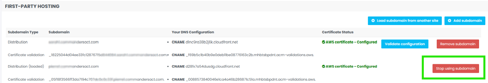

# Plugin Commanders Act Assistant

## Introduction

We are excited to introduce the latest version of our browser plugin, **Commanders Act Assistant (CAA)**! Designed to streamline your testing and debugging processes, CAA is fully compatible with **Google Chrome** and **Microsoft Edge**, offering seamless integration into your workflow.

[Download it now in the Chrome Store](https://chromewebstore.google.com/detail/commanders-act-assistant/lfaifjhjdolnpnlgeohohaalbeidhlpj)

\*Availability in the Microsoft Edge Store is coming soon!

## Key Features &#x20;

### Replace Web Containers easily

With CAA, you can effortlessly **switch between Web Containers versions without a container deployment.** You can test directly on your production website, allowing for quality assurance without disrupting your live environment.\
\
:heart: It's also **compatible with** [**Branches** ](branches.md)feature! :heart:&#x20;

<figure><figcaption></figcaption></figure>

<figure><figcaption></figcaption></figure>

### How to replace your(s) Web Container(s)

You can **test directly using the dedicated buttons** visible on the steps **"Generate," "Test," and "Deploy"** within the Commanders Act platform, making it easier to validate your configurations.


Plugin must be active on your browser to see these buttons


<figure><figcaption></figcaption></figure>

<figure><figcaption></figcaption></figure>

<figure><figcaption></figcaption></figure>

On click, you will be invited to enter the expected landing page for your test session, then click 'OK' to be redirected to your site.

<figure><figcaption></figcaption></figure>

### Stop Web Container(s) replacement&#x20;

To **turn off the override**, simply click the **button "stop override" on the plugin**.

<figure><figcaption></figcaption></figure>

### Monitor Tags in Action

Easily **view the list of triggered tags** as they fire on your website, giving you a clear overview of your tracking implementation in real time. Simply unfold the "web containers" section to see the list

<figure><figcaption></figcaption></figure>

### Reach your Web Container in 1 click

Use the icon aside the Site Name - Container Name to reach in just one click your Web Container on our Platform

<figure><figcaption></figcaption></figure>

### Keep a History Across Pages

CAA **records events across multiple pages**, ensuring you have a complete history of tag activations for a comprehensive debugging experience.

<figure><figcaption></figcaption></figure>


Need to clear your history ? You can **clear** by stopping the **"record across pages"** option, reloading the page, and turning it on again. \
This process will be improved in an upcoming update!


### Login required

To preserve confidentiality, our plugin requires to be logged on our platform.


Once you are logged, only the Sites and the Web Containers that you have access are visible through the extension


<figure><figcaption></figcaption></figure>

### Limitations

While CAA is a powerful tool, here are some current limitations to keep in mind:

* 🌍 **Consistent Web Container URLs:** The WebContainer URLs must remain the same across all pages for the plugin to function correctly.\

* ⚡ **SPA Compatibility:** On **Single Page Applications (SPA)**, the list of triggered tags is only filled on the **first hit** collected by the plugin. On each page change, the tags are added to the list.\
  \*This will behavior will be improved in an upcoming update, so stay tuned!\

<figure><figcaption></figcaption></figure>

### Future Enhancements

CAA is **continuously evolving**, with new features and improvements planned to further enhance your testing experience. Keep an eye out for future updates that will make debugging and optimization even easier!

Coming soon

* Events tracking
* Web DataLayer visibility

