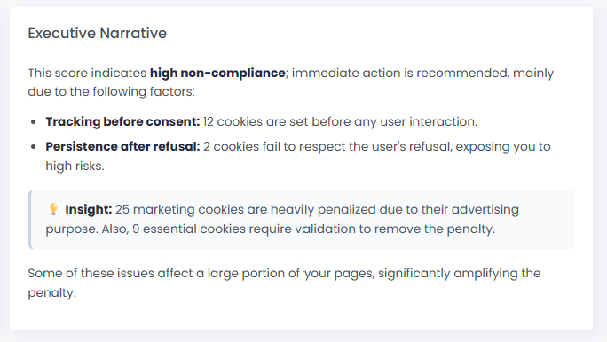

# Release notes

## Release 10.0.8 - 24/01/23

* **Product enrichment** & **External API -** _Public opening_\
  Enrich your events in real time with data transmission from your product catalog or from an external API. It does not requires any data storage \
  .png>)\

*   **OnSite API:**

    [5 new commands](https://community.commandersact.com/consent-management/onsite-api/consent.onready) are available, to help you on consent behaviour management:&#x20;

    * cact('consent.onReady', (consent) => console.log(consent))
    * cact('consentBanner.show')
    * cact('consentBanner.hide')
    * cact('consentCenter.show')
    * cact('consentCenter.hide')

* **Destinations:**
  * **Adobe Analytics**: beta
  * **Pinterest**: beta
  * **Piano Analytics**: improvement you can now set the Piano Site Id parameter with a dynamic value

## Release 10.0.7 - 24/12/22

* **Event enrichment** – **External API** Version 1.0 closed alpha. _Public opening on 12 Jan._\
  Enrich your events with instantaneous data transmission from an external API - no data storage required\
  .png>)
* **Destinations:**
  *   Easier debug in Event delivery and Event inspector, now both shows information when a javascript error raise in the destination code. Usefull when you build your own destination using the [Destination builder's Javascript Sandbox](../features/destinations/destination-builder/)\\

      <figure><figcaption></figcaption></figure>
  * **Google Universal Analytics** (GA3): beta
  * **Adobe Analytics**: closed beta
  * **Audience based destinations :** All "closed beta" or "closed alpha" destinations are now open to everybody.\
    Also, all these audience-based destinations benefit from the [Event Delivery](../features/destinations/event-delivery.md) feature and Threshold [Alerting](../features/destinations/event-delivery.md#alerting) feature\\
*   **Explore:** Enhancement of LRB integrations in the platform\\

    <figure><figcaption></figcaption></figure>

## Release 10.0.6 - 24/11/22

* Data Management – New feature:​
  * **Data Cleansing** no-code : **Rename event** public opening.\
    ​.png>)
  * **Campaign analytics** interfaces: public opening
  * **Event collection** UI : add a **global counter​**\
    .png>)
* **Event enrichment** – **product catalog** enhancement (closed alpha)​ _Public opening on 12 Jan._\
   (5).png>)
* Destinations:​
  * Destination builder **Sandbox JS**: Closed alpha\
    .png>)
  * **Google Enhanced Conversion** connector now supports more events​
  * **Commission Junction** : smart mapping adjustments and public opening​
  * **Google Univers Analytics**: closed beta
  * **Partnerize**: closed alpha
  * **TikTok**: Add **Smart Mapping** : closed alpha
  * **Adobe Analytics** : closed alpha
* Global Platform X:​
  * **Even faster interfaces** on : CMP UI, client-side TMS UI, Administrations UI, Campaigns Analytics UI => closed alpha. _Public opening on 13 Jan._
  * **Data Activation** features: public opening

## Release 10.0.5 - 24/10/22

* **Data management - new feature:**
  * [**Data Cleansing**](../features/data-quality/data-cleansing/) **no-code :** Clean, fix, refine your event data with a userfriendly interface (closed beta) _Public opening on 21 Nov._\
     (6) (1).png>)
* **Enrichment - new feature:**
  *   **Event enrichment from your Product catalog:** Copy in realtime time any properties of your imported product catalog to your choosen event.\
      Use case example: send a purchase event with only product ids and enrich your events on the server with all the product properties you have in your product catalog for these ids.\
      (closed beta) _Public opening on 08 Dec._\\

      ***

      <figure><figcaption></figcaption></figure>
*   **Destinations improvements:**

    * New destinations: [Commission Junction](../features/destinations/destinations-catalog/commission-junction.md) (closed alpha), Partenerize (closed alpha),[ Google Customer Match](../features/destinations/destinations-catalog/google-customer-match.md) (public beta)
    * New feature : **smart mapping** (closed alpha) : visualize/edit the data mapping done automatically by the system between your event properties and the destination's API.\
      _This feature will be progressively open on each destination during next months._\\

    <figure><figcaption></figcaption></figure>

    * Enhancement on existing destinations: Tradedoubler, Criteo conversion, Snapchat, GEC, TikTok, Kwanko
    * Event delivery: error's labels enhancement, easier to understand what is wrong
* **Sources enhancements:**
  * Web container : Add a summary/setup guide step.
* **Campaign analytics - new feature:**
  * New **whitelist** feature for landing page redirections (closed beta)

## Release 10.0.4 - 24/09/22

* **Global Platform enhancement**:
  * Help icon: a new menu that allows you to quickly find helps or send feedbacks\
     (2).png>)
  * **Onboarding tour:**\
    Interactive tutorials have been added to discover the platform features. You can access to it through the help icon at the top right\
    
* **Source improvements:**
  * Trend graph and quality indicator for HTTP Tracking API sources.\
     (5) (1).png>)
  * Quality indicators have also been added to Source Data Quality view. For each event you can now see at a glance if an event has a quality issue.\
    
  * iOS SDK: Core 5.1.1 ServerSide 5.1.2
    * Supporting TVOS Consent 5.1.2
    * Disclosure for IAB's vendors
* **Destinations improvements:**
  * Event delivery detail popin now shows also the intial events beside the destination hit and response. It allows to easily understand if there is wrong or missing properties in the original event\
    
  * Event inspector now show initial event too in each log
  * Enhancement on existing destinations : Piano Analytics
* Explore improvements:
  * Live report builder: you can now change in live the attribution model without having to edit the report\
    .png>)

## Release 10.0.3 - 24/08/22

* Sources improvements:
  * Live Events Inspector for sources, available both in Sources menu (for all sources) and on each source (tab Event Inspector). It allows to inspect/debug your incoming events​
* Destinations improvements: ​
  * _Advanced mapping_ feature evolves to Event [_Properties transformation_](../features/destinations/advanced-mapping.md) feature.
    * Ability to create new property and map them to existing one for a specific destination
    * Ability to remove event properties for a specific destination\
       (3).png>)
  * [_Alerting_ ](../features/destinations/event-delivery.md): _Event delivery_ alerting is now open to everybody on channels _email_, _Slack_ and _Microsoft Teams_.\
    Be alerted in real-time when one of your destination delivery drop below your threshold.\
    .png>)\\
  * Enhancement on existing destinations : Piano Analytics, Snapchat and Google Enhanced conversions
  * [Webhook ](../features/destinations/destinations-catalog/webhook.md)enhancement : ability to use properties, static values, or a melt of both, everywhere (url, body, headers)​
  * New destinations :
    * [Matomo](../features/destinations/destinations-catalog/matomo.md)
    * [Mapp](../features/destinations/destinations-catalog/mapp.md)
  * Template importer (closed alpha) : import in the destination catalog your custom destination template build with the [sandbox JS](../features/destinations/destination-builder/javascript-destination-builder/)\
    (Compatible with GTM templates)
* Campaign analysis -> Live Report builder look and feel enhancements
* Minor UI enhancements:
  * tooltip on all destinations or sources logo in overview UI
  * Increase clarity of labels on some UI
  * Add technical base for future onboarding features

## Release 10.0.2 - 24/07/22

* Event collection​\
   (1).png>)\
  Follow your events arriving at the platform in near-realtime, understand which source send it and which destinations are using it.​\
  Analyze past event count, up to one year ago, to master your event collection and associated cost\\
*   Sources improvements: ​

    * Duplicate a source (except web containers)​
    * Link/unlink destinations to a source (create and edit)​

    .png>)
* Destinations improvements: ​
  * Duplicate a destination to edit it in another environment​
  * Activate/ deactivate switch​, to pause a destination
  * Userfriendly way to select a specific sources to a destination (create and edit)​
  * Advanced mapping​ on each destination
  * TikTok connector (Web mode only, App mode in September)​
  * Piano Analytics, Snapchat, Criteo, GA4 enhancements/fix​
  * Matomo Analytics in closed alpha test\
     (1) (1) (1) (1).png>) (5).png>)

## Release 10.0.1 - 24/06/22

* Sources improvements: ​
  * Source data quality in health menu (global) and in a tab for each source​
  * Adding new sources, currently in closed alpha (Shopify, pixel tracking, cost imports…)​
  * Source event inspector : inspect each event individually (intelligent sampling)
  * Adding new environment: ‘development’​
* Destinations improvements: ​
  * Consent categories dropdown on destination’s filters​​
  * Destination description: what you will need & supported sources sections​
  * Adding new environment: ‘development’​
* Improvements on 2FA​
* Integration of segment stats interface​
* New connectors: Criteo Events, Tradedoubler, Xandr\*, Appnexus\*, Tableau\*​
* Destination enhancements:​
  * Webhook v2 (more methods, and more formatting data possibilities)​
  * Google Enhanced Conversion v2 (new Google API)​
  * Google Analytics 4 (more options)​
  * AT Internet (cookie server)​
  * Awin (more advanced affiliation property option)

(\*) audience based destination

## Release 10.0.0 - 21/01/2022

* Serverside v2 interfaces - closed beta 1

## Release 0.0.12 - 01/02/1970

* Removed humans, they weren't doing fine with animals.
* Animals are now super cute, all of them.

## Release 0.0.1 - 01/01/1970

* Introduced animals into the world, we believe they're going to be a neat addition.
