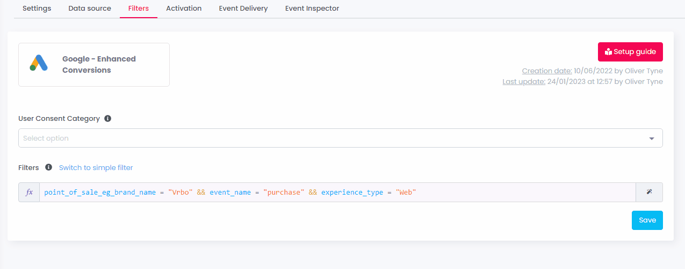

# Release notes

## Release 10.0.32 - November - 2025

✨ **New Features**

📤 **New Destination — Salesforce Marketing Cloud: Profile Sync (API)**  
A streamlined **real-time** destination for Salesforce Marketing Cloud is now available.  
It allows customers to **upsert profiles in real time** into Data Extensions using Salesforce’s official API, powering use cases such as abandoned cart flows, journey triggers, and continuous profile synchronisation.  
Setup is simple, with intuitive field selection and batch-compatible processing.

---

🧮 **Data Cleansing — Full-Screen Formula Editor**  
The formula editor has been completely redesigned for a more powerful and comfortable experience.

**What’s new:**  
* Full-screen editing in a side panel  
* Integrated Property Picker  
* Function catalog with one-click insertion  
* **Live Formula Tester** with instant feedback  
* Built-in AI copilot (**JarvX**) to create, modify, or explain formulas  

→ A faster, more intuitive workflow for all users.

---

🔧 **Destinations — Simplified Inputs & Smarter Editing**  
Destination setup is now easier and more consistent across all connectors.

**Highlights:**  
* Removal of old dual-mode inputs (text mode vs formula mode)  
* Each field now has two optional actions:  
  * **Property Picker** to inject dynamic values  
  * **Formula Editor** for advanced transformations  
* Cleaner UX aligned with modern server-side standards  
* More power thanks to integrated formulas & transformations  

→ Faster setup, fewer mistakes, and easier onboarding for all users.

---

🔗 **Destinations — Smart Mapping**  
Mappings are now easier to understand and configure.

**Improvements include:**  
* Display of labels, descriptions, and technical names  
* Guided Property Picker for selecting or changing mapped fields  
* Search capabilities for instant access to the right property  

→ Makes mapping self-explanatory and prevents configuration errors.

---

🔢 **Enhanced Data Types in Destinations**  
Destination connectors now provide more advanced handling of property types (numbers, booleans, strings, etc.).  
Users can still explicitly cast types using `STRING()` or `NUMBER()` when required.

→ Adds flexibility for advanced users with specific formatting or API integration needs.

---

🕓 **View History for Destinations**  
A new **View history** button summarises all modifications applied to a destination.

**Includes:**  
* Who made the change  
* What was updated  
* When it occurred  
* A compact before/after comparison  

→ Enables faster investigations, smoother collaboration, and clearer audit trails.

---

📜 **Activity Logs API — Now Filterable**  
The Activity Logs API can now filter activity based on any feature of the platform, including:

* Destinations  
* Sources  
* Enrichments  
* Data Cleansing  
* Data Models  
* Consent  
* Configuration updates  
* …and more  

→ Makes it easy to isolate specific events for troubleshooting, compliance reviews, and operational audits.

---

🔍 **Event Inspector for Audience-Based Destinations**  
Audience-based destinations now include a dedicated **Event Inspector** tab.  
Until now, Event Inspector was only available for event-based destinations.  
Customers can now review in realtime **exactly what is shared with each partner in real time** when sending audiences.

→ Easier debugging, full visibility on outbound payloads in realtime, and faster troubleshooting for consultants and support teams.

***

## Release 10.0.31 - October - 2025

✨ **New Features**

🍪 **Realtime Cookie Scanner**  
A new version of the Cookie Scanner is now available in the **Health** section.  
This redesigned module introduces a modern interface, improved navigation, and prepares the transition away from the legacy Cookie Scanner.

---

🍪 **Realtime Cookie Scanner – Feature Upgrades**  
Significant enhancements have been added to the new version:

* **Real-time alerting** when new cookies are detected  
* **Excel export** of the full cookie list (with filtering support)  
* **Redesigned Cookie Notice interface** for improved clarity and navigation  
* **Expandable rows** giving immediate access to detailed information  
* **Smarter cookie information**, with improved vendor/category/description detection  

→ Faster detection, clearer insights, and more audit-ready compliance reporting.

**What’s next?**  
The Realtime Cookie Scanner will continue to evolve with **new dedicated views** designed to give a more complete picture of cookie behaviour and compliance across your digital properties.  
These upcoming screens will progressively enrich the module with extended monitoring, origin tracing, categorisation, and more advanced compliance diagnostics.

📘 Documentation:  
[Realtime Cookie Scanner – EN](https://doc.commandersact.com/features/realtime-cookie-scanner)  
[Realtime Cookie Scanner – FR](https://doc.commandersact.com/fr/fonctionnalites/realtime-cookie-scanner)

---

📈 **Adloop – Automatic Tracking Templates for Google Ads**  
Google Ads tracking is now handled automatically by Adloop.

* Automatic installation of tracking parameters on campaigns  
* Option to apply parameters to existing and future campaigns  
* Alerts when tracking is missing or when reconnection is required  
* Unified Google Ads source replacing multiple variants (Search, PMax, Display…)  
* Much faster Transaction ID report loading, even on large accounts  

→ Simplifies setup, reduces errors, and ensures consistent data quality.

---

💡 **CMP – Banner Editor Optimization**  
The banner editing interface now loads significantly faster, even with large privacy configurations or custom code.  
→ Smoother workflows for advanced CMP setups.

---

📊 **Facebook CAPI – Easier Access to the “Performance” Tab**  
The Performance tab now automatically reuses the credential created during destination setup.  
→ No more login prompts, easier access to quality metrics.

---

⚡ **CMP – Banner Loading Optimization**  
CMP banners now load on **DOMReady**, improving website performance and reducing their impact on Core Web Vitals.  
This optimization becomes active when customers regenerate and redeploy their containers.

---

🧩 **Commanders Act Assistant v3.2.1**  
New improvements to the QA Chrome Extension:

* Simplified **container version replacement**  
* One-click **“Stop override”** action  
* Cleaner layout with more vertical space for tag review  

→ Faster and more intuitive QA experience.

---

🧱 **New Source – Effinity (Adloop)**  
Adloop now supports the **Effinity** affiliate source, enabling automatic import of affiliate conversion data.  
→ Extends attribution and reporting for affiliate programs.

***

#### 🛠️ Improvements

🖥️ **Server-Side Infrastructure Enhancements**  
Optimizations applied across server-side pipelines to deliver:  
* Faster and more consistent event processing  
* Higher scalability under heavy traffic  
* Improved stability across destinations  

🎨 **General UX & Performance Polishing**  
Additional interface refinements and micro-performance improvements deployed across the platform.

***


## Release 10.0.30 - September - 2025

✨ **New Features**

🧪 **Dry Mode for Destinations (General Availability)**\
Dry Mode, previously in closed beta, is now available to all customers.

* Simulate event delivery without sending data to the destination
* Outbound HTTP requests are mocked
* Full payloads visible in **Event Inspector**\
  → Safer setups, faster validation, and more confidence when going live.

📊 **Data Cleansing — Aggregation Functions**\
You can now apply **aggregation functions** directly on array properties of events:

* Functions: **AVERAGE, MIN, MAX, SUM, COUNT**
* Use cases: calculate margin per transaction, total order value, enrich events with margin data from product catalog
* Bonus: added **STRING()** function to convert numbers into strings

⚙️ **Data Cleansing — Execution Timing**\
Decide **when** your transformations run:

* At event reception (default)
* After enrichments (new)\
  → Enables margin-enriched events for advanced segmentation, exports, or POAS steering.\
  Currently in closed beta (open on request), rollout to all customers soon.

📤 **New Destination — Reddit Conversions API**\
Send your conversion data directly to Reddit via its Conversions API.

* Share web conversions with Reddit Ads
* Measure & optimize campaign performance
* Easy configuration with predefined templates

***

**🛠️ Improvements**

🧩 **Commanders Act Assistant v3.2.0**

* Container version switching via dropdown
* Hide empty variables for a cleaner view
* Automatic internationalization (FR/EN)
* Bugfix: `tC.event.*` no longer executes incorrectly on current page

🗑️ **TMS — Soft Delete**

* Deleted containers & branches kept in backup for **30 days**
* Restore available by support/devops after accidental deletion
* Past versions preserved for investigation\
  → Peace of mind for customers & support teams.

💸 **Server-Side Architecture Optimization**

* **Faster event processing**, even under peak traffic
* **Higher scalability**, ensuring smoother onboarding for large volumes
* **Improved stability**, with fewer resource constraints

📚 **Documentation in French**

* Product documentation now available in **French**: [doc.commandersact.com/fr](https://doc.commandersact.com/fr/)

***

## Release 10.0.29 - August - 2025

✨ **New Features**

📤 **New Destination — Econda (Server-Side)**\
Implement **Econda Analytics** via server-side as an alternative to client-side scripts.\
Includes support for **On-Site Campaigns** and **Rich Media (Video) Tracking**.

***

#### 🛠️ Improvements

⚙️ **Infrastructure & Performance Upgrades**\
This month, our teams have delivered a set of behind-the-scenes improvements to make the platform even more robust and ready for the future:

* Optimized data pipelines for **higher throughput** and smoother handling of peak traffic
* **Security hardening** across core services to further protect customer data
* Introduction of a smarter **backup system** with multiple redundancy points, ensuring rapid recovery in case of unexpected issues
* Continuous performance tuning of backend services to reduce latency
* Scalable foundations laid to support upcoming product features without service disruption

These upgrades are mostly invisible in the daily UI, but they strengthen the platform’s foundation and ensure customers benefit from **greater stability, performance, and security**.

***

### Release 10.0.28-bis - July - 2025

✨ **New Features**

🛒 **New Source — Shopify (Web) + App**

* Capture Shopify standard & custom events
* Respect **Shopify Customer Privacy API**
* Preserve original payloads for **Smart Mapping** & **Property Transformations**
* Easy install via dedicated Shopify App

🧮 **Adloop — Post-View Attribution**\
A new **probabilistic attribution model** is now available. It reallocates part of conversions initially credited to **SEO or Direct traffic** towards **Social Media campaigns** (Facebook, TikTok, etc.) when these campaigns likely influenced the conversion path.

The mechanism evaluates:

* **Advertising intensity** (campaign pressure & exposure)
* **Engagement metrics** (views, interactions, clicks)

→ This results in **fairer attribution** for social channels, correcting long-standing underestimation issues and helping marketers make **better budget allocation decisions**.

📘 Full documentation of the mechanism is available here: [Post-View Mechanism Documentation](https://community.commandersact.com/adloop/vii-adloop-tracking-and-attribution/post-view-mechanism)

***

#### 🛠️ Improvements

📊 **Adloop — Transaction ID Report**

* **Micro-conversions** now visible in the side panel for each touchpoint
* Report load time reduced to **1–2 seconds** for most clients

📱 **Flutter SDK Plugins Update**\
Forwarding of **Firebase events & consent signals** to Flutter apps (Android/iOS).

***

### Release 10.0.28-ter - June - 2025

✨ **New Features**

⚡ **Instant Interfaces — Phase 1 & 2**\
Massive speed improvements across the platform:

* **Instant** rendering (lists, tag creation, destinations, sources, event specification, enrichment, storage settings, properties list, segment stats & overlap)
* **Faster** UIs overall (\~25% on average, up to ×10 for container generation)\
  → First available internally in June, then **rolled out to all users on July 1st**.

***

#### 🛠️ Improvements

🧭 **CMP Contextual Side Nav**\
Dedicated sidebar for all privacy-related features → mirrors the TMS side-nav for a consistent UX.

🍪 **Cookie Scanner — Group Peek**\
Hover on grouped cookie names to instantly see the **5 most frequent cookies** in the group.

***

### Release 10.0.28-quater - May - 2025

✨ **New Features**

🧰 **Adloop — BigQuery as an Attribution Data-Source**\
Adloop can now run attribution on **BigQuery datasets** (alongside GA4 & Piano Analytics).\
→ Ideal for **large volumes** and **more precise raw data**.

📤 **New Destination — BigQuery (Server-Side)**\
Export server-side events to **Google BigQuery** in real time with:

* Easy connection to your GCP project
* Automatic schema mapping
* Optional table structure auto-discovery

📤 **Adloop — BigQuery Export Destination**\
Send **all Adloop data** (including conversion paths) directly to BigQuery for deeper analysis with BI tools.

***

#### 🛠️ Improvements

🔌 **Adloop — Simplified Data-Source Setup**

* Google & Bing (Shopping, Search, PMax…) and Meta accounts now easier to add
* **Simplified mode** (normalized metrics/dimensions) or **Expert mode** (extra options, filters, custom conversions)\
  → Faster onboarding, especially for agencies or clients with many accounts.

🛡️ **GDPR — Revoked User Logs**\
Automatic anonymization of all user logs older than **12 months post-revocation**.

🧪 **Tag Assistant (Chrome Extension)**

* Full **Data Layer** visibility (internal & external vars)
* **Container & Site names** displayed
* **Access control** enforced (only see what you’re allowed)
* UX refinements (collapsible panels, tc\_events history, login bug fix, etc.)

### Release 10.0.28 - April - 2025

✨ **New Features**

🔎 **Tag Assistant Chrome Extension**\
Perform faster, more secure QA with our browser plugin:

* See all tags triggered in one place
* Quickly access containers
* Security enhancements with login widget
*   Test your Branches directly\\

    <figure><figcaption></figcaption></figure>

📱 **New Source:** **Mobile Server-Side Events via React Native**\
Easily send server-side events from mobile apps using the React Native framework. A perfect fit for many of our customers.\\

🧠 **AI-Powered Support (Early Access)**\
The AI journey begins with new tools to assist your daily work:

* _JarvX_ auto-generates comments
* Formula generator pop-in for advanced setups
*   Side panel guidance for Commanders\\

    <figure><figcaption></figcaption></figure>

***

#### 🛠️ **Improvements**

📤 **Destination Builder – Direct Publishing**

* Users can now **publish Custom Destinations instantly**
*   Built-in safety checks to prevent errors\
    → **Greater autonomy & faster go-live**\\

    <figure><figcaption></figcaption></figure>

🗑️ **TMS – Branch Deletion Confirmation**

*   Added confirmation pop-up before branch deletion\
    → **No more accidental deletions**\\

    <figure><figcaption></figcaption></figure>

🗃️ **Custom Data Store & Storage Settings**

* Retain and reuse event data (up to 730 days)
* Store specific object properties
*   Fully configurable UI with safety warnings\
    → **Enrich future events with past context**\\

    <figure><figcaption></figcaption></figure>

***

#### 📌 **Beta / Closed Tests**

📁 **CSV Conversion Importer**\
Still in closed alpha – enabling 1st-party library hosting for **Google Ads + GA4** integrations.

🧪 **AI Features**\
Currently limited to selected users (Commanders) in closed beta. Public availability coming soon.

***

🎉 **New Destinations: (alpha versions)**

* Button
* Floodlight Mobile App Conversion

🛠️ **Destinations updates:**

* FB CAPI destinations: updated EMQ score via “Integration Quality” API (Performance tab)
* FB CAPI Advanced: fallback support for standard fields user.email and user.email\_sha256
* Effinity: support for custom properties and input fields for landing parameters
* Awin: encoded product names
* Piano Analytics: Enrichment API: value in the “Enrichment Configuration” instead of property name
* Snapchat CAPI: support for “invite” and “reserve” events.

That’s all for this update! Stay tuned for more improvements, and as always, let us know your feedback! 🚀🌟

## Release 10.0.27 - February - 2025

🍾 1st Party Hosting Now Available for All Customers!

What is it? Customers can now use their own URL (via CNAME) to host privacy files & web containers.

Why is it important? Ensures better data control while maintaining compliance.

<figure><figcaption></figcaption></figure>

***

🚨 TMS Modernization & Performance Boost

Web container generation is now faster and supports larger containers (though smaller is still best practice!).

New TMS UI with contextual side nav

<figure><figcaption></figcaption></figure>

***

🔒 Cookie Scanner Update: Teaser Alert Module Added

Prepares for future alerting features – get notified immediately when new cookies are found.

Competitive Advantage – Unlike competitors, our scanner provides real-time alerts (no waiting 24h for a crawler!).

<figure><figcaption></figcaption></figure>

***

🛠️ UX Enhancement: Filter Categories for Sources & Destinations

Find specific sources/destinations faster.

Easier workspace overview – Quick visibility on available integrations.

<figure><figcaption></figcaption></figure>

***

🌟 IAB Banners: Total Vendors Now Displayed

Market alignment with Google CMP Partner requirements.

Easier vendor visibility – Just regenerate & deploy the banner to update.

<figure><figcaption></figcaption></figure>

***

TMS API Update:

Added mapping variables for tags in API calls

[https://commandersact.github.io/api\_doc/#tag/Web-Containers](https://commandersact.github.io/api_doc/#tag/Web-Containers)

***

🎉 CMP Template Update in GTM

Use IAB TCF consent to manage part of the Google Consent Mode signal.

For customers using our CMP in GTM – Just enable it in Advanced Features.

<figure><figcaption></figcaption></figure>

***

🌟 TMS API Update – Retrieve Destination Mappings

New API capability – Customers can now retrieve destination mapping properties for data governance audits.

Technical Documentation:[ Commanders Act API Docs](https://commandersact.github.io/api_doc/#tag/Web-Containers)

***

🤖 AI-Based Commenting on Container Generation (Beta)

Faster comment generation (still optimizing for larger changesets).

Smarter summaries – Improved clarity.

Now translated UI – Not just in English anymore!

<figure><figcaption></figcaption></figure>

***

🔥 Event Specification (aka Normalized Datalayer) is Live for All Customers!

New Feature Name – Renamed based on Sales & Consulting feedback.

Customers can now set up their own validation rules.

<figure><figcaption></figcaption></figure>

***

🌟 Source Data Quality Enhancements

New Features:

Pagination added for event lists.

Event details now open in a side panel.

Search bar for easier filtering.

Benefits:

No more freezing or bugs with large event lists.

Faster page load times (side panel optimizations coming soon).

<figure><figcaption></figcaption></figure>

***

🎉 New Destination: RTB House Audience

Leverage RTB House Audience API to share audiences efficiently.

[Full integration guide available](../features/destinations/destinations-catalog/rtb-house-audience.md).

***

That’s all for this update! Stay tuned for more improvements, and as always, let us know your feedback! 🚀🌟

***

## Release 10.0.26 - December 16 - 2024

Modernization of TMS client-side interfaces!

-Simplified Navigation, with contextual side nav\
-Improved TMS steps

Pages Revamped:\
-Containers Overview\
-Tags Overview\
-Tags Library\
-Container settings\\

<figure><figcaption></figcaption></figure>

<figure><figcaption></figcaption></figure>

<figure><figcaption></figcaption></figure>

<figure><figcaption></figcaption></figure>

## Release 10.0.25 - October 2024

🍪🔍**Enhanced Cookie Scanner: Automatic Filtering & Unmatched Usability**

Our Cookie Scanner now delivers an unmatched user experience, combining the most exhaustive cookie capture on the market with powerful enhancements for usability and insight. Already leveraging data from tens of thousands of real users to capture a truly comprehensive view of cookies—something no virtual crawler can match—this update automatically filters out rare and irrelevant cookies, while adding advanced investigation and filtering capabilities for a more streamlined analysis.

* **Smart Filtering**: By default, cookies detected in fewer than 5% of sessions are now filtered out, allowing clients to focus on frequently relevant cookies while eliminating noise.
* **Flexible “Rare Cookies” Toggle**: A new toggle enables users to view all cookies, including rare ones, by adjusting an interactive frequency setting for tailored insights.
* **Automatic Pattern-Based Grouping**: Cookies with similar names are grouped when three or more share a pattern (e.g., `cookie_name...`), simplifying cookie lists and making analysis easier.
* **Enhanced Filters by Type and Domain**: New filters for cookie storage type and 3rd-party domain allow for more precise targeting in analyses.
* **Frequency Display for Insight**: Each cookie now includes an occurence frequency percentage, giving immediate insight into detection rates and relevance.
* **Detailed Tracking for 1st Party Cookies**: Full URLs of recent detections are displayed for first-party cookies, helping identify exact points of origin.
* **Improved Cookie Descriptions**: Enhanced descriptions clarify cookie types, offering clients a better understanding of cookie purposes.
* **Updated Documentation**: Detailed guidance on using these new features is available in our [documentation](https://doc.commandersact.com/features/consent-management/extensions/cookie-scanner) for a seamless user experience.

***

🔍📊 **Introducing the Destination Logs Exporter: Full Transparency for Outgoing Requests**

Our new **Destination Logs Exporter** feature, now in closed beta, complements our Live Event Inspector by providing a more comprehensive monitoring solution. While the Event Inspector samples data during high-traffic periods, the Destination Logs Exporter allows users to export _all_ outgoing requests from selected destinations. Each log includes detailed information, including the originating events, status, errors, etc. setting a new standard in data transparency and control.

* **Full Log Export to SFTP**: This feature captures every outgoing request, exporting raw logs to an SFTP server for secure access and long-term storage.
* **Detailed Event Tracing**: Logs provide comprehensive insights into outgoing requests, including the originating events, enabling precise data flow tracking and easier troubleshooting.
* **Seamless Integration**: Configurable directly within the destination catalog, ensuring quick setup and intuitive management.

Explore the full feature details in our [documentation](https://doc.commandersact.com/features/destinations/destinations-catalog/destination-logs-exporter) as we refine this tool during the closed beta phase.

***

👁️ **Enhanced Login Accessibility**

*   You can now view your password while logging in! This small addition aims to enhance accessibility for all users.\\

    <figure><figcaption></figcaption></figure>

***

🔗 **Improved Navigation for Sources**

*   The navigation menu now includes a shortcut to our Sources Catalog, saving you a click and making it even easier to locate the resources you need.\\

    <figure><figcaption></figcaption></figure>

***

🔄 **General UX Enhancements**

* **Loader Spinner:** Added to additional TMS client-side interfaces for smoother interactions.
* **Destination Overview:** Destinations in “dry mode” now display a clear label, reducing uncertainty about destination status.
* **Event Delivery:** Similar “dry mode” labels are added here too, so you’ll always know if a destination is live.
* **Augmented User Attribute:** Removed redundant “visitor” tags in sub-universes for clarity.
* **Source Data Quality:** Action buttons are now available to help quickly address errors in data sources.

***

:medal: **1st party hosting**

* **What’s New:** WebContainers and Privacy Banners can now use your customer domain to host files via CNAME, keeping data on our servers without external hosting. This will help bypass ad blockers and increase data collection while staying RGPD-compliant. The feature can be opened on customers account, on request.\
  Explore the full feature details in [our documentation](../configure/administration/domain-management/cdn-1st.md)

***

🔐 **New User Access Rights**

*   We’ve added 3 new access rights for destination UIs, providing more secure access for all Custom Profiles users.\\

    <figure><figcaption></figcaption></figure>

## Release 10.0.24 - September 2024

#### 🎯 _**Facebook CAPI Advanced**_**&#x20;Destination**

**Key Updates:**

* **Smart mapping:** Visualise all the data sent to Meta with default mapping you can customize
* **Enable App Tracking**: A new option to manage automatically to send all mobile data needed by Meta with dedicated app properties smart mapping.
* **More advanced options**: send automatically search event with page\_view if needed, and test mode\
  **Benefit**: You get the most configurable and user-friendly Facebook CAPI solution available on the market, tailored to fit advanced needs.

***

**New Destinations and Integrations**

* **Facebook Lead Ads**: Unlock lead optimization by [sharing CRM data back to Meta](https://doc.commandersact.com/features/destinations/destinations-catalog/facebook/facebook-lead-ads).
* **X (Twitter) Conversion API** Global opening : [Track conversions](https://doc.commandersact.com/features/destinations/destinations-catalog/x-twitter-conversion-api) without the website code.
* **Microsoft Advertising UET**: Available for all clients, offering features like [conversion tracking and auto-bidding](https://doc.commandersact.com/features/destinations/destinations-catalog/microsoft-uet).

***

🔧 **Javascript SDK new setProperty command**\
Now, you can set permanent property values, just like in our mobile SDK.\
**Why it’s useful:** This update allows you to save values more efficiently, simplifying processes for all customers.\
👉 For more details, check out our documentation [here](https://doc.commandersact.com/developers/tracking/properties-reference/permanent-properties).

***

🌟 **Enhanced cact API**\
A new cact('emit') API has been introduced to send browser-side events, replacing the older `tC.event.XXX` functions.\
**Why it’s better:** This new method ensures smoother integration with our tools and reduces errors when sending custom events. For more details, read [our documentation](https://doc.commandersact.com/features/sources/sources-catalog/web/js-sdk#browser-side-events)

***

#### 🔧 **Privacy-Related Custom Triggers**

We’ve added a set of [privacy-related events](https://doc.commandersact.com/features/consent-management/onsite-api) you can use to trigger custom actions in your tags.\
New triggers include:

* `consent_ready`
* `consent_updated`
* `consent_revoke`
* `banner_show/hide`
* `privacy_center_show/hide`

**Benefit**: Greater control over privacy actions within your tagging structure.

***

📦 **Server-Side Tracking as a Custom Trigger**\
The `cact('trigger', 'page_view')` method now launches [custom event tracking](https://doc.commandersact.com/features/sources/sources-catalog/web/js-sdk#custom-tag-triggers), streamlining your server-side and client-side event handling.\
**Benefit:** Enhance your event tracking setups with more precision and flexibility, especially useful for consultants handling complex multi-site environments.

***

🔧 **Tag Context Variables**\
We’ve introduced [Context variables](https://doc.commandersact.com/features/sources/sources-catalog/web/js-sdk#tag-context-variables) like `cact_container.id_site` and `cact_event.type` that can be used directly in your tags.\
**Why it’s helpful:** These additions make it easier to manage and track events across different sites and containers.

***

💾 Event enrichment from **Custom Data Store (Beta)**\
For our Beta customers, Storage Settings for [Custom Data Store](https://doc.commandersact.com/features/enrichments/events-enrichment#enrichment-from-custom-data-store) now allows a longer duration (30 days), improving data retention capabilities.\
Global opening : end of september

<figure><figcaption></figcaption></figure>

***

#### 🖇️ **TMS UX Enhancements (Closed Beta)**

Our TMS interface has been modernized to provide a smoother, more intuitive user experience. Now available for beta testing with some customers!

**New Features Include**:

* **Breadcrumb Navigation**: Stay on top of your position within the TMS with easy access to your containers (and soon your branches)
* **Contextual Side Navigation:** shortcuts to reach all webcontainer's related page's in a single click
* **Expanded Editing Space**: More room to modify tags, with a clearer "Tags Overview" UI for faster workflows.
*   **A new interface and 3 revamped ones:**

    * Tags Overview,
    * Tag Catalog,
    * WebContainers Overview,
    * Container Settings\\

    \\

    <figure><figcaption><p>Web containers UI</p></figcaption></figure>

    <figure><figcaption></figcaption></figure>

<figure><figcaption></figcaption></figure>

<figure><figcaption></figcaption></figure>

<figure><figcaption></figcaption></figure>

***

#### 🛡️ **Google CMP Partnership: Gold Tier**

We are officially a **Gold Tier** partner for Google’s CMP partner Program. This recognition underscores our commitment to the highest Google's standards in consent management.

***

Thank you for your attention and continuous engagement!\
We look forward to your feedback on these improvements.

***

## Release 10.0.23 - May 2024

#### May Release Notes 🌟

#### 📱 New Mobile Release

**Android**

* **Consent 5.3.2:** Automatic JSON update when receiving a new one from the CDN.\
  \&#xNAN;_Benefit: Ensures continuous compliance and accuracy._

**iOS**

* **Consent 5.3.0 / Core 5.4.0 / IAB 5.1.0:**
  * **Unified TCConsent Module:** Now there's only one module instead of separate ones for IAB and non-IAB.\
    \&#xNAN;_Benefit: Simplifies consent management._
  * **Remove Refused Vendors from TCUser:** When no consent is available.\
    \&#xNAN;_Benefit: Cleaner consent handling._

***

#### 💳 Credit Usage UI Improvements

**What's New:**

* **Time Split:** View by day for periods < 30 days, by week for periods < 90 days.\
  \&#xNAN;_Benefit: More precise credit usage tracking._
* **New Metric Names:** Closer to those on customer invoices.\
  \&#xNAN;_Benefit: Better data understanding._
* **UI Enhancements:** Improved sorting order, labels, and colors.\
  \&#xNAN;_Benefit: More intuitive and navigable interface._

**👥 Target Audience:** Sales team & customers with "account administrator" rights.

<figure><figcaption></figcaption></figure>

***

#### 🧼 Data Cleansing UX Improvement

* **Show More Than 10 Cleansings on a Single Page.**\
  \&#xNAN;_Benefit: Improved organization and management of cleansings._

<figure><figcaption></figcaption></figure>

***

#### 🍪 Technical Session Cookies Update

* **Renaming Cookies for 1st Party Tracking:** Previously named "phoenix".\
  \&#xNAN;_Benefit: More accurate and understandable nomenclature._

[More information here](https://doc.commandersact.com/configure/cookies).

***

#### 🔧 Cookie Scanner Fix

* Better detection of first-party session cookies

***

#### 🔍 Anti-Adblocking Enhancement

**Key Changes:**

* **Adblocker Detection:** Now included in web containers.\
  \&#xNAN;_Benefit: More comprehensive data collection despite adblockers._

**👥 Target Audience:** Customers using oneTag.\
You need to generate/redeploy all containers containing a oneTag tag.

***

#### 📈 Google Analytics 4 Enhanced Conversions

* **New Feature:** Send user-provided data along with the user identifier to improve behavior and conversion measurement.

***

#### 🛠 Amazon Ads CAPI Update

**Key Changes:**

* No longer in closed beta, open to all customers.
* More user-friendly setup: Add a new conversion definition directly within the destination settings.

**✨ Benefits:**

* Officially the easiest and most user-friendly Amazon CAPI setup

***

#### 📊 Facebook - Conversion API Advanced (closed beta)

**Key Changes:**

* **Dynamic Fields:** Allows dynamic values for Pixel ID and token.
* **Smart Mapping:**
  * Easier to review/master all data shared with Facebook
  * Option to send all properties as custom data or define them manually.
  * Option to send **App events** and review/edit app specific properties sent to Facebook
* **Advanced Settings:** Options for content type, custom data, test code and additional PageView events.\
  \
  \&#xNAN;_Benefit: Greater control over data shared with Facebook, more options, and flexibility._

**🎯 Why These Changes:**

* Integration of requested features and customer feedback

***

#### 🚀 New Destination: Outbrain

* **Server-Side Event Tracking:** Enabled for more accurate performance measurement.\
  \&#xNAN;_Benefit: Enhanced tracking capabilities._

***

Thank you for your attention and continuous engagement!\
We look forward to your feedback on these improvements.

***

## Release 10.0.22 - March 2024

**Mobile SDK Consent 5.2.1**\
🔧 Resolved a potential crash with Vendors details drop-down.\
➕ Added the Privacy Manifest file for enhanced security.\
🔨 Fixed Layout Constraints warnings on the purposes screen.\
🖼️ Ensured the Illustrations button always displays correctly.

_Benefits:_

* Smoother navigation without crashes.
* Enhanced privacy with manifest file integration.
* Improved layout stability for a seamless user experience.

***

**Mobile SDK Core 5.3.4, ServerSide 5.4.3, IAB 5.0.2**\
➕ All modules now feature the Privacy Manifest file.

_Benefits:_

* Heightened privacy measures across all platforms.

***

**New Destination: LinkedIn Conversions API**:link:\
🎉 Introducing the [LinkedIn CAPI](../features/destinations/destinations-catalog/linkedin_capi.md) for direct marketing data connection.\
\&#xNAN;_Benefits:_

* Track campaign performance anywhere for optimized results.
* Better attribution and cost efficiency with complete data sets.

***

**New Destination: Firebase Analytics for Mobile Applications** :bulb:\
📱 Introducing a new informative configuration page for Firebase Analytics integration.\
\&#xNAN;_Benefits:_

* Seamless bridge between CMP & Firebase Analytics.
* Easy implementation of Google Consent Mode with Firebase Analytics (GA4).

<figure><figcaption></figcaption></figure>

***

**Security Enhancement!** :shield:\
🔒 Native platform login has been exclusively streamlined with SSO.

_Benefits:_

* Enhanced security with SSO-only access.
* Improved user experience without confusion.

***

**Speed Boost!** :fast\_forward:\
🚀 TMS client-side now limits displayed container versions at the generation step for efficiency.

_Benefits:_

* Eliminates timeouts and crashes during version generation.
* Clients can still access the latest 100 versions effortlessly.

***

**Real-time Destination's settings updates** :rocket:\
🚀 Modifications now propagate instantly across all servers for faster updates (settings, filters, activation, dry mode, etc.).

_Benefits:_

* No more waiting times, changes take effect instantly.
* Easy testing iterations for seamless destination adjustments.

***

**Introducing new "Reset Password" Page!** :key:\
🔑 Enjoy a user-friendly password reset experience.

_Benefits:_

* Simplicity: Visual widget for accurate input and ability to use passphrase
* Smartness: Progress bar for security evaluation.
* Solidity: Compliance with new standards for passphrase usage.

<figure><figcaption></figcaption></figure>

***

**New Destination: Taboola Events**\
🎉 New destination now available for server-side event tracking with [Taboola](../features/destinations/destinations-catalog/taboola/).

_Benefits:_

* Track conversions without client-side pixel installation.

***

Your feedback matters! Let us know how these updates enhance your Commanders Act experience. :smiley: [https://www.commandersact.com/en/contact/](https://www.commandersact.com/en/contact/)

## Release 10.0.21 - February 2024

🔧 **GA4 Source Update (Adloop)** 🔧

* All GA4 conversion events now selectable as main conversions in Adloop
* Events conditionable by custom variables (customEvent, customUser)

💡 **Benefits**:

* Comprehensive GA4 data-source connector
* Clients easily locate diverse GA4 conversions & events in Adloop
* Precise attribution calculation for better performance insights

***

🔍 **Dry mode enhancement** 🔍\
We had a smart credential cache management on our (closed beta) [dry mode](https://doc.commandersact.com/features/destinations/dry-mode-lab) feature on destinations.\
💡Benefits: Allow to not have Event Delivery polluted by false errors when you switch to OFF the dry mode

***

🚀 **Source Data Quality Boost** 🚀\
🔍 Here's what's new:

🛠️ Faster interface loading for seamless user experience\
🛠️ Simplified menu for quicker access\
🛠️ Sneak peek into the Alerting system (closed beta)\
🛠️ Shortcut buttons for validation rules & Data Cleansing

✅ **Why it rocks**:

* Increased productivity with lightning-fast loading
* Simplified workflows for easier navigation
* Immediate issue detection for data quality perfection

<figure><figcaption></figcaption></figure>

***

🛡️ **New Privacy Template "popin accessibility"** 🛡️\
🔒 New offerings for enhanced privacy & UX:

🔹 Ready-to-use privacy template for WCAG compliance\
🔹 Streamlined UX with improved information display

💡 **Why it's great**:

* WCAG compliance made simple
* Enhanced opt-in rates with new popin template
* Improved clarity for better user engagement

<figure><figcaption></figcaption></figure>

***

🚀 **Customer Spotlight: Amazon CAPI Integration** 🚀\
🌟 Big shoutout to the team for wowing users with our CAPI integration! 🌟

## Release 10.0.20 - January 2024

🌟 **Vue.js Wrapper Version Update** (TMS)🌟\
🔗 [Explore the Latest Release](https://github.com/CommandersAct/vue-tag-commander)

* **Compatibility Enhanced**: Now fully compatible with Vue3, ensuring a smoother integration for your web applications.
* **Why This Matters**: Seamless updates mean less downtime and more productivity for developers leveraging Vue.js in their projects.

***

🔍 **Live Event Inspector Enhancements** 🔍

* **Test Code Events Bypass**: Events with the `test_code` property can now bypass the standard sampling limit (2 millions stored logs max), guaranteeing visibility in high-traffic scenarios.
* **Increased Visibility for Test Code Events**: For events marked with `test_code`, there is now a generous sampling allowance of 100 events per minute per event type. This guarantees the visibility of these events for testing and validation purposes.
* **Filterable Test Codes**: The `test_code` property has been made searchable and filterable, simplifying the QA process.
* **Targeted Benefit**: Ideal for server-side feature users needing comprehensive event tracking, like mobile app production tests.

***

📦 **Amazon CAPI Destination Beta** 📦\
🔗 [Closed Beta Access](https://doc.commandersact.com/features/destinations/destinations-catalog/amazon/amazon-ads-conversions-api)

* **Exclusive Early Access**: Initially available to some customers, with potential openings for eager customers.
* **Why Join the Beta**: Influence the development of our Amazon CAPI destination and get a head start on leveraging this powerful integration.

***

🔧 **Smart Mapping for Google Enhanced Conversions** 🔧

* **Intuitive Automation**: Automatic mapping with the option for manual adjustments enhances data accuracy and utility.
* **Why It's Great**: Spend less time on setup and more on Data Governance with this smart, flexible feature.

<figure><figcaption></figcaption></figure>

***

🛠 **UX Enhancements Across Destinations** 🛠

* **Error Prevention**: Fields now have helpful prompts in red for incorrect inputs, reducing errors and improving data quality.
* **Why It Matters**: A more user-friendly interface leads to fewer mistakes and a smoother operation for our clients.

<figure><figcaption></figcaption></figure>

***

📈 **Significant User Enrichment Feature Upgrade** 📈

* **Advanced Data Enrichment**: Create complex formulas for dynamic [**user scoring**](../features/enrichments/augmented-user-attributes/) and attributes, all with a no-code approach.
* **Business Impact**: Drive targeted marketing actions and advanced customer segmentation, leading to improved ROI and analytics capabilities.

<figure><figcaption></figcaption></figure>

<figure><figcaption></figcaption></figure>

***

📣 **CMP Feature Release: Google Consent Mode V2** 📣

* **Effortless Implementation**: Activate Google Consent Mode v2 easily, enhancing data collection quality while ensuring compliance.
* **Who Benefits**: Any client using Commanders Act Consent banners with Google tags, aiming for hassle-free RGPD compliance.

***

🌱 **Server-Side Architecture Eco-Efficiency** 🌱

* **Increased Efficiency**: We've optimized our architecture to process events more efficiently, significantly improving performance while minimizing our environmental footprint.

***

🔧 **Segmentation Engine v1 Update** 🔧

* **Refined Performance**: We've made incremental but meaningful updates to the Segmentation Engine v1, improving the efficiency of segment calculation times. This enhancement ensures smoother site personalization experiences.
* **Site Personalization Impact**: These improvements will subtly enhance the speed for websites to customize pages for each visitor, ensuring a more seamless user experience.
* **Looking Ahead**: Our development focus is on the Segmentation Engine v2 (currently in QA phase), which is set to bring groundbreaking performance and modernization that will take segmentation to the next level.

***

📲 **Facebook CAPI Now Supports Offline Conversions** 📲

* Send your offline conversion through your purchase event (type: offline)

***

📱 **Google Consent Mode Update for Android & iOS** 📱

* **Firebase Users**: Ensure seamless integration with the latest versions tailored for Android and iOS platforms.

***

🎹 **Piano Analytics Enrichment API Destination Released** 🎹

* **Data Enrichment Made Easy**: Seamlessly update transaction statuses or values, enriching your data landscape.

## Release 10.0.19 - December 2023

*   🔧 **Advanced Flexibility in Destination’s Consent Filters:** Get more flexibility for complex privacy setups\
    \
    You managing consent through our CMP while also utilizing a competitor's solution for different websites on the same account?\
    \
    You can now employ native privacy filters from either our CMP or an external solution within the same account !\\

    <figure><figcaption></figcaption></figure>
*   📊 **Enhanced Event Collection Charts: Now More Insightful.** It's such easier to see the type of events collected! \\

    <figure><figcaption><p><br></p></figcaption></figure>
*   🔒 **Data Governance: Introducing 'Tag & Data Sharing' Page.** In a quick view, control the shared Datas through the Client-Side TMS tags.\
    \&#xNAN;_\*Please note: This is the preview v0 of this page. A nicer version is coming soon!_\\

    <figure><figcaption></figcaption></figure>
*   🔑 **Streamlined Platform Administration Access**: Instant Workspace Access. No more need to log out and re login when you get access to a new site\
    \
    As an administrator, you granted access to a workspace to one of your colleague? He just need to refresh the page to see the site into the search bar's list. No need to log out and re-login anymore!\\

    <figure><figcaption></figcaption></figure>
*   🌟 **Consistent and Upgraded Chart Styles Across the Platform** is now applied to all graphs!

    All our customers can enjoy a better visualization with this enhancement of standardization on our platform.\\

    <figure><figcaption></figcaption></figure>

## Release 10.0.18 - November 2023

* **Ability to search by source-key** in the Source Overview & Destination Overview UIs:

<figure><figcaption></figcaption></figure>

*   **New version of the Source Data Quality** UI: It's even easier to see the quality of your data at a glance !\
    "_What proportion of events have errors to need to be fixed?_" The new Overview chart give you the answer in realtime.\
    You will also be able to filter by environment (by default Production environment is shown) and by source.\\

    <figure><figcaption></figcaption></figure>
* **Platform**
  * User Management UI: speed increase x3 \\
* **Destinations**
  * GEC destination enhancement: Avoid random "failed\_get\_conversion\_id" errors in Event Delivery.
* **Mobile**
  * **React-Native:**
    * add `useLegacyUniqueIDForConsentID` & `useLegacyUniqueIDForAnonymousID`
    *   startScreen for privacy center choose your launch on the Vendors or Purposes UI

        \\
* **Documentation**
  * [Easy setup guide for Privacy in GTM](https://doc.commandersact.com/features/consent-management/setup-guides/tag-manager/google-tag-manager-gtm)
  * [Data retention duration](https://doc.commandersact.com/configure/data-management/data-retention-duration)

## Release 10.0.17 - 24/10/23

* **Platform**
  * Security enhancement : passwords now required a minimum of 12 characters
  * Proxy configuration (Cloud Flare, etc.) in domain management UI

<figure><figcaption></figcaption></figure>

* **TMS/CMP interfaces:**
  * Slightly increase UI loading time on TMS pages​
  * UI random errors fixed\\
*   **Server Side**

    * **Event Inspector** UX improvement: user properties (standard and custom) are now searchable by default

    <figure><figcaption></figcaption></figure>

    * **Destination Event delivery** UX improvement:​ Longer duration for conservation of error details​

    <figure><figcaption></figcaption></figure>

    * **Destination Properties Transformations** option UX improvement: allows the same transformations as the Data Cleansing UI​

    <figure><figcaption></figcaption></figure>
* **Debug Mode for Source/Destination Live Event Inspector**\
  Adding a special parameter to you events allows you to have them visible in Event Inspector, even on production environment with billions of events. This debug parameter will allows you to bypass the "Intelligent Sampling".\
  [https://doc.commandersact.com/features/sources/live-event-inspector#debug-mode](https://doc.commandersact.com/features/sources/live-event-inspector#debug-mode)\\
* **Mobile**
  *   **Consent​**

      Android & iOS: ​

      * iAB new function to get the number of IAB vendors​
        * iAB remove consentOutdated callback migrating to iabv2.2​

      Android: do\_not\_track parameter as a boolean inside the payload​

      IOS: illustrations fix on privacy center​

      ​
  * **Core​**
    * Android & iOS: translations fix on migrating to iab v2.2​
  *   **Server Side​**

      * Android & iOS: ​
        * language and country code from the device​
        * 2 function to use legacy ID TC\_UNIQUEID​

      ​
* **New destinations**
  * The Trade Desk: CAPI
  * Piwik PRO
  * Alphalyr Marketing Studio
  * TradeTracker
* **Destinations​ updates**
  * Awin: support for “Smart Mapping” and “Custom Event Properties”.​
  * Mapp: support for "Independent parameters“.

## Release 10.0.16 - 24/09/23

* **TMS/CMP ​interfaces:** Add a loading indicator to TMS/CMP interfaces\\
* **Copy Manager​**: When you duplicate a site (aka workspace), you can now copy Server Side configurations (PlatformX activation, Sources, Destinations, Data Management, Enrichments, etc...)

<figure><figcaption></figcaption></figure>

* **Interface speed improvements​** on the following pages:
  * TMS: Container overview => +22%​
  * TMS: External variable => +41%​
  * Mix: Attribution option => + 46%​
  * CMP: Privacy banners overview => +38%​
  * Admin: Profile management => +21%
  * Segment overview => +40%
* **Files imports:** The fields mapping now support conditionnal value transformation with [Data cleansing formulas​](../features/data-quality/data-cleansing/supported-transformation-functions/)\\
*   **Data Activation: Variables** **UI** can now be reached from Segment overview\\

    <figure><figcaption></figcaption></figure>
* **Mobile​**\
  Android & iOS: add language & region​\
  Android & iOS: Firebase Destination (for Analytics)​\
  IOS: Fix for non-IAB Privacy​\\
* **Destinations​ updates**
  * Adobe Analytics​ authentication token. You can see our [updated documentation here](https://doc.commandersact.com/features/destinations/destinations-catalog/adobe/adobe-analytics)
  * Pinterest: support for "click\_id“ and "view\_item" mapped to "page\_visit“.​
  * Piano Analytics Collection API: removed useless “ref” parameter.​

## Release 10.0.15 - 24/08/23

* **New API "Users Activities logs"**\
  This new API allows administrators to get all users activities history (who has changed what, when, etc...). Read the technical [API documentation](https://commandersact.github.io/api_doc/#tag/AdminActivityLogs) to start using it.\\
*   **Live Report Builder: enhancement on UI**\
    The filters are now directly visible as before, and the data set limitation (if any) is visible on mouse over only on the flag "limited dataset"

    \\

    <figure><figcaption></figcaption></figure>
*   **Data Cleansing: new function "GET(property\_name)"**\
    Allows to work on a property name that contains special characters incompatible with formula. For example if your property name contains a `-` like `page-count` you will not be able to write this formula because it is interpreted as a minus sign :\\

    ```
    page-count-5
    ```

    Now you can, just write :\\

    ```
    GET("page-count")-5
    ```

    \
    You can read our dedicated [documentation here](https://doc.commandersact.com/features/data-quality/data-cleansing/supported-transformation-functions)\\
*   **Consent dashboards: new metric for "Global Privacy Control"**\
    This new metric will help you to identify the amount of "Optout All" registered through a GPC parameter turned ON\\

    <figure><figcaption></figcaption></figure>
* **Consent banners: IAB TCF v2.2 compliance**\
  Our customers can now be compliant with the latest framework of IAB TCF (v2.2)\
  It is available for Web & Mobile apps !\
  If you need more information about migration please check [this section of our documentation](https://doc.commandersact.com/features/consent-management/knowledge-base/iab-tcf-v2.2-release-details)\\
* New destination : [Google Ads Conversion Adjustment](../features/destinations/destinations-catalog/google/google-conversion-adjustments.md) (_closed beta_)\\
* Normalized Datalayer (closed beta)_:_ Add an option to not consider missing properties as an issue (not impacting quality score). Accept unspecified properties without warning\\
* UX enhancements and speed up of Destination's interfaces (destination list, etc.)

## Release 10.0.14 - 24/07/23

*   **Performance tab of Facebook CAPI destinations**\
    For more information, you can have look to our new documentation's [dedicated page](https://doc.commandersact.com/features/destinations/destinations-catalog/facebook/facebook-conversions-api/performance-tab-event-match-quality)\\

    <figure><figcaption></figcaption></figure>
*   **Live Report Builder: 2 new charts**\
    We added two new type of charts in LRB : bar chart and pie chart.\
    You can retrieve them in the edition part of a LRB report !\\

    <figure><figcaption></figcaption></figure>

    <figure><figcaption></figcaption></figure>
*   **Live Report Builder: UX enhancement**\
    The filters are now directly visible as before, and the data set limitation (if any) is visible on mouse over only on the flag "limited dataset"\\

    <figure><figcaption></figcaption></figure>
* **Mobile: New SDK version released for IAB TCFv2.2**\
  For more details, please read our [documentation page](https://community.commandersact.com/consent-management/knowledge-base/iab-tcf-v2.2-release-details/iab-tcf-v2.2-migration-guide-app)\
  For technical instructions, you can refer to our Github : [Android](https://github.com/CommandersAct/AndroidV5/tree/master/TCIAB) &[ IOS](https://github.com/CommandersAct/iOSV5/tree/master/TCIAB)

## Release 10.0.13 - 24/06/23

* **New Source: Pixel Tracking API**\
  Pixel Tracking API, also known as 1x1 gifs, or clear gifs, allows you to send data to Commanders Act with a HTTP GET request from your server, your local console or any development framework.\
  You can have a look to [our dedicated documentation](https://doc.commandersact.com/features/sources/sources-catalog/web/pixel-tracking) page for more details.\
  \
   (8).png>)\\
*   **Data Cleansing: New functions available**\
    9 new functions related to dates:\
    DATEPARSE ; DATEFORMAT ; DATEADD ; DATESUB ; DATEDIFF ; AGE ; \[YEAR, MONTH, DAY, HOUR, MINUTES, SECONDS] ; TIMEZONE ; TODAY\
    \\

    <figure><figcaption></figcaption></figure>
*   **Consent: New setting "Global Privacy Control"**\
    Setting to be configured at the banner level. Required for CCPA banners\
    For further information, you can read [this page](https://community.commandersact.com/consent-management/knowledge-base/ccpa-and-global-privacy-control)\\

    <figure><figcaption></figcaption></figure>
*   **Destinations: New section 'events filtered' on Event Delivery tab**\
    For all destinations, on Event Delivery tab, there is a new section with number of filtered events (consents, conditions defined)\\

    <figure><figcaption></figcaption></figure>
*   **Destinations: Dry Mode (lab) - Closed Beta**\
    The Dry mode allows you to simulate sending events, **but events are not sent** to the destination.\\

    <figure><figcaption></figcaption></figure>
*   **Destinations: update on Facebook Conversion API**\
    We released a Performance tab with Event Match Quality score\
    The Performance tab can now display Event Match Quality insights, coming from Facebook.\
    It represents the matching quality, referring to the quality of events sent (completeness of data, like events with email, phone, fbp, fbc...). More identifiers are present on events sent, better is the score.\
    You can have a look to our [documentation ](https://doc.commandersact.com/features/destinations/destinations-catalog/facebook/facebook-conversions-api/performance-tab-event-match-quality)\\

    <figure><figcaption></figcaption></figure>
*   **UI Improvements: Statistics on weather icons**\
    On hover of weather icons, you can see the percentage of accepted/refused events\\

    <figure><figcaption></figcaption></figure>

## Release 10.0.12 - 24/05/23

*   **Event delivery improvement for Audience based destinations**\
    Event Delivery errors messages for Audience connectors (API connectors such as Facebook Custom Audience, Google Customer Match...) now provide more detailed information about errors encountered.

    <figure><figcaption></figcaption></figure>
*   **Sources: update on GTM Bridge**\
    A Commanders Act source key is now required in the bridge configuration. As, in the future, events without a source key will be discarded, it is important that you apply the update.\
    If it is not already done, please update it as soon as you can, following the instructions available in our [documentation](https://doc.commandersact.com/features/sources/sources-catalog/gtm).\
    \\

    <figure><figcaption></figcaption></figure>
*   **Destinations settings enhancement:**\
    New dynamic text input component on settings fields (except Smart Mapping for the moment)\
    \\

    <figure><figcaption></figcaption></figure>
* **Mobile:**
  * **Video Events are now natively supported**\
    For more informations about video events, you can have a look to [our documentation](https://doc.commandersact.com/developers/tracking/about-events/mobile-sdk-event-specificity)
  * **the property 'do not track' has been added**\
    Required by CNIL for Consent Statistics exempted. For more information check [our documentation](https://community.commandersact.com/consent-management/knowledge-base/consent-cookies-exemption/implementation-guide-for-exempted-consent-statistics-fr-market)
  * **Flutter SDK minor updates**\\
*   **New destinations releases:**\
    \
    [**Adform**](../features/destinations/destinations-catalog/adform.md)**:**\\

    <figure><figcaption></figcaption></figure>
*   **Destinations updates:**\
    \
    **Equativ:** improvements and user/cookie sync fix\\

    <figure><figcaption></figcaption></figure>

    **GA4:** send all properties option, automatic session id.\
    Proxy mode is open to more beta customers. Global opening on 25/05\\

    <figure><figcaption></figcaption></figure>

    **Piano Analytics:** send all properties\\

    <figure><figcaption></figcaption></figure>

    **TikTok:** “Smart Mapping” support\\

    <figure><figcaption></figcaption></figure>

    **Partnerize:** field encoding fixes\\

    <figure><figcaption></figcaption></figure>

    **Awin:** dynamic fields support

    <figure><figcaption></figcaption></figure>

    \
    **Commission Junction:** dynamic fields support

    <figure><figcaption></figcaption></figure>

## Release 10.0.11 - 24/04/23

*   **A new item has been added to the navigation menu of our platform: 'Data Governance'**.\
    For the moment, you will find the pages related to your privacy banners configuration's in the tab 'Consent Management'.\
    More pages are coming soon!

    <figure><figcaption></figcaption></figure>
*   **Data Cleansing: 2 new function for your formulas:**\\

    <figure><figcaption></figcaption></figure>

    <figure><figcaption></figcaption></figure>
*   **New destinations releases**\
    \
    **Data Activation Legacy:** Only for Data Activation customers. Gives you the possibility to map the format of the events to the format of the data activation (Data Commander variables). To go deeper, you can consult our [online documentation](https://doc.commandersact.com/features/destinations/destinations-catalog/data-activation-legacy) \\

    <figure><figcaption></figcaption></figure>

    **GA4 Proxy Mode:** The proxy mode option allows you to anonymize data before to send it to Google.\
    \*We also added analyses, suggestions and report's impact in our [online documentation](https://doc.commandersact.com/features/destinations/destinations-catalog/google/google-analytics-4/google-analytics-4-proxy-mode#3.-impact-analysis-and-open-suggestions)\
    \\

    <figure><figcaption></figcaption></figure>
*   **Destinations updates**\
    \
    **GA4:** Send all properties in one click to Google\\

    <figure><figcaption></figcaption></figure>

    \
    \
    **TikTok:** Offers a smart mapping option

<figure><figcaption></figcaption></figure>

* **Bridge updates**\
  \
  GTM bridge: a Commanders Act source key is now required in the bridge configuration. As, in the future, events without a source key will be discarded, it is important that you apply the update.\
  For further information, read the bridge’s [updated documentation](https://doc.commandersact.com/features/sources/sources-catalog/gtm).

## Release 10.0.10 - 24/03/23

* **Formula component enhancement (Data Cleansing, Event Enrichment, ...)**\
  The field now resizes automatically according to the size of the formula, to facilitate the reading and writing of complex formulas. Users can also resize the field themselves if needed

<figure><figcaption></figcaption></figure>

* **New User Rights**\
  3 new user rights have been added in Rights management interface to manage the _Destination Builder_ feature

<figure><figcaption></figcaption></figure>

* **New SDKs:**\
  \
  SDK for **Flutter** is launched\
  For further informations, please check our github\
  [https://github.com/CommandersAct/tcserverside-plugin\
  https://github.com/CommandersAct/tc-consent-plugin\
  https://github.com/CommandersAct/TCMobileDemo-flutter](https://github.com/CommandersAct/tcserverside-pluginhttps://github.com/CommandersAct/tc-consent-pluginhttps://github.com/CommandersAct/TCMobileDemo-flutter)\
  \
  SDK **Angular 15** is available\
  Note : it's also compatible with Angular 14.\
  Check our GitHub for more informations :\
  [https://github.com/CommandersAct/ngx-tag-commander](https://github.com/CommandersAct/ngx-tag-commander)\
  [https://github.com/CommandersAct/ngx-tag-commander/blob/master/README.md](https://github.com/CommandersAct/ngx-tag-commander/blob/master/README.md)\\
*   **Filters enhanced on destinations**

    * quick/easy filter with autocomplete
    * more operators (contains, match regex, etc.)
    * advanced mode with formula (ability to create very complexe filter, applying our formula function to any condition)\\

    <figure><figcaption></figcaption></figure>
*   **Data Quality indicators and trend graph are now displayed on all sources**\\

    <figure><figcaption></figcaption></figure>
*   **New option on LRB report**\
    you can now choose to do not display the "non attributed" line in a report

    <figure><figcaption></figcaption></figure>
* **New destinations releases**\
  \
  **Partenerize**\
  Note : this destination allows a dynamic field\
  \
  \
  **SmartAd Server**\
   (3).png>)\
  \
  **Rakuten Events**\
   (1) (1).png>)\\
* **Destinations updates**\
  \
  **Mapp:** usability improvements\
   (1).png>)\
  \
  **Partnerize:** Advanced operations added\
   (2).png>)\
  \
  **Snapchat:** SmartMapping support\
   (1).png>)

## Release 10.0.9.1 - 22/02/23

* **Destination builder - Javascript sandbox**\
  Create your own custom destination using basic javascript code !\
  You can create event-based or audience-based destination.\
   (2).png>) (1).png>) (3) (3).png>) (1).png>)

\
More information here:


[destination-builder](../features/destinations/destination-builder/)


* **UI enhancement**\
  Data Cleansing and Event Enrichment features benefit for a even more userfriendly autocomplete property selector component. Find quicly your property or create a new one in a click.\
   (3).png>)
*   **Data Cleansing – new functions added​**

    [JSON\_PARSE() and VALUE\_FROM\_JSON()​](../features/data-quality/data-cleansing/supported-transformation-functions/#available-functions)
*   **Events reference update**

    [video events](../developers/tracking/events-reference/video-event-reference.md) has been added
* **New destinations:**
  * [Pinterest](../features/destinations/destinations-catalog/pinterest.md)
  * [Equativ ](../features/destinations/destinations-catalog/equativ-audience.md)(audience)
  * [Partnerize](../features/destinations/destinations-catalog/partnerize.md)
  * Updates: Matomo, Kwanko, Google Universal Analytics
* **Consent management - Exempted statistics** ​
  * New tag in the library to facilitate the setup​
* **Event Replay -** _Closed alpha​_
* **New source:**
  * **Flutter - for mobile App** – _Closed bet&#x61;_&#x200B;
* **Campaign analysis ​**
  * Campaign Overlap enhanced => possibility to go back up to 30 days​\
     (2).png>)
  * Make it possible to send a timestamp with the incoming hit​ of your campaigns collection

## Release 10.0.9 - 14/02/23

* **27% increase in the speed** of the interfaces listed below:
  * Client-side TMS UIs
  * Segments UIs
  * Admin UIs
  * Campaign options UIs
  * Banner builder and consent Dashboard UIs

## Release 10.0.8 - 24/01/23

* **Product enrichment** & **External API -** _Public opening_\
  Enrich your events in real time with data transmission from your product catalog or from an external API. It does not requires any data storage\
   (2) (1).png>)\\
*   **OnSite API:**

    [5 new commands](https://community.commandersact.com/consent-management/onsite-api/consent.onready) are available, to help you on consent behaviour management:

    * cact('consent.onReady', (consent) => console.log(consent))
    * cact('consentBanner.show')
    * cact('consentBanner.hide')
    * cact('consentCenter.show')
    * cact('consentCenter.hide')
* **Destinations:**
  * **Adobe Analytics**: beta
  * **Pinterest**: beta
  * **Piano Analytics**: improvement you can now set the Piano Site Id parameter with a dynamic value

## Release 10.0.7 - 24/12/22

* **Event enrichment** – **External API** Version 1.0 closed alpha. _Public opening on 12 Jan._\
  Enrich your events with instantaneous data transmission from an external API - no data storage required\
   (3) (1).png>)
* **Destinations:**
  *   Easier debug in Event delivery and Event inspector, now both shows information when a javascript error raise in the destination code. Usefull when you build your own destination using the [Destination builder's Javascript Sandbox](../features/destinations/destination-builder/):

      <figure><figcaption></figcaption></figure>
  * **Google Universal Analytics** (GA3): beta
  * **Adobe Analytics**: closed beta
  * **Audience based destinations :** All "closed beta" or "closed alpha" destinations are now open to everybody.\
    Also, all these audience-based destinations benefit from the [Event Delivery](../features/destinations/event-delivery.md) feature and Threshold [Alerting](../features/destinations/event-delivery.md#alerting) feature\\
*   **Explore:** Enhancement of LRB integrations in the platform\\

    <figure><figcaption></figcaption></figure>

## Release 10.0.6 - 24/11/22

* Data Management – New feature:​
  * **Data Cleansing** no-code : **Rename event** public opening.\
    ​ (3) (1).png>)
  * **Campaign analytics** interfaces: public opening
  * **Event collection** UI : add a **global counter​**\
     (2) (2).png>)
* **Event enrichment** – **product catalog** enhancement (closed alpha)​ _Public opening on 12 Jan._\
   (5).png>)
* Destinations:​
  * Destination builder **Sandbox JS**: Closed alpha\
     (3).png>)
  * **Google Enhanced Conversion** connector now supports more events​
  * **Commission Junction** : smart mapping adjustments and public opening​
  * **Google Univers Analytics**: closed beta
  * **Partnerize**: closed alpha
  * **TikTok**: Add **Smart Mapping** : closed alpha
  * **Adobe Analytics** : closed alpha
* Global Platform X:​
  * **Even faster interfaces** on : CMP UI, client-side TMS UI, Administrations UI, Campaigns Analytics UI => closed alpha. _Public opening on 13 Jan._
  * **Data Activation** features: public opening

## Release 10.0.5 - 24/10/22

* **Data management - new feature:**
  * [**Data Cleansing**](../features/data-quality/data-cleansing/) **no-code :** Clean, fix, refine your event data with a userfriendly interface (closed beta) _Public opening on 21 Nov._\
     (6) (1).png>)
* **Enrichment - new feature:**
  *   **Event enrichment from your Product catalog:** Copy in realtime time any properties of your imported product catalog to your choosen event.\
      Use case example: send a purchase event with only product ids and enrich your events on the server with all the product properties you have in your product catalog for these ids.\
      (closed beta) _Public opening on 08 Dec._\\

      <figure><figcaption></figcaption></figure>
*   **Destinations improvements:**

    * New destinations: [Commission Junction](../features/destinations/destinations-catalog/commission-junction.md) (closed alpha), Partenerize (closed alpha),[ Google Customer Match](../features/destinations/destinations-catalog/google/google-customer-match.md) (public beta)
    * New feature : **smart mapping** (closed alpha) : visualize/edit the data mapping done automatically by the system between your event properties and the destination's API.\
      \&#xNAN;_This feature will be progressively open on each destination during next months._\\

    <figure><figcaption></figcaption></figure>

    * Enhancement on existing destinations: Tradedoubler, Criteo conversion, Snapchat, GEC, TikTok, Kwanko
    * Event delivery: error's labels enhancement, easier to understand what is wrong
* **Sources enhancements:**
  * Web container : Add a summary/setup guide step.
* **Campaign analytics - new feature:**
  * New **whitelist** feature for landing page redirections (closed beta)

## Release 10.0.4 - 24/09/22

* **Global Platform enhancement**:
  * Help icon: a new menu that allows you to quickly find helps or send feedbacks\
     (2) (3).png>)
  * **Onboarding tour:**\
    Interactive tutorials have been added to discover the platform features. You can access to it through the help icon at the top right\
    
* **Source improvements:**
  * Trend graph and quality indicator for HTTP Tracking API sources.\
     (5) (1) (1).png>)
  * Quality indicators have also been added to Source Data Quality view. For each event you can now see at a glance if an event has a quality issue.\
    
  * iOS SDK: Core 5.1.1 ServerSide 5.1.2
    * Supporting TVOS Consent 5.1.2
    * Disclosure for IAB's vendors
* **Destinations improvements:**
  * Event delivery detail popin now shows also the intial events beside the destination hit and response. It allows to easily understand if there is wrong or missing properties in the original event\
    
  * Event inspector now show initial event too in each log
  * Enhancement on existing destinations : Piano Analytics
* Explore improvements:
  * Live report builder: you can now change in live the attribution model without having to edit the report\
     (2).png>)

## Release 10.0.3 - 24/08/22

* Sources improvements:
  * Live Events Inspector for sources, available both in Sources menu (for all sources) and on each source (tab Event Inspector). It allows to inspect/debug your incoming events​
* Destinations improvements: ​
  * _Advanced mapping_ feature evolves to Event [_Properties transformation_](../features/destinations/advanced-mapping.md) feature.
    * Ability to create new property and map them to existing one for a specific destination
    * Ability to remove event properties for a specific destination\
       (3) (1) (1).png>)
  * [_Alerting_ ](../features/destinations/event-delivery.md): _Event delivery_ alerting is now open to everybody on channels _email_, _Slack_ and _Microsoft Teams_.\
    Be alerted in real-time when one of your destination delivery drop below your threshold.\
    .png>)\\
  * Enhancement on existing destinations : Piano Analytics, Snapchat and Google Enhanced conversions
  * [Webhook ](../features/destinations/destinations-catalog/webhook.md)enhancement : ability to use properties, static values, or a melt of both, everywhere (url, body, headers)​
  * New destinations :
    * [Matomo](../features/destinations/destinations-catalog/matomo.md)
    * [Mapp](../features/destinations/destinations-catalog/mapp.md)
  * Template importer (closed alpha) : import in the destination catalog your custom destination template build with the [sandbox JS](../features/destinations/destination-builder/javascript-destination-builder/)\
    (Compatible with GTM templates)
* Campaign analysis -> Live Report builder look and feel enhancements
* Minor UI enhancements:
  * tooltip on all destinations or sources logo in overview UI
  * Increase clarity of labels on some UI
  * Add technical base for future onboarding features

## Release 10.0.2 - 24/07/22

* Event collection​\
   (1) (1) (1).png>)\
  Follow your events arriving at the platform in near-realtime, understand which source send it and which destinations are using it.​\
  Analyze past event count, up to one year ago, to master your event collection and associated cost\\
*   Sources improvements: ​

    * Duplicate a source (except web containers)​
    * Link/unlink destinations to a source (create and edit)​

     (1).png>)
* Destinations improvements: ​
  * Duplicate a destination to edit it in another environment​
  * Activate/ deactivate switch​, to pause a destination
  * Userfriendly way to select a specific sources to a destination (create and edit)​
  * Advanced mapping​ on each destination
  * TikTok connector (Web mode only, App mode in September)​
  * Piano Analytics, Snapchat, Criteo, GA4 enhancements/fix​
  * Matomo Analytics in closed alpha test\
     (1) (1).png>) (5).png>)

## Release 10.0.1 - 24/06/22

* Sources improvements: ​
  * Source data quality in health menu (global) and in a tab for each source​
  * Adding new sources, currently in closed alpha (Shopify, pixel tracking, cost imports…)​
  * Source event inspector : inspect each event individually (intelligent sampling)
  * Adding new environment: ‘development’​
* Destinations improvements: ​
  * Consent categories dropdown on destination’s filters​​
  * Destination description: what you will need & supported sources sections​
  * Adding new environment: ‘development’​
* Improvements on 2FA​
* Integration of segment stats interface​
* New connectors: Criteo Events, Tradedoubler, Xandr\*, Appnexus\*, Tableau\*​
* Destination enhancements:​
  * Webhook v2 (more methods, and more formatting data possibilities)​
  * Google Enhanced Conversion v2 (new Google API)​
  * Google Analytics 4 (more options)​
  * AT Internet (cookie server)​
  * Awin (more advanced affiliation property option)

(\*) audience based destination

## Release 10.0.0 - 21/01/2022

* Serverside v2 interfaces - closed beta 1

## Release 0.0.12 - 01/02/1970

* Removed humans, they weren't doing fine with animals.
* Animals are now super cute, all of them.

## Release 0.0.1 - 01/01/1970

* Introduced animals into the world, we believe they're going to be a neat addition.
