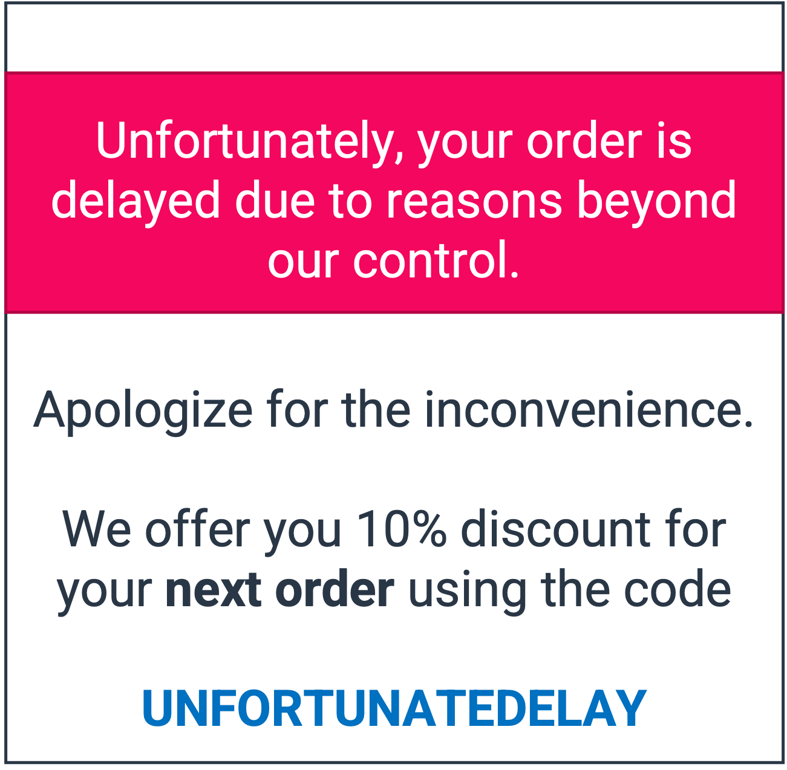

# Notification about order delay

## Use case description

🎯 Goal:

Answer to customers expectations, **reduce call center traffic** and increase loyalty.

Notify your customers when an order is delayed, this will reduce the call center traffic and bring more interactions with customers by giving them more info. If needed, you can add also an incentive for next purchase as compensation.

🔧 Complexity: 2/5

💰 ROI: Low

## Use case setup

Step 1: create a new variable order\_delay = True / False and import values

Step 2: create a segment with order\_delay = True

Step 3: create a stream to send users in segment previously created to an emailing or push notification solution
