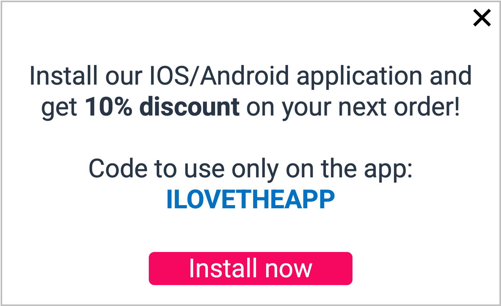

# Discount banner for installing the application

## Use case description

🎯  Goal:

**Encourage** customers to download the app

Applications are keys to engage new customers and retain them because it allows businesses to communicate directly with their customers using ads, promotions, and **notifications**. Push new customers to install the app with an incentive is important to keep them activated.

🔧  Complexity: 2/5

💰  ROI: Medium

## Use case setup

Step 1: create a segment for customers who never used the app

Step 2: two options are possible here, use TagCommander or use a partner personalization solution
