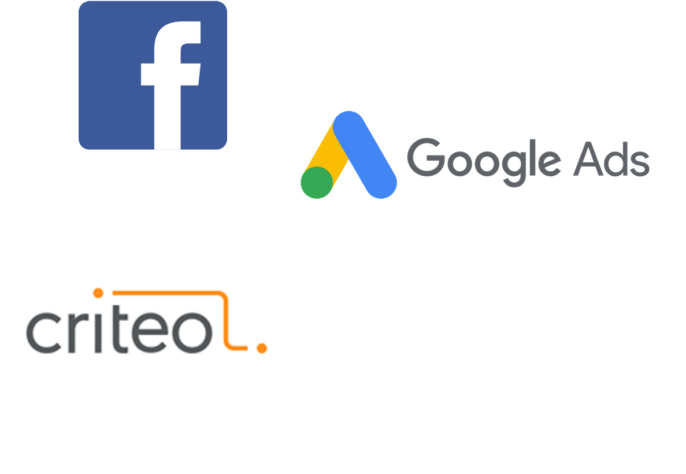

# Engage similar audience (lookalike)

## Use case description

🎯  Goal:

Create similar audience segments from your best customers.\
**Send your best customers** to our partners (Facebook, Google, Criteo…) and let them **find similar profiles** on their database.

Then create relevant and personalized ads to activate these similar users.

🔧  Complexity: 1/5

💰  ROI: Medium

## Use case setup

Step 1: create a segment, like for example with customers with a CRM status = VIP

Step 2: create a stream to push your segment to partners like Facebook, Google, Criteo…

Step 3: on our partners’ platform, create a lookalike audience based on the segment you just pushed

Step 4: create relevant and personalized ads and activate it for the new lookalike audience
