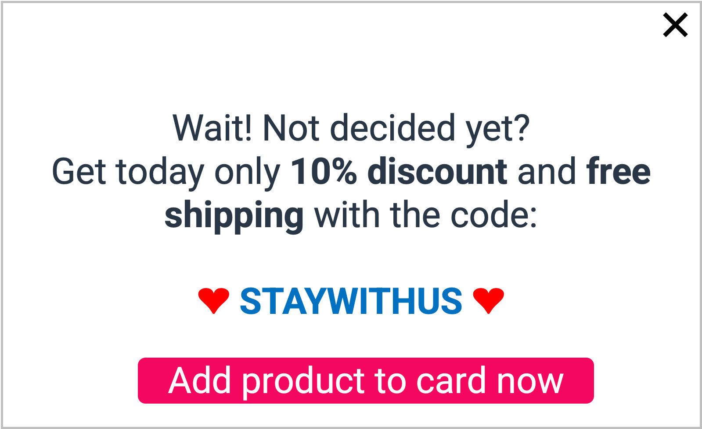

# Engage hesitant customers

## Use case description

🎯  Goal:

**Convert** hesitant customers

Detect hesitant customers: they have viewed products from a certain category at least a few times but have not made a purchase.\
We can push them a dedicated pop-in message with a % discount and/or free shipping.

🔧  Complexity: 2/5

💰  ROI: High

## Use case setup

Step 1: create a segment for hesitant customers

Step 2: two options are possible here, use TagCommander or use a partner personalization solution
