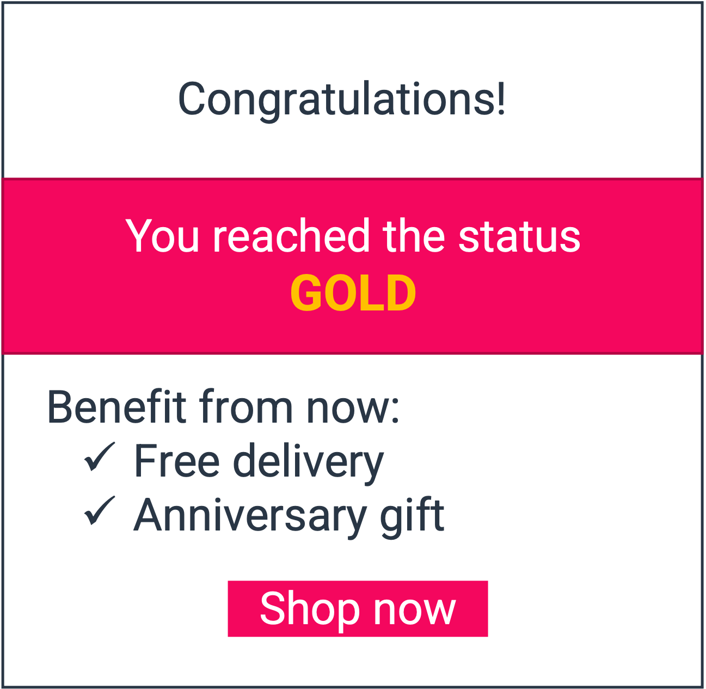

# Increase Customer Lifetime Value with a loyalty program

## Use case description

🎯  Goal:

Increase Customer Lifetime Value, boost customers loyalty and **avoid churn**.

Flag your customers based on their behaviour to switch from one status to another (Gold, Silver…). Define rewards and gains for each status and communicate by email any changes or promotion.

🔧  Complexity: 2/5

💰  ROI: Medium

## Use case setup

Step 1: create new Augmented User Attributes to FLAG your customers according to their status (define conditions to enter and exit flags). 1 flag per status&#x20;

 (1) (1) (1) (1).png>)

Step 2: create segments based on flags previously created (=fidelity status) and more conditions if needed. 1 segment per status

Step 3: create streams to send users in segments previously created (to an emailing solution for example)
